# 高级运算符

<ToBePolishedAfterTranslation />

<OriginalSource
  title="Advanced Operators"
  url="https://docs.swift.org/swift-book/documentation/the-swift-programming-language/advancedoperators"
  summary="定义自定义运算符、执行按位运算并使用构建器语法"
/>

除了 [基本运算符](../basic-operators/index.mdx) 中描述的运算符之外，Swift 还提供了几个高级运算符来执行更复杂的值操作。这些包括你从 C 和 Objective-C 中熟悉的所有按位和位移运算符。

与 C 中的算术运算符不同，Swift 中的算术运算符默认情况下不会溢出。溢出行为被捕获并报告为错误。要选择溢出行为，请使用 Swift 的第二组默认溢出的算术运算符，例如溢出加法运算符 ( &+)。所有这些溢出运算符都以与号 ( &) 开头。

当你定义自己的结构、类和枚举时，为这些自定义类型提供你自己的标准 Swift 运算符的实现会很有用。Swift 可以轻松地为这些运算符提供量身定制的实现，并为你创建的每种类型准确确定它们的行为。

你不限于预定义的运算符。Swift 使你可以自由定义自己的自定义中缀、前缀、后缀和赋值运算符，以及自定义优先级和关联性值。这些运算符可以像任何预定义运算符一样在你的代码中使用和采用，你甚至可以扩展现有类型以支持你定义的自定义运算符。

## 位运算符

按位运算符使你能够操作数据结构中的各个原始数据位。它们通常用于低级编程，例如图形编程和设备驱动程序创建。当你处理来自外部源的原始数据时，按位运算符也很有用，例如通过自定义协议对数据进行编码和解码以进行通信。

Swift 支持 C 中的所有按位运算符，如下所述。

## 按位非运算符

按位非运算符( ~) 反转数字中的所有位：

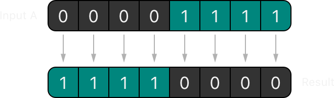

按位 NOT 运算符是一个前缀运算符，紧接在它所运算的值之前出现，没有任何空格：

```swift
let initialBits: UInt8 = 0b00001111
let invertedBits = ~initialBits  // equals 11110000
```

UInt8 整数有八位，可以存储 0 和之间的任何值 255。此示例 UInt8 使用二进制值初始化一个整数 00001111，其前四位设置为 0，后四位设置为 1。这相当于 的十进制值 15。

然后使用按位 NOT 运算符创建一个名为 的新常量，它等于，但所有位都取反了。零变成一，一变成零。的值为，等于 的无符号十进制值。invertedBitsinitialBitsinvertedBits11110000240

## 按位与运算符

按位与运算符( )&组合两个数字的位。它返回一个新数字，其位仅在两个输入数字中 1 的位相等时才设置为：1

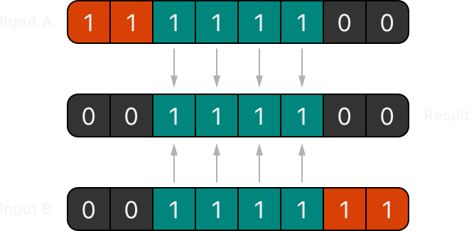

在下面的示例中，和的值都有四个中间位等于。按位 AND 运算符将它们组合起来生成数字，它等于无符号十进制值：firstSixBitslastSixBits10011110060

```swift
let firstSixBits: UInt8 = 0b11111100
let lastSixBits: UInt8  = 0b00111111
let middleFourBits = firstSixBits & lastSixBits  // equals 00111100
```

## 按位或运算符

按位或运算符( |) 比较两个数字的位。1 如果任 1 一输入数字中的位等于，则运算符返回一个新数字，其位设置为：

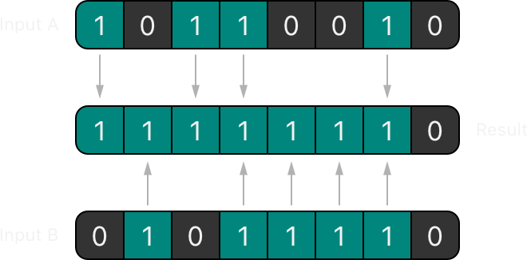

在下面的示例中，和的值将不同的位设置为。按位 OR 运算符将它们组合成数字，它等于 的无符号小数：someBitsmoreBits111111110254

```swift
let someBits: UInt8 = 0b10110010
let moreBits: UInt8 = 0b01011110
let combinedbits = someBits | moreBits  // equals 11111110
```

## 按位异或运算符

按位 XOR 运算符或"异或运算符"( ^) 比较两个数字的位。运算符返回一个新数字，其位设置为 1 输入位不同的位置和 0 输入位相同的位置：

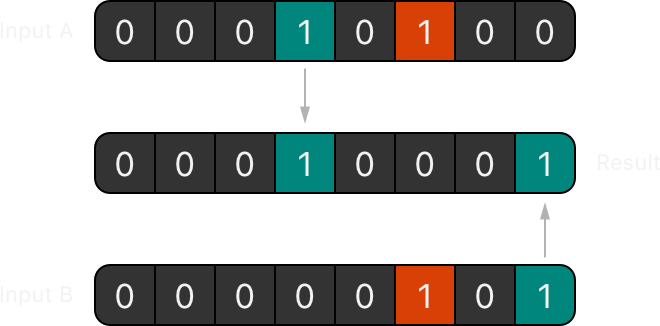

在下面的示例中，和每个的值都在一个位置设置了一个位，而另一个没有。按位 XOR 运算符将这两个位设置为其输出值。和中的所有其它位匹配并在输出值中设置为：firstBitsotherBits11firstBitsotherBits0

```swift
let firstBits: UInt8 = 0b00010100
let otherBits: UInt8 = 0b00000101
let outputBits = firstBits ^ otherBits  // equals 00010001
```

## 按位左移和右移运算符

按位左移运算符( )<<和按位右移运算符( >>) 根据下面定义的规则将数字中的所有位向左或向右移动一定数量的位置。

按位左移和右移具有将整数乘以或除以两倍的效果。将整数的位向左移动一位使其值加倍，而将其向右移动一位使其值减半。

## 无符号整数的移位行为

无符号整数的位移行为如下：

- 现有位向左或向右移动请求的位数。
- 任何超出整数存储范围的位都将被丢弃。
- 将原始位向左或向右移动后，在留下的空格中插入零。

这种方法称为逻辑移位。

11111111 << 1 下图显示了（按位置 11111111 向左移动 1）和 11111111 >> 1（按位置 11111111 向右移动 1）的结果。蓝色数字被移动，灰色数字被丢弃，橙色零被插入：

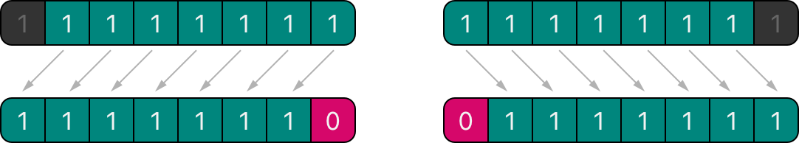

下面是位移在 Swift 代码中的样子：

```swift
let shiftBits: UInt8 = 4   // 00000100 in binary
shiftBits << 1             // 00001000
shiftBits << 2             // 00010000
shiftBits << 5             // 10000000
shiftBits << 6             // 00000000
shiftBits >> 2             // 00000001
```

你可以使用位移来编码和解码其它数据类型中的值：

```swift
let pink: UInt32 = 0xCC6699
let redComponent = (pink & 0xFF0000) >> 16    // redComponent is 0xCC, or 204
let greenComponent = (pink & 0x00FF00) >> 8   // greenComponent is 0x66, or 102
let blueComponent = pink & 0x0000FF           // blueComponent is 0x99, or 153
```

此示例使用 UInt32 名为的常量 pink 来存储粉红色的级联样式表颜色值。CSS 颜色值按照 Swift 的十六进制数字表示#CC6699 形式编写。然后，此颜色通过按位与运算符 ( ) 和按位右移运算符 ( )分解为其红色 ( )、绿色( ) 和蓝色 ( ) 分量。0xCC6699CC6699&>>

红色分量是通过在数字和之间执行按位与获得的。中的零有效地"屏蔽"了 的第二个和第三个字节，导致被忽略并作为结果离开。0xCC66990xFF00000xFF00000xCC669966990xCC0000

然后将该数字向右移动 16 位 ( >> 16)。十六进制数中的每对字符使用 8 位，因此向右移动 16 位将转换为. 这与 相同，它的十进制值为。0xCC00000x0000CC0xCC204

类似地，绿色分量是通过在数字和之间执行按位与获得的，其输出值为。然后将此输出值向右移动八位，得到值，其十进制值为.0xCC66990x00FF000x0066000x66102

最后，通过在数字和之间执行按位与运算得到蓝色分量，输出值为。因为已经等于，其十进制值为，所以使用该值时无需将其右移，0xCC66990x0000FF0x0000990x0000990x99153

## 有符号整数的移位行为

由于有符号整数以二进制表示的方式，有符号整数的移位行为比无符号整数更复杂。（为简单起见，以下示例基于 8 位有符号整数，但相同的原则适用于任何大小的有符号整数。）

有符号整数使用它们的第一位（称为符号位）来指示整数是正数还是负数。符号位为 0 正，符号位为 1 负。

其余位（称为值位）存储实际值。正数的存储方式与无符号整数完全相同，从 向上计数 0。以下是 an 中的位如何 Int8 查找数字 4：

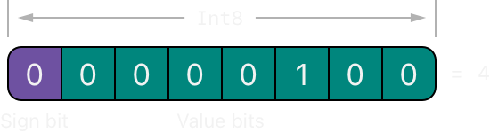

符号位是 0（意思是"正数"），七个值位就是数字 4，用二进制表示。

但是，负数的存储方式不同。2 它们的存储方式是从 的次方减去它们的绝对值 n，其中 n 是值位数。一个八位数字有七个值位，所以这意味着, 或 的 2 幂。7128

以下是 an 中的位如何 Int8 查找数字-4：

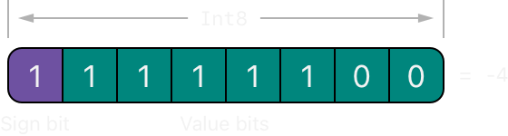

这次，符号位是 1（意思是"负数"），七个值位的二进制值为 124（即 128 - 4）：

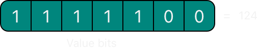

这种对负数的编码称为二进制补码表示。这似乎是一种表示负数的不寻常方式，但它有几个优点。

首先，你可以添加-1 到-4，只需对所有八位（包括符号位）执行标准二进制加法，并在完成后丢弃任何不适合这八位的内容：

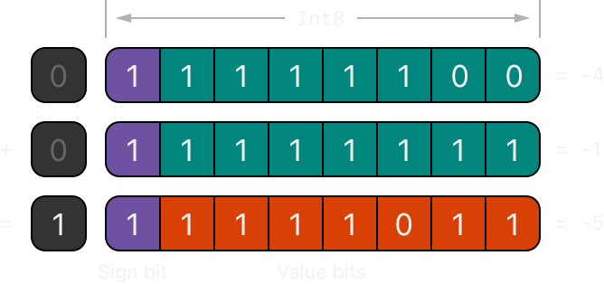

其次，二进制补码表示还允许你像正数一样将负数的位向左和向右移动，并且仍然会在每次向左移动时将它们加倍，或者在每次向右移动时将它们减半. 为了实现这一点，当有符号整数向右移动时使用了一个额外的规则：当你向右移动有符号整数时，应用与无符号整数相同的规则，但是用符号位填充左边的任何空位，而不是比零。

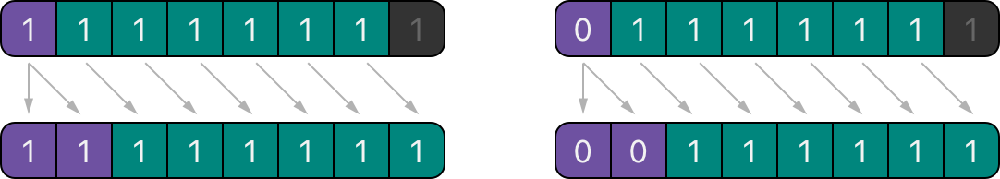

此操作确保有符号整数在右移后具有相同的符号，称为算术移位。

由于正数和负数的特殊存储方式，将它们中的任何一个向右移动会使它们更接近于零。在此移位期间保持符号位相同意味着负整数在其值接近零时保持负值。

## 溢出运算符

如果你试图将一个数字插入到一个不能保存该值的整数常量或变量中，默认情况下 Swift 会报告一个错误，而不是允许创建一个无效的值。当你处理太大或太小的数字时，此行为会提供额外的安全性。

例如，Int16 整数类型可以包含-32768 和之间的任何有符号整数 32767。尝试将 Int16 常量或变量设置为超出此范围的数字会导致错误：

```swift
var potentialOverflow = Int16.max
// potentialOverflow equals 32767, which is the maximum value an Int16 can hold
potentialOverflow += 1
// this causes an error
```

在值变得太大或太小时提供错误处理可以让你在为边界值条件编码时更加灵活。

但是，当你特别希望溢出条件截断可用位数时，你可以选择加入此行为而不是触发错误。Swift 提供了三个算术溢出运算符，它们选择加入整数计算的溢出行为。这些运算符都以与号 ( &) 开头：

- 溢出加法 ( &+)
- 溢出减法 ( &-)
- 溢出乘法 ( &\*)

## 值溢出

数字可以在正方向和负方向上溢出。

下面是使用溢出加法运算符 ( ) 允许无符号整数沿正方向溢出时发生的情况的示例&+：

```swift
var unsignedOverflow = UInt8.max
// unsignedOverflow equals 255, which is the maximum value a UInt8 can hold
unsignedOverflow = unsignedOverflow &+ 1
// unsignedOverflow is now equal to 0
```

该变量用 a 可以容纳的最大值（ ，或二进制）初始化。然后使用溢出加法运算符 ( )对其进行递增。这将其二进制表示推到刚好超过 a 可以容纳的大小，导致它溢出超出其范围，如下图所示。溢出加法后保留在 边界内的值为, 或零。unsignedOverflowUInt8255111111111&+UInt8UInt800000000

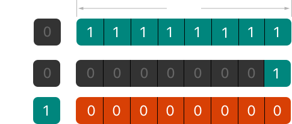

当允许无符号整数沿负方向溢出时，会发生类似的情况。下面是一个使用溢出减法运算符 ( &-) 的示例：

```swift
var unsignedOverflow = UInt8.min
// unsignedOverflow equals 0, which is the minimum value a UInt8 can hold
unsignedOverflow = unsignedOverflow &- 1
// unsignedOverflow is now equal to 255
```

a 可以容纳的最小值 UInt8 是零，或者 00000000 是二进制。如果你使用溢出减法运算符 ( ) 进行减法 1，00000000 则&-该数字将溢出并环绕到 11111111, 或 255 十进制。

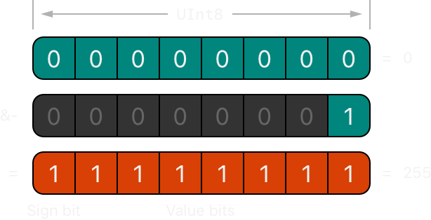

有符号整数也会发生溢出。有符号整数的所有加法和减法都以按位方式执行，符号位作为被加或减的数字的一部分，如按位左移和右移运算符中所述。

```swift
var signedOverflow = Int8.min
// signedOverflow equals -128, which is the minimum value an Int8 can hold
signedOverflow = signedOverflow &- 1
// signedOverflow is now equal to 127
```

Int8an 可以容纳的最小值是-128, 或 10000000 二进制。用溢出运算符从这个二进制数中减去 1 得到二进制值 01111111，它切换符号位并给出正数，即 an 可以容纳的 127 最大正值。Int8

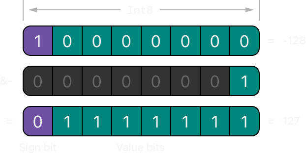

对于有符号和无符号整数，正方向溢出从最大有效整数值回绕到最小值，而负方向溢出从最小值回绕到最大值。

## 优先级和结合性

运算符优先级赋予某些运算符比其它运算符更高的优先级；首先应用这些运算符。

运算符结合性定义了相同优先级的运算符如何组合在一起——从左边分组，或者从右边分组。可以将其理解为"他们与左侧的表达相关联"或"他们与右侧的表达相关联"。

在计算复合表达式的计算顺序时，考虑每个运算符的优先级和结合性很重要。例如，运算符优先级解释了为什么以下表达式等于 17。

```swift
2 + 3 % 4 * 5
// this equals 17
```

如果严格从左到右阅读，你可能希望表达式计算如下：

- 2 加 3 等于 5
- 5 余数 4 等于 1
- 1 次 5 等于 5

然而，实际的答案是 17，不是 5。优先级较高的运算符在优先级较低的运算符之前进行评估。在 Swift 中，与在 C 中一样，取余运算符 ( %) 和乘法运算符 ( \*) 的优先级高于加法运算符 ( +)。因此，在考虑添加之前，它们都会被评估。

但是，余数和乘法彼此具有相同的优先级。要计算出要使用的确切评估顺序，你还需要考虑它们的关联性。余数和乘法都与它们左边的表达式相关联。将其视为在表达式的这些部分周围添加隐式括号，从它们的左侧开始：

```swift
2 + ((3 % 4) * 5)
```

`(3 % 4)` 是 `3`，所以这等同于：

```swift
2 + (3 * 5)
```

`(3 * 5)` 是 `15`，所以这等同于：

```swift
2 + 15
```

此计算得出最终答案 `17`。

有关 Swift 标准库提供的运算符的信息，包括运算符优先级组和关联性设置的完整列表，请参阅 [运算符声明](https://developer.apple.com/documentation/swift/operator-declarations)。

:::note
Swift 的运算符优先级和结合性规则比 C 和 Objective-C 中的更简单、更可预测。然而，这意味着它们与基于 C 的语言并不完全相同。在将现有代码移植到 Swift 时，请小心确保运算符交互仍按照你预期的方式运行。
:::

## 运算符方法

类和结构可以提供它们自己的现有运算符的实现。这称为重载现有运算符。

下面的示例显示了如何+为自定义结构实现算术加法运算符 ( )。算术加法运算符是一个二元运算符，因为它在两个目标上运行，它是一个中缀运算符，因为它出现在这两个目标之间。

该示例定义了 Vector2D 一个二维位置向量的结构，然后是一个运算符方法(x, y)的定义，用于将结构的实例加在一起：Vector2D

```swift
struct Vector2D {
    var x = 0.0, y = 0.0
}

extension Vector2D {
    static func + (left: Vector2D, right: Vector2D) -> Vector2D {
       return Vector2D(x: left.x + right.x, y: left.y + right.y)
    }
}
```

运算符方法被定义为 on 的类型方法 Vector2D，其方法名称与要重载的运算符 ( +) 相匹配。因为加法不是向量基本行为的一部分，所以类型方法是在 的扩展中而 Vector2D 不是在 的主结构声明中定义的 Vector2D。因为算术加法运算符是二元运算符，所以此运算符方法采用两个类型的输入参数 Vector2D 并返回一个输出值，也是类型 Vector2D。

在此实现中，输入参数被命名为 leftandright 以表示 Vector2D 将位于运算符左侧和右侧的实例+。该方法返回一个新 Vector2D 实例，其 x 和属性使用两个实例的和属性相加的 y 总和进行初始化。xyVector2D

type 方法可以用作现有 Vector2D 实例之间的中缀运算符：

```swift
let vector = Vector2D(x: 3.0, y: 1.0)
let anotherVector = Vector2D(x: 2.0, y: 4.0)
let combinedVector = vector + anotherVector
// combinedVector is a Vector2D instance with values of (5.0, 5.0)
```

此示例将向量和加在一起以生成向量，如下图所示。(3.0, 1.0)(2.0, 4.0)(5.0, 5.0)

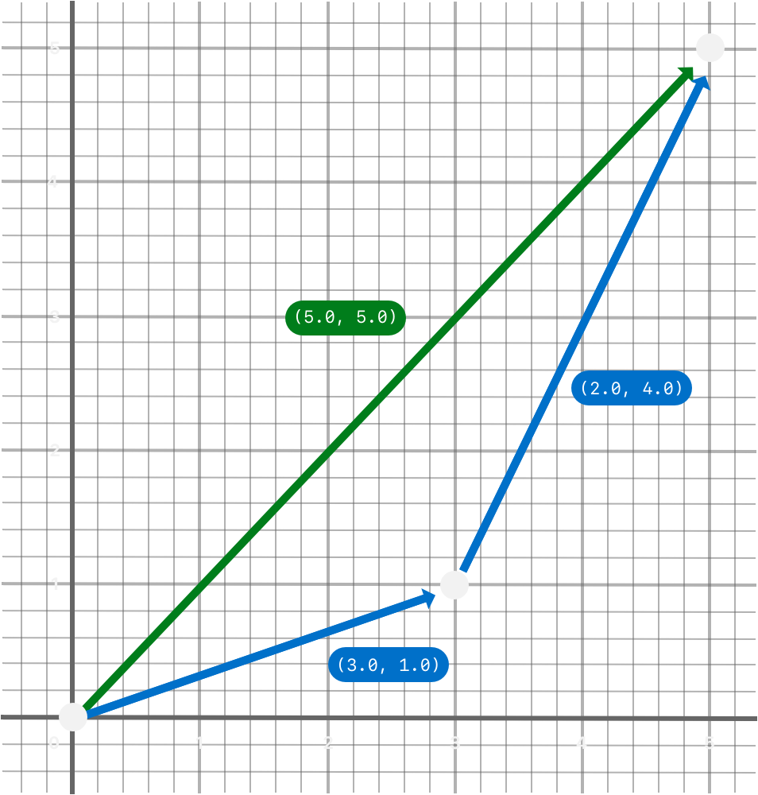

## 前缀和后缀运算符

上面显示的示例演示了二进制中缀运算符的自定义实现。类和结构也可以提供标准一元运算符的实现。一元运算符对单个目标进行操作。如果它们位于目标之前（例如），则它们是前缀；如果它们位于目标之后（例如） ，则它们是后缀运算符。-ab!

在声明运算符方法时，通过在关键字前写入 prefixor 修饰器来实现前缀或后缀一元运算符：postfixfunc

```swift
extension Vector2D {
    static prefix func - (vector: Vector2D) -> Vector2D {
        return Vector2D(x: -vector.x, y: -vector.y)
    }
}
```

上面的示例-a 为实例实现了一元减号运算符 ( ) Vector2D。一元减号运算符是前缀运算符，因此必须使用修饰器限定此方法 prefix。

对于简单的数值，一元减运算符将正数转换为负数，反之亦然。实例的相应实现 Vector2D 对 x 和 y 属性执行此操作：

```swift
let positive = Vector2D(x: 3.0, y: 4.0)
let negative = -positive
// negative is a Vector2D instance with values of (-3.0, -4.0)
let alsoPositive = -negative
// alsoPositive is a Vector2D instance with values of (3.0, 4.0)
```

## 复合赋值运算符

复合赋值运算符将赋值 ( =) 与另一个运算组合在一起。例如，加法赋值运算符 ( +=) 将加法和赋值结合到一个运算中。你将复合赋值运算符的左输入参数类型标记为 inout，因为参数的值将直接从运算符方法中修改。

下面的示例为 Vector2D 实例实现了加法赋值运算符方法：

```swift
extension Vector2D {
    static func += (left: inout Vector2D, right: Vector2D) {
        left = left + right
    }
}
```

因为前面已经定义了一个加法运算符，所以这里不需要重新实现加法过程。相反，加法赋值运算符方法利用了现有的加法运算符方法，并使用它将左值设置为左值加上右值：

```swift
var original = Vector2D(x: 1.0, y: 2.0)
let vectorToAdd = Vector2D(x: 3.0, y: 4.0)
original += vectorToAdd
// original now has values of (4.0, 6.0)
```

:::note
无法重载默认赋值运算符 ( `=` )。只能重载复合赋值运算符。同样，三元条件运算符 ( `a ? b : c` ) 也不能重载。
:::

## 等价运算符

默认情况下，自定义类和结构没有等价运算符的实现，称为等于运算符 ( ==) 和不等于运算符 ( !=)。你通常会实现==运算符，并使用标准库的默认!=运算符实现来否定运算符的结果==。有两种实现==运算符的方法：你可以自己实现它，或者对于许多类型，你可以让 Swift 为你合成一个实现。在这两种情况下，你都添加了对标准库 Equatable 协议的一致性。

==你以与实现其它中缀运算符相同的方式提供运算符的实现：

```swift
extension Vector2D: Equatable {
    static func == (left: Vector2D, right: Vector2D) -> Bool {
       return (left.x == right.x) && (left.y == right.y)
    }
}
```

上面的示例实现了一个 `==` 运算符来检查两个 Vector2D 实例是否具有相等的值。在 的上下文中 Vector2D，将"相等"视为"两个实例具有相同的 x 值和 y 值"是有意义的，因此这是运算符实现使用的逻辑。

你现在可以使用此运算符来检查两个 `Vector2D` 实例是否等效：

```swift
let twoThree = Vector2D(x: 2.0, y: 3.0)
let anotherTwoThree = Vector2D(x: 2.0, y: 3.0)
if twoThree == anotherTwoThree {
    print("These two vectors are equivalent.")
}
// Prints "These two vectors are equivalent."
```

在许多简单的情况下，你可以要求 Swift 为你提供等价运算符的合成实现，如采用合成实现的协议中所述。

## 自定义运算符

除了 Swift 提供的标准运算符之外，你还可以声明和实现自己的自定义运算符。有关可用于定义自定义运算符的字符列表，请参阅运算符。

新运算符使用关键字在全局级别声明 operator，并标有 prefix,infix 或 postfix 修饰器：

```swift
prefix operator +++
```

上面的例子定义了一个新的前缀运算符+++. 这个运算符在 Swift 中没有现成的含义，因此在下面处理 Vector2D 实例的特定上下文中，它被赋予了自己的自定义含义。出于本示例的目的，+++被视为新的"前缀加倍"运算符。它通过使用前面定义的加法赋值运算符将向量与自身相加，将实例的 x 和值加倍。要实现该运算符，你需要添加一个类型方法调用，如下所示：yVector2D++++++Vector2D

```swift
extension Vector2D {
    static prefix func +++ (vector: inout Vector2D) -> Vector2D {
        vector += vector
        return vector
    }
}

var toBeDoubled = Vector2D(x: 1.0, y: 4.0)
let afterDoubling = +++toBeDoubled
// toBeDoubled now has values of (2.0, 8.0)
// afterDoubling also has values of (2.0, 8.0)
```

## 自定义中缀运算符的优先级

每个自定义中缀运算符都属于一个优先级组。优先级组指定运算符相对于其它中缀运算符的优先级，以及运算符的结合性。有关这些特征如何影响中缀运算符与其它中缀运算符的交互的解释，请参阅优先级和关联性。

未明确放置在优先级组中的自定义中缀运算符被赋予默认优先级组，其优先级直接高于三元条件运算符的优先级。

以下示例定义了一个名为 的新自定义中缀运算符+-，它属于优先级组：AdditionPrecedence

```swift
infix operator +-: AdditionPrecedence
extension Vector2D {
    static func +- (left: Vector2D, right: Vector2D) -> Vector2D {
        return Vector2D(x: left.x + right.x, y: left.y - right.y)
    }
}
let firstVector = Vector2D(x: 1.0, y: 2.0)
let secondVector = Vector2D(x: 3.0, y: 4.0)
let plusMinusVector = firstVector +- secondVector
// plusMinusVector is a Vector2D instance with values of (4.0, -2.0)
```

此运算符将两个向量的值相加 x，并 y 从第一个向量中减去第二个向量的值。因为它本质上是一个"加法"运算符，所以它被赋予与加法中缀运算符相同的优先级组，例如+and -。有关 Swift 标准库提供的运算符的信息，包括运算符优先级组和关联性设置的完整列表，请参阅运算符声明。有关优先级组的更多信息以及查看用于定义你自己的运算符和优先级组的语法，请参阅运算符声明。

:::note
定义前缀或后缀运算符时不指定优先级。但是，如果将前缀运算符和后缀运算符应用于同一操作数，则首先应用后缀运算符。
:::

## 结果生成器

结果构建器是你定义的一种类型，它以自然的声明方式添加用于创建嵌套数据（如列表或树）的语法。使用结果生成器的代码可以包含普通的 Swift 语法，例如 if and for，以处理有条件或重复的数据片段。

下面的代码定义了几种使用星号和文本在单行上绘制的类型。

```swift
protocol Drawable {
    func draw() -> String
}
struct Line: Drawable {
    var elements: [Drawable]
    func draw() -> String {
        return elements.map { $0.draw() }.joined(separator: "")
    }
}
struct Text: Drawable {
    var content: String
    init(_ content: String) { self.content = content }
    func draw() -> String { return content }
}
struct Space: Drawable {
    func draw() -> String { return " " }
}
struct Stars: Drawable {
    var length: Int
    func draw() -> String { return String(repeating: "*", count: length) }
}
struct AllCaps: Drawable {
    var content: Drawable
    func draw() -> String { return content.draw().uppercased() }
}
```

该 Drawable 协议定义了对可以绘制的东西的要求，例如线条或形状：该类型必须实现一种 draw()方法。该 Line 结构表示单线绘图，它为大多数绘图提供顶级容器。要绘制 Line，该结构会调用 draw()该行的每个组件，然后将生成的字符串连接成一个字符串。该 Text 结构包裹了一个字符串，使其成为绘图的一部分。该结构包装并修改了另一幅图，将图中的任何文本转换为大写。AllCaps

可以通过调用它们的初始化器来使用这些类型进行绘图：

```swift
let name: String? = "Ravi Patel"
let manualDrawing = Line(elements: [
     Stars(length: 3),
     Text("Hello"),
     Space(),
     AllCaps(content: Text((name ?? "World") + "!")),
     Stars(length: 2),
])
print(manualDrawing.draw())
// Prints "***Hello RAVI PATEL!**"
```

这段代码有效，但有点笨拙。后面嵌套很深的括号很难阅读。当必须使用运算符内联完成时使用"World"的回退逻辑，这对于任何更复杂的事情来说都是困难的。如果你需要包含开关或循环来构建绘图的一部分，则无法做到这一点。结果构建器让你可以像这样重写代码，使其看起来像普通的 Swift 代码。AllCapsnamenil??for

要定义结果生成器，你可以在类型声明中编写属性。例如，此代码定义了一个名为 的结果构建器，它允许你使用声明性语法来描述绘图：@resultBuilderDrawingBuilder

```swift
@resultBuilder
struct DrawingBuilder {
    static func buildBlock(_ components: Drawable...) -> Drawable {
        return Line(elements: components)
    }
    static func buildEither(first: Drawable) -> Drawable {
        return first
    }
    static func buildEither(second: Drawable) -> Drawable {
        return second
    }
}
```

该结构定义了三个方法来实现部分结果生成器语法。该方法增加了对在代码块中编写一系列行的支持。它将那个块中的组件组合成一个. 和方法添加了对-的支持。DrawingBuilderbuildBlock(\_:)LinebuildEither(first:)buildEither(second:)ifelse

你可以将该属性应用于函数的参数，这会将传递给函数的闭包转换为结果构建器从该闭包创建的值。例如：@DrawingBuilder

```swift
func draw(@DrawingBuilder content: () -> Drawable) -> Drawable {
    return content()
}
func caps(@DrawingBuilder content: () -> Drawable) -> Drawable {
    return AllCaps(content: content())
}

func makeGreeting(for name: String? = nil) -> Drawable {
    let greeting = draw {
        Stars(length: 3)
        Text("Hello")
        Space()
        caps {
            if let name = name {
                Text(name + "!")
            } else {
                Text("World!")
            }
        }
        Stars(length: 2)
    }
    return greeting
}
let genericGreeting = makeGreeting()
print(genericGreeting.draw())
// Prints "***Hello WORLD!**"

let personalGreeting = makeGreeting(for: "Ravi Patel")
print(personalGreeting.draw())
// Prints "***Hello RAVI PATEL!**"
```

该函数接受一个参数并使用它来绘制个性化的问候语。和函数都将一个闭包作为它们的参数，该闭包用属性标记。当你调用这些函数时，你使用定义的特殊语法。Swift 将绘图的声明性描述转换为对方法的一系列调用，以构建作为函数参数传递的值。例如，Swift 将该示例中的调用转换为如下代码：makeGreeting(for:)namedraw(_:)caps(_:)@DrawingBuilderDrawingBuilderDrawingBuildercaps(\_:)

```swift
let capsDrawing = caps {
    let partialDrawing: Drawable
    if let name = name {
        let text = Text(name + "!")
        partialDrawing = DrawingBuilder.buildEither(first: text)
    } else {
        let text = Text("World!")
        partialDrawing = DrawingBuilder.buildEither(second: text)
    }
    return partialDrawing
}
```

Swift 将 if-else 块转换为对和方法的调用。虽然你不会在自己的代码中调用这些方法，但显示转换结果可以让你更轻松地了解 Swift 在你使用语法时如何转换你的代码。buildEither(first:)buildEither(second:)DrawingBuilder

要 for 在特殊绘图语法中添加对编写循环的支持，请添加一个方法。buildArray(\_:)

```swift
extension DrawingBuilder {
    static func buildArray(_ components: [Drawable]) -> Drawable {
        return Line(elements: components)
    }
}
let manyStars = draw {
    Text("Stars:")
    for length in 1...3 {
        Space()
        Stars(length: length)
    }
}
```

在上面的代码中，for 循环创建了一个绘图数组，该方法将该数组转换为一个.buildArray(\_:)Line

有关 Swift 如何将构建器语法转换为对构建器类型方法的调用的完整列表，请参阅[resultBuilder](../../reference/attributes/index.mdx)。
