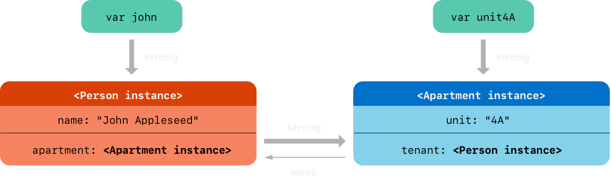

# 自动引用计数

<DocCaution />

<OriginalLink
  title="对对象的生命周期及其关系进行建模"
  value="https://docs.swift.org/swift-book/documentation/the-swift-programming-language/automaticreferencecounting"
/>

Swift 使用自动引用计数(ARC) 来跟踪和管理应用程序的内存使用情况。在大多数情况下，这意味着内存管理在 Swift 中“正常工作”，你不需要自己考虑内存管理。当不再需要这些实例时，ARC 会自动释放这些实例所使用的内存。

但是，在少数情况下，ARC 需要有关代码各部分之间关系的更多信息，以便为您管理内存。本章描述了这些情况并展示了如何启用 ARC 来管理应用程序的所有内存。在 Swift 中使用 ARC 与 Transitioning to ARC Release Notes 中描述的将 ARC 与 Objective-C 结合使用的方法非常相似。

引用计数仅适用于类的实例。结构和枚举是值类型，而不是引用类型，并且不按引用存储和传递。

## ARC 的工作原理

每次创建类的新实例时，ARC 都会分配一块内存来存储有关该实例的信息。此内存保存有关实例类型的信息，以及与该实例关联的任何存储属性的值。

此外，当不再需要某个实例时，ARC 会释放该实例使用的内存，以便将内存用于其他目的。这确保类实例在不再需要时不会占用内存空间。

但是，如果 ARC 要释放仍在使用的实例，将无法再访问该实例的属性或调用该实例的方法。实际上，如果您尝试访问该实例，您的应用很可能会崩溃。

为了确保实例在它们仍然需要时不会消失，ARC 会跟踪当前引用每个类实例的属性、常量和变量的数量。只要该实例的至少一个活动引用仍然存在，ARC 就不会释放该实例。

为了实现这一点，无论何时将类实例分配给属性、常量或变量，该属性、常量或变量都会对该实例进行强引用。该引用被称为“强”引用，因为它会牢牢控制该实例，并且只要该强引用仍然存在，就不允许释放它。

## 弧在行动

下面是自动引用计数如何工作的示例。此示例从一个名为 的简单类开始 Person，该类定义了一个名为 的存储常量属性 name：

```swift
class Person {
    let name: String
    init(name: String) {
        self.name = name
        print("\(name) is being initialized")
    }
    deinit {
        print("\(name) is being deinitialized")
    }
}
```

该类 Person 有一个初始化程序，它设置实例的 name 属性并打印一条消息以指示初始化正在进行。该类 Person 还有一个析构器，它在释放该类的实例时打印一条消息。

下一个代码片段定义了三个 type 变量 Person?，用于 Person 在后续代码片段中设置对新实例的多个引用。因为这些变量是可选类型（Person?，而不是 Person），所以它们会自动初始化为值 nil，并且当前不引用 Person 实例。

```swift
var reference1: Person?
var reference2: Person?
var reference3: Person?
```

您现在可以创建一个新 Person 实例并将其分配给以下三个变量之一：

```swift
reference1 = Person(name: "John Appleseed")
// Prints "John Appleseed is being initialized"
```

请注意，消息"John Appleseed is being initialized"是在您调用类的初始化程序时打印的 Person。这确认初始化已经发生。

因为新 Person 实例已分配给 reference1 变量，所以现在存在 reference1 对新 Person 实例的强引用。因为至少有一个强引用，ARC 确保它 Person 保存在内存中并且不会被释放。

如果将同一个 Person 实例分配给另外两个变量，则会建立对该实例的两个更强引用：

```swift
reference2 = reference1
reference3 = reference1
```

现在有对这个单一实例的三个强引用 Person。

如果您通过分配 nil 给两个变量来破坏这些强引用中的两个（包括原始引用），则会保留一个强引用，并且 Person 不会释放实例：

```swift
reference1 = nil
reference2 = nil
```

在第三个也是最后一个强引用被破坏之前， ARC 不会释放 Person 实例，此时很明显您不再使用该 Person 实例：

```swift
reference3 = nil
// Prints "John Appleseed is being deinitialized"
```

## 类实例之间的强引用循环

在上面的示例中，ARC 能够跟踪对您创建的新实例的引用数量，并在不再需要时 Person 释放该实例。Person

但是，可以编写这样的代码，其中类的实例永远不会达到它具有零强引用的程度。如果两个类实例彼此保持强引用，这样每个实例都使另一个实例保持活动状态，就会发生这种情况。这称为强引用循环。

您可以通过将类之间的某些关系定义为弱引用或无主引用而不是强引用来解决强引用循环。解决类实例之间的强引用循环中描述了此过程。但是，在学习如何解决强引用循环之前，了解这种循环是如何引起的很有用。

这是一个如何意外创建强引用循环的示例。此示例定义了两个名为 Person 和 的类 Apartment，它们对公寓楼及其居民进行建模：

```swift
class Person {
    let name: String
    init(name: String) { self.name = name }
    var apartment: Apartment?
    deinit { print("\(name) is being deinitialized") }
}

class Apartment {
    let unit: String
    init(unit: String) { self.unit = unit }
    var tenant: Person?
    deinit { print("Apartment \(unit) is being deinitialized") }
}
```

每个 Person 实例都有一个 nametype 的属性 String 和一个 apartmentinitially 的可选属性 nil。该 apartment 属性是可选的，因为一个人可能并不总是拥有公寓。

同样，每个 Apartment 实例都有一个 unittype 属性 String 和一个可选 tenant 属性 initialized nil。租户属性是可选的，因为公寓可能并不总是有租户。

这两个类还定义了一个反初始化器，它打印出该类的一个实例正在被反初始化的事实。这使您能够查看 和 的实例是否 Person 按 Apartment 预期被释放。

下一个代码片段定义了两个名为 johnand 的可选类型的变量 unit4A，它们将在下面设置为特定的 ApartmentandPerson 实例。nil 由于是可选的，这两个变量的初始值为：

```swift
var john: Person?
var unit4A: Apartment?
```

您现在可以创建特定 Person 实例和 Apartment 实例并将这些新实例分配给 john 和 unit4A 变量：

```swift
john = Person(name: "John Appleseed")
unit4A = Apartment(unit: "4A")
```

以下是强引用在创建和分配这两个实例后的样子。该 john 变量现在具有对新 Person 实例的强引用，并且该 unit4A 变量具有对新实例的强引用 Apartment：


您现在可以将这两个实例链接在一起，这样这个人就有一间公寓，而这间公寓就有一个租户。请注意，感叹号 ( !) 用于解包和访问存储在 john 和 unit4A 可选变量中的实例，以便可以设置这些实例的属性：

```
john!.apartment = unit4A
unit4A!.tenant = john
```

以下是将两个实例链接在一起后强引用的样子：


不幸的是，链接这两个实例在它们之间创建了一个强大的引用循环。实例 Person 现在对实例有强引用 Apartment，实例 Apartment 对实例有强引用 Person。john 因此，当您破坏由和变量持有的强引用时 unit4A，引用计数不会降为零，并且实例不会被 ARC 释放：

```swift
john = nil
unit4A = nil
```

请注意，当您将这两个变量设置为 时，两个析构器都没有被调用 nil。强引用循环可防止 Person 和 Apartment 实例被释放，从而导致您的应用程序发生内存泄漏。

john 以下是将和 `unit4A` 变量设置为 后强引用的表现 `nil` ：


Person 实例与实例之间的强引用 Apartment 保持不变，无法破坏。

## 解决类实例之间的强引用循环

当您使用类类型的属性时，Swift 提供了两种解决强引用循环的方法：弱引用和无主引用。

弱引用和无主引用使引用循环中的一个实例可以引用另一个实例，而无需对其进行强保留。然后实例可以相互引用而无需创建强引用循环。

当另一个实例的生命周期较短时使用弱引用——也就是说，当另一个实例可以首先被释放时。在 Apartment 上面的示例中，公寓在其生命周期的某个时刻可以没有租户是合适的，因此在这种情况下，弱引用是打破引用循环的合适方法。相反，当另一个实例具有相同或更长的生命周期时，使用无主引用。

## 弱引用

弱引用是一种引用，它不会对其引用的实例保持强控制，因此不会阻止 ARC 处理引用的实例。此行为可防止引用成为强引用循环的一部分。weak 您可以通过将关键字放在属性或变量声明之前来指示弱引用。

因为弱引用不会对其引用的实例保持强保留，所以有可能在弱引用仍在引用该实例时释放该实例。nil 因此，ARC 在它引用的实例被释放时自动设置一个弱引用。而且，因为弱引用需要允许在运行时更改它们的值 nil，所以它们总是被声明为可选类型的变量，而不是常量。

您可以检查弱引用中的值是否存在，就像任何其他可选值一样，您永远不会以对不再存在的无效实例的引用告终。

:::note
当 ARC 设置对 的弱引用时，不会调用属性观察器 nil。
:::

下面的示例与上面的 Person 和示例相同，只有一个重要区别。Apartment 这一次，Apartment 类型的 tenant 属性被声明为弱引用：

```swift
class Person {
    let name: String
    init(name: String) { self.name = name }
    var apartment: Apartment?
    deinit { print("\(name) is being deinitialized") }
}

class Apartment {
    let unit: String
    init(unit: String) { self.unit = unit }
    weak var tenant: Person?
    deinit { print("Apartment \(unit) is being deinitialized") }
}
```

两个变量 (john 和 unit4A) 的强引用以及两个实例之间的链接像以前一样创建：

```swift
var john: Person?
var unit4A: Apartment?

john = Person(name: "John Appleseed")
unit4A = Apartment(unit: "4A")

john!.apartment = unit4A
unit4A!.tenant = john
```

现在您已将两个实例链接在一起，引用看起来是这样的：



实例 Person 仍然对实例有强引用 Apartment，但 Apartment 实例现在对实例有弱 Person 引用。这意味着当您 john 通过将变量设置为 来打破变量持有的强引用时 nil，将不再有对该 Person 实例的强引用：

```swift
john = nil
// Prints "John Appleseed is being deinitialized"
```

因为没有更多对该 Person 实例的强引用，所以它被释放并且 tenant 属性设置为 nil：


唯一剩下的对 Apartment 实例的强引用来自 unit4A 变量。如果你打破那个强引用，就没有更多对该 Apartment 实例的强引用：

```swift
unit4A = nil
// Prints "Apartment 4A is being deinitialized"
```

因为没有更多对该 Apartment 实例的强引用，所以它也被释放：


:::note
在使用垃圾回收的系统中，弱指针有时被用来实现一种简单的缓存机制，因为没有强引用的对象只有在内存压力触发垃圾回收时才会被释放。但是，对于 ARC，值在最后一个强引用被删除后会立即被释放，这使得弱引用不适合这样的目的。
:::

## 无主引用

与弱引用一样，无主引用不会对其引用的实例保持强引用。然而，与弱引用不同的是，当另一个实例具有相同或更长的生命周期时，将使用无主引用。unowned 您可以通过将关键字放在属性或变量声明之前来指示无主引用。

与弱引用不同，无主引用应始终具有值。因此，将一个值标记为 unowned 并不会使其成为可选的，并且 ARC 永远不会将 unowned 引用的值设置为 nil。

:::note 重要的
仅当您确定引用始终引用尚未释放的实例时，才使用无主引用。

如果您在该实例被释放后尝试访问无主引用的值，则会出现运行时错误。
:::

以下示例定义了两个类 Customer 和，它们为银行客户和该客户的可能信用卡建模。这两个类各自存储另一个类的实例作为属性。这种关系有可能创造一个强大的参考循环。CreditCard

Customer 和之间的关系与上面弱引用示例中看到的和之间的关系略有不同。在此数据模型中，客户可能拥有也可能没有信用卡，但信用卡始终与客户相关联。一个实例永远不会超过它所指的那个。为了表示这一点，该类有一个可选属性，但该类有一个无主（和非可选）属性。CreditCardApartmentPersonCreditCardCustomerCustomercardCreditCardcustomer

此外，只能通过将值和实例传递给自定义初始化程序来创建新实例。这确保了一个实例在创建时总是有一个实例与之关联。CreditCardnumbercustomerCreditCardCreditCardcustomerCreditCard

因为信用卡总是有客户，所以您将其 customer 属性定义为无主引用，以避免强引用循环：

```swift
class Customer {
    let name: String
    var card: CreditCard?
    init(name: String) {
        self.name = name
    }
    deinit { print("\(name) is being deinitialized") }
}

class CreditCard {
    let number: UInt64
    unowned let customer: Customer
    init(number: UInt64, customer: Customer) {
        self.number = number
        self.customer = customer
    }
    deinit { print("Card #\(number) is being deinitialized") }
}
```

:::note
该类 number 的属性定义为 类型而不是，以确保该属性的容量足够大，可以在 32 位和 64 位系统上存储 16 位卡号。CreditCardUInt64Intnumber
:::

下一个代码片段定义了一个 Customer 名为 的可选变量 john，它将用于存储对特定客户的引用。由于是可选的，此变量的初始值为 nil：

```swift
var john: Customer?
```

您现在可以创建一个 Customer 实例，并使用它来初始化和分配一个新实例作为该客户的属性：CreditCardcard

```swift
john = Customer(name: "John Appleseed")
john!.card = CreditCard(number: 1234_5678_9012_3456, customer: john!)
```

既然您已经链接了两个实例，那么引用的外观如下：


该 Customer 实例现在具有对该实例的强引用，并且该实例具有对该实例的无主引用。CreditCardCreditCardCustomer

由于无主 customer 引用，当你打破变量持有的强引用时 john，就没有对 Customer 实例的强引用了：


因为没有更多对该 Customer 实例的强引用，所以它被释放。发生这种情况后，不再有对该实例的强引用，它也被释放：CreditCard

```swift
john = nil
// Prints "John Appleseed is being deinitialized"
// Prints "Card #1234567890123456 is being deinitialized"
```

上面的最终代码片段显示了 Customer 实例和实例的反初始化器在变量设置为.CreditCardjohnnil

:::note
上面的例子展示了如何使用安全的无主引用。Swift 还为需要禁用运行时安全检查的情况提供了不安全的无主引用——例如，出于性能原因。对于所有不安全的操作，您有责任检查该代码的安全性。

您通过编写 来指示不安全的无主引用 unowned(unsafe)。如果您在引用的实例被释放后尝试访问不安全的无主引用，您的程序将尝试访问该实例曾经所在的内存位置，这是不安全的操作。
:::

## 无主可选引用

您可以将对类的可选引用标记为无主。就 ARC 所有权模型而言，无主可选引用和弱引用都可以在相同的上下文中使用。不同之处在于，当您使用无主可选引用时，您有责任确保它始终引用有效对象或设置为 nil.

这是一个跟踪学校特定部门提供的课程的示例：

```swift
class Department {
    var name: String
    var courses: [Course]
    init(name: String) {
        self.name = name
        self.courses = []
    }
}

class Course {
    var name: String
    unowned var department: Department
    unowned var nextCourse: Course?
    init(name: String, in department: Department) {
        self.name = name
        self.department = department
        self.nextCourse = nil
    }
}
```

Department 保持对该部门提供的每门课程的强烈参考。在 ARC 所有权模型中，一个部门拥有其课程。Course 有两个未归属的推荐信，一个给系，一个给学生应该修的下一门课程；课程不拥有这些对象中的任何一个。每门课程都是某个部门的一部分，因此该 department 属性不是可选的。但是，由于某些课程没有推荐的后续课程，因此该属性是可选的。nextCourse

下面是使用这些类的示例：

```swift
let department = Department(name: "Horticulture")

let intro = Course(name: "Survey of Plants", in: department)
let intermediate = Course(name: "Growing Common Herbs", in: department)
let advanced = Course(name: "Caring for Tropical Plants", in: department)

intro.nextCourse = intermediate
intermediate.nextCourse = advanced
department.courses = [intro, intermediate, advanced]
```

上面的代码创建了一个部门及其三个课程。入门课程和中级课程都在其属性中存储了建议的下一门课程，该课程保留了一个未拥有的可选参考，指向学生在完成这门课程后应该参加的课程。nextCourse


一个无主的可选引用不会强烈保留它包装的类的实例，因此它不会阻止 ARC 释放实例。它的行为与 ARC 下无主引用的行为相同，除了无主可选引用可以是 nil.

与非可选无主引用一样，您有责任确保始终引用尚未解除分配的课程。在这种情况下，例如，当您从中删除一门课程时，您还需要删除其他课程可能拥有的对它的任何引用。nextCoursedepartment.courses

:::note
可选值的底层类型是 Optional，它是 Swift 标准库中的枚举。但是，可选类型是值类型不能用 标记的规则的例外 unowned。

包装类的可选项不使用引用计数，因此您不需要维护对可选项的强引用。
:::

## 无主引用和隐式展开的可选属性

上面的弱引用和无主引用的示例涵盖了两个更常见的场景，在这些场景中，有必要打破强引用循环。

和示例显示了一种情况，其中两个属性都被允许为 Person，有可能导致强引用循环。这种情况最好用弱引用来解决。Apartmentnil

和示例显示了一种情况，其中允许的一个属性和不允许的另一个属性有 Customer 可能导致强引用循环。这种情况最好用无主引用来解决。CreditCardnilnil

然而，还有第三种情况，在这种情况下，两个属性都应该始终有一个值，并且 nil 一旦初始化完成，任何一个属性都不应该有值。在这种情况下，将一个类的无主属性与另一个类的隐式展开的可选属性结合起来很有用。

一旦初始化完成，这使得两个属性都可以直接访问（无需可选的解包），同时仍然避免引用循环。本节向您展示如何建立这样的关系。

下面的示例定义了两个类，Country 和 City，每个类都将另一个类的实例存储为一个属性。在这个数据模型中，每个国家都必须有一个首都城市，每个城市都必须属于一个国家。为了表示这一点，Country 类有一个属性，类有一个属性：capitalCityCitycountry

```swift
class Country {
    let name: String
    var capitalCity: City!
    init(name: String, capitalName: String) {
        self.name = name
        self.capitalCity = City(name: capitalName, country: self)
    }
}

class City {
    let name: String
    unowned let country: Country
    init(name: String, country: Country) {
        self.name = name
        self.country = country
    }
}
```

为了在两个类之间建立相互依赖性，for 的初始化程序 City 采用一个 Country 实例，并将该实例存储在其 country 属性中。

的初始化程序 City 是从 的初始化程序中调用的 Country。但是，如两阶段初始化中所述，在新实例完全初始化之前，Country 不能将初始化器传递 self 给初始化器。CityCountry

为满足此要求，您将 的属性声明为隐式展开的可选属性，由其类型注释 ( ) 末尾的感叹号指示。这意味着该属性具有默认值，就像任何其他可选值一样，但可以在不需要解包其值的情况下访问，如 Implicitly Unwrapped Optionals 中所述。capitalCityCountryCity!capitalCitynil

因为具有默认值，所以只要实例在其初始化器中设置其属性，就认为新实例已完全初始化。这意味着初始化程序可以在设置属性后立即开始引用和传递隐式属性。因此，当初始化器设置自己的属性时，初始化器可以作为初始化器的参数之一传递。capitalCitynilCountryCountrynameCountryselfnameCountryselfCityCountrycapitalCity

所有这些意味着您可以在单个语句中创建 Country 和实例，而无需创建强引用循环，并且可以直接访问该属性，而无需使用感叹号来解包其可选值：CitycapitalCity

```swift
var country = Country(name: "Canada", capitalName: "Ottawa")
print("\(country.name)'s capital city is called \(country.capitalCity.name)")
// Prints "Canada's capital city is called Ottawa"
```

在上面的示例中，使用隐式展开的可选意味着满足所有两阶段类初始化器要求。一旦初始化完成，就可以像非可选值一样使用和访问该属性，同时仍然避免强引用循环。capitalCity

## 闭包的强引用循环

您在上面看到了当两个类实例属性彼此保持强引用时如何创建强引用循环。您还看到了如何使用弱引用和无主引用来打破这些强引用循环。

如果您将闭包分配给类实例的属性，并且该闭包的主体捕获该实例，也会发生强引用循环。发生此捕获可能是因为闭包的主体访问了实例的属性，例如，或者因为闭包调用了实例上的方法，例如。在任何一种情况下，这些访问都会导致闭包“捕获” ，从而创建一个强引用循环。self.somePropertyself.someMethod()self

之所以会出现这种强引用循环，是因为闭包和类一样，都是引用类型。当您将一个闭包分配给一个属性时，您就是在分配一个对该闭包的引用。本质上，它和上面的问题是一样的——两个强引用让彼此保持活力。然而，这次不是两个类实例，而是一个类实例和一个闭包使彼此保持活动状态。

Swift 为这个问题提供了一个优雅的解决方案，称为闭包捕获列表。然而，在学习如何使用闭包捕获列表打破强引用循环之前，了解这种循环是如何产生的是很有用的。

下面的示例显示了如何在使用引用的闭包时创建强引用循环 self。此示例定义了一个名为 的类 HTMLElement，它为 HTML 文档中的单个元素提供了一个简单模型：

```swift
class HTMLElement {

    let name: String
    let text: String?

    lazy var asHTML: () -> String = {
        if let text = self.text {
            return "<\(self.name)>\(text)</\(self.name)>"
        } else {
            return "<\(self.name) />"
        }
    }

    init(name: String, text: String? = nil) {
        self.name = name
        self.text = text
    }

    deinit {
        print("\(name) is being deinitialized")
    }

}
```

该类 HTMLElement 定义了一个 name 属性，它指示元素的名称，例如"h1"标题元素、"p"段落元素或"br"换行符元素。HTMLElement 还定义了一个可选 text 属性，您可以将其设置为表示要在该 HTML 元素中呈现的文本的字符串。

除了这两个简单的属性之外，该类还 HTMLElement 定义了一个称为 的惰性属性。此属性引用一个将 and 组合到 HTML 字符串片段中的闭包。该属性的类型为，或“一个不带参数并返回值的函数”。asHTMLnametextasHTML() -> StringString

默认情况下，该属性被分配一个闭包，该闭包返回 HTML 标记的字符串表示形式。该标签包含可选值（如果存在），如果不存在则不包含文本内容。对于段落元素，闭包将返回 or ，具体取决于属性是否等于 or 。asHTMLtexttext"<p>some text</p>""<p />"text"some text"nil

该属性的命名和使用有点像实例方法。但是，由于是闭包属性而不是实例方法，如果您想更改特定 HTML 元素的 HTML 呈现，您可以用自定义闭包替换属性的默认值。asHTMLasHTMLasHTML

例如，如果属性为 ，则可以将属性设置为默认为某些文本的闭包，以防止表示返回空的 HTML 标记：asHTMLtextnil

```swift
let heading = HTMLElement(name: "h1")
let defaultText = "some default text"
heading.asHTML = {
    return "<\(heading.name)>\(heading.text ?? defaultText)</\(heading.name)>"
}
print(heading.asHTML())
// Prints "<h1>some default text</h1>"
```

:::note
该属性被声明为惰性属性，因为只有当元素实际需要呈现为某个 HTML 输出目标的字符串值时才需要它。惰性属性的事实意味着您可以在默认闭包中引用，因为惰性属性在初始化完成并已知存在之前不会被访问。asHTMLasHTMLselfself
:::

该类 `HTMLElement` 提供了一个单独的初始化器，它接受一个 name 参数和（如果需要的话）一个 text 参数来初始化一个新元素。该类还定义了一个析构器，它打印一条消息以显示 HTMLElement 实例何时被释放。

以下是使用该类 HTMLElement 创建和打印新实例的方法：

```swift
var paragraph: HTMLElement? = HTMLElement(name: "p", text: "hello, world")
print(paragraph!.asHTML())
// Prints "<p>hello, world</p>"
```

:::note
上面的变量 paragraph 被定义为可选的 HTMLElement，因此可以将其设置为 nil 下面以证明存在强引用循环。
:::

不幸的是，HTMLElement 如上所述，该类在 HTMLElement 实例和用于其默认值的闭包之间创建了一个强引用循环。这是循环的样子：asHTML


实例的属性持有对其闭包的强引用。但是，因为闭包在其主体内引用（作为引用 and 的一种方式），所以闭包捕获了 self，这意味着它持有对实例的强引用。两者之间形成了强引用循环。（有关在闭包中捕获值的更多信息，请参阅捕获值。）asHTMLselfself.nameself.textHTMLElement

:::note
即使闭包引用了 self 多次，它也只捕获了一个对实例的强引用 HTMLElement。
:::

如果将 paragraph 变量设置为 nil 并打破其对实例的强引用 HTMLElement，HTMLElement 则由于强引用循环，实例及其闭包都不会被释放：

```swift
paragraph = nil
```

HTMLElement 请注意，未打印析构器中的消息，这表明该 HTMLElement 实例未被释放。

## 解决闭包的强引用循环

您通过将捕获列表定义为闭包定义的一部分来解决闭包和类实例之间的强引用循环。捕获列表定义了在闭包体内捕获一个或多个引用类型时使用的规则。与两个类实例之间的强引用循环一样，您将每个捕获的引用声明为弱引用或无主引用，而不是强引用。适当的弱或无人选择的选择取决于代码不同部分之间的关 ​​ 系。

:::note
Swift 要求你在闭包中引用成员时写 or （而不仅仅是 or ）。这有助于您记住可能会意外捕获。self.somePropertyself.someMethod()somePropertysomeMethod()selfself
:::

## 定义捕获列表

捕获列表中的每个项目都是 weakorunowned 关键字与对类实例（例如 self）或用某个值初始化的变量（例如）的引用的配对。这些配对写在一对方括号内，用逗号分隔。delegate = self.delegate

将捕获列表放在闭包的参数列表和返回类型之前（如果提供的话）：

```swift
lazy var someClosure = {
        [unowned self, weak delegate = self.delegate]
        (index: Int, stringToProcess: String) -> String in
    // closure body goes here
}
```

如果闭包没有指定参数列表或返回类型，因为它们可以从上下文中推断出来，请将捕获列表放在闭包的最开始，然后是关键字 in：

```swift
lazy var someClosure = {
        [unowned self, weak delegate = self.delegate] in
    // closure body goes here
}
```

## 弱引用和无主引用

当闭包和它捕获的实例总是相互引用时，将闭包中的捕获定义为无主引用，并且总是同时释放。

nil 反之，当被捕获的引用在未来的某个时刻可能变成弱引用时，定义一个捕获为弱引用。弱引用始终是可选类型，并 nil 在它们引用的实例被释放时自动变为可选类型。这使您能够检查它们在闭包体内的存在。

:::note
如果捕获的引用永远不会成为 nil，则应始终将其捕获为无主引用，而不是弱引用。
:::

无主引用是用于解决上述闭包的强引用循环 HTMLElement 示例中的强引用循环的适当捕获方法。以下是编写类 HTMLElement 以避免循环的方法：

```swift
class HTMLElement {

    let name: String
    let text: String?

    lazy var asHTML: () -> String = {
            [unowned self] in
        if let text = self.text {
            return "<\(self.name)>\(text)</\(self.name)>"
        } else {
            return "<\(self.name) />"
        }
    }

    init(name: String, text: String? = nil) {
        self.name = name
        self.text = text
    }

    deinit {
        print("\(name) is being deinitialized")
    }

}
```

HTMLElement 除了在闭包中添加捕获列表外，此实现与之前的实现相同。在这种情况下，捕获列表是，这意味着“将 self 捕获为无主引用而不是强引用”。asHTML[unowned self]

您可以像以前一样创建和打印 HTMLElement 实例：

```swift
var paragraph: HTMLElement? = HTMLElement(name: "p", text: "hello, world")
print(paragraph!.asHTML())
// Prints "<p>hello, world</p>"
```

以下是引用在适当的捕获列表中的样子：


这一次，闭包捕获的 self 是一个无主引用，并没有强保留 HTMLElement 它捕获的实例。如果您将变量的强引用设置 paragraph 为 nil，HTMLElement 实例将被释放，如下例中其去初始化消息的打印所示：

```swift
paragraph = nil
// Prints "p is being deinitialized"
```

有关捕获列表的更多信息，请参阅 [捕获列表](../../reference/expressions/)。
