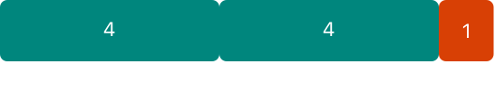

# 基本运算符

<ToBePolishedAfterTranslation />

<OriginalSource
  title="Basic Operators"
  url="https://docs.swift.org/swift-book/documentation/the-swift-programming-language/basicoperators"
  summary="执行赋值、算术和比较等操作"
/>

运算符是用于检查、更改或组合值的特殊符号或短语。例如，加法运算符 ( +) 将两个数字相加，如 中 `let i = 1 + 2`，逻辑与运算符 ( &&) 组合两个布尔值，如 中。`if enteredDoorCode && passedRetinaScan`

Swift 支持你可能已经从 C 等语言中了解的运算符，并改进了多项功能以消除常见的编码错误。赋值运算符 ( =) 不返回值，以防止在==打算等于运算符 ( ) 时错误地使用它。算术运算符（+、-、\*、/等%）检测并禁止值溢出，以避免在处理大于或小于存储它们的类型的允许值范围的数字时出现意外结果。你可以使用 Swift 的溢出运算符选择值溢出行为，如溢出运算符中所述。

Swift 还提供了 C 中没有的范围运算符，例如 `a..<b` and `a...b`，作为表示值范围的快捷方式。

本章介绍 Swift 中的常用运算符。Advanced Operators 涵盖了 Swift 的高级运算符，并描述了如何定义你自己的自定义运算符并为你自己的自定义类型实现标准运算符。

## 术语

运算符是一元的、二元的或三元的：

- 一元运算符对单个目标（例如-a）进行操作。一元前缀运算符紧接在它们的目标之前（例如!b），一元后缀运算符紧接在它们的目标之后（例如 c!）。
- 二元运算符对两个目标（例如 2 + 3）进行操作并且是中缀，因为它们出现在两个目标之间。
- 三元运算符在三个目标上运行。与 C 一样，Swift 只有一个三元运算符，即三元条件运算符 ( a ? b : c)。

运算符影响的值是操作数。在表达式中 1 + 2，+符号是一个中缀运算符，它的两个操作数是值 1 和 2。

## 赋值运算符

赋值运算符( )用 的 a = b 值初始化或更新 的值：ab

```swift
let b = 10
var a = 5
a = b
// a is now equal to 10
```

如果赋值的右边是一个有多个值的元组，它的元素可以一次性分解成多个常量或变量：

```swift
let (x, y) = (1, 2)
// x is equal to 1, and y is equal to 2
```

与 C 和 Objective-C 中的赋值运算符不同，Swift 中的赋值运算符本身并不返回值。以下声明无效：

```swift
if x = y {
    // This isn't valid, because x = y doesn't return a value.
}
```

此功能可防止在实际需要=等于运算符 ( ) 时意外使用赋值运算符 ( )。==通过使 if x = y 无效，Swift 帮助你避免代码中的这些类型的错误。

## 算术运算符

Swift 支持所有数字类型的四种标准算术运算符：

- 加法 ( +)
- 减法 ( -)
- 乘法 ( \*)
- 除法 ( /)

```swift
1 + 2       // equals 3
5 - 3       // equals 2
2 * 3       // equals 6
10.0 / 2.5  // equals 4.0
```

与 C 和 Objective-C 中的算术运算符不同，Swift 算术运算符默认情况下不允许值溢出。你可以使用 Swift 的溢出运算符（例如 ）来选择值溢出行为 a &+ b。请参阅溢出运算符。

连接也支持加法 String 运算符：

```swift
"hello, " + "world"  // equals "hello, world"
```

## 余数运算符

余数运算符( )a % b 计算出多少倍数 b 将适合内部 a 并返回剩余的值（称为余数）。

:::note
余数运算符 ( %) 在其它语言中也称为模运算符。然而，它在 Swift 中对负数的行为意味着，严格来说，它是余数而不是模运算。
:::

余数运算符的工作原理如下。要计算，你首先要算出里面可以装 9 % 4 多少 s ：49



你可以在 中放入两个 4s 9，剩下的是 1（以橙色显示）。

在 Swift 中，这将被写成：

```swift
9 % 4    // equals 1
```

为确定 的答案 a % b，%运算符计算以下等式并将 remainder 其作为输出返回：

`a= (bx some multiplier) + remainder`

其中是 some multiplier 的最大倍数。ba

将 9 和插入 4 到这个等式中得到：

`9= ( 4x 2) +1`

在计算 的负值的余数时应用相同的方法 a：

```swift
-9 % 4   // equals -1
```

将-9 和插入 4 到等式中得到：

`-9 = (4x -2) + -1`

给出余值-1。

b 对于 的负值，忽略 的符号 b。这意味着 a % banda % -b 总是给出相同的答案。

## 一元减运算符

-可以使用称为一元减号运算符的前缀来切换数值的符号：

```swift
let three = 3
let minusThree = -three       // minusThree equals -3
let plusThree = -minusThree   // plusThree equals 3, or "minus minus three"
```

一元减号运算符 ( -) 直接放在它所操作的值之前，没有任何空格。

## 一元加运算符

一元加运算符( +) 只返回它操作的值，没有任何变化：

```swift
let minusSix = -6
let alsoMinusSix = +minusSix  // alsoMinusSix equals -6
```

尽管一元加号运算符实际上不执行任何操作，但你可以使用它在代码中为正数提供对称性，同时还对负数使用一元减号运算符。

## 复合赋值运算符

与 C 一样，Swift 提供复合赋值运算符，将赋值 ( =) 与另一个操作组合在一起。一个例子是加法赋值运算符( +=)：

```swift
var a = 1
a += 2
// a is now equal to 3
```

该表达式 a += 2 是 的简写 a = a + 2。实际上，加法和赋值被合并到一个运算符中，同时执行这两项任务。

:::note
复合赋值运算符不返回值。例如，你不能写 let b = a += 2.
:::

有关 Swift 标准库提供的运算符的信息，请参阅运算符声明。

## 比较运算符

Swift 支持以下比较运算符：

- 等于 ( a == b)
- 不等于 ( a != b)
- 大于 ( a > b)
- 小于 ( a < b)
- 大于或等于 ( a >= b)
- 小于或等于 ( a <= b)

:::note
Swift 还提供了两个标识运算符（===和!==），你可以使用它们来测试两个对象引用是否都指向同一个对象实例。有关详细信息，请参阅身份运算符。
:::

每个比较运算符都返回一个 Bool 值来指示语句是否为真：

```swift
1 == 1   // true because 1 is equal to 1
2 != 1   // true because 2 isn't equal to 1
2 > 1    // true because 2 is greater than 1
1 < 2    // true because 1 is less than 2
1 >= 1   // true because 1 is greater than or equal to 1
2 <= 1   // false because 2 isn't less than or equal to 1
```

比较运算符常用于条件语句中，例如 if 语句：

```swift
let name = "world"
if name == "world" {
    print("hello, world")
} else {
    print("I'm sorry \(name), but I don't recognize you")
}
// Prints "hello, world", because name is indeed equal to "world".
```

有关该 if 语句的更多信息，请参阅控制流。

如果两个元组具有相同类型和相同数量的值，则可以比较它们。元组从左到右进行比较，一次比较一个值，直到比较发现两个不相等的值。比较这两个值，比较的结果决定了元组比较的整体结果。如果所有元素都相等，则元组本身也相等。例如：

```swift
(1, "zebra") < (2, "apple")   // true because 1 is less than 2; "zebra" and "apple" aren't compared
(3, "apple") < (3, "bird")    // true because 3 is equal to 3, and "apple" is less than "bird"
(4, "dog") == (4, "dog")      // true because 4 is equal to 4, and "dog" is equal to "dog"
```

在上面的示例中，你可以在第一行看到从左到右的比较行为。因为 1 小于 2，(1, "zebra")被认为小于(2, "apple")，而不管元组中的任何其它值如何。不"zebra"小于并不重要"apple"，因为比较已经由元组的第一个元素确定。但是，当元组的第一个元素相同时，将比较它们的第二个元素——这就是第二行和第三行发生的情况。

仅当运算符可以应用于相应元组中的每个值时，才可以将元组与给定运算符进行比较。例如，如下面的代码所示，你可以比较两个类型的元组，(String, Int)因为可以使用运算符比较 String 和值。相反，两个类型的元组不能与运算符进行比较，因为运算符不能应用于值。`Int<(String, Bool)<<Bool`

```swift
("blue", -1) < ("purple", 1)        // OK, evaluates to true
("blue", false) < ("purple", true)  // Error because < can't compare Boolean values
```

:::note
Swift 标准库包含用于少于七个元素的元组的元组比较运算符。要比较具有七个或更多元素的元组，你必须自己实现比较运算符。
:::

# 三元条件运算符

三元条件运算符是一个由三部分组成的特殊运算符，其形式为 question ? answer1 : answer2。它是根据是 question 真还是假评估两个表达式之一的快捷方式。如果 question 为真，则评估 answer1 并返回其值；否则，它计算 answer2 并返回它的值。

三元条件运算符是以下代码的简写：

```swift
if question {
    answer1
} else {
    answer2
}
```

下面是一个示例，它计算表格行的高度。如果行有标题，行高应该比内容高度高 50 磅，如果行没有标题，行高应该比内容高度高 20 磅：

```swift
let contentHeight = 40
let hasHeader = true
let rowHeight = contentHeight + (hasHeader ? 50 : 20)
// rowHeight is equal to 90
```

上面的例子是下面代码的简写：

```swift
let contentHeight = 40
let hasHeader = true
let rowHeight: Int
if hasHeader {
    rowHeight = contentHeight + 50
} else {
    rowHeight = contentHeight + 20
}
// rowHeight is equal to 90
```

第一个示例使用三元条件运算符意味着可以在一行代码中将其设置为正确的值，这比第二个示例中使用的代码更加简洁。rowHeight

三元条件运算符为决定考虑两个表达式中的哪一个提供了一种高效的简写形式。但是，请谨慎使用三元条件运算符。如果过度使用，它的简洁性会导致难以阅读的代码。避免将三元条件运算符的多个实例组合到一个复合语句中。

## 零合并运算符

nil-coalescing 运算符( )a ?? b 解包一个可选的 a，如果它包含一个值，或者返回一个默认值，b 如果 a 是 nil。表达式 a 始终是可选类型。表达式 b 必须与存储在 a.

nil-coalescing 运算符是以下代码的简写：

```swift
a != nil ? a! : b
```

上面的代码使用三元条件运算符和强制展开 ( ) 来访问 when isn't 时 a!包裹在里面的值，否则返回。nil-coalescing 运算符提供了一种更优雅的方式来以简洁易读的形式封装此条件检查和展开。aanilb

:::note
如果 的值为 anon- ，则不评估 nil 的值。b 这被称为短路评估。
:::

下面的示例使用 nil-coalescing 运算符在默认颜色名称和可选的用户定义颜色名称之间进行选择：

```swift
let defaultColorName = "red"
var userDefinedColorName: String?   // defaults to nil

var colorNameToUse = userDefinedColorName ?? defaultColorName
// userDefinedColorName is nil, so colorNameToUse is set to the default of "red"
```

该变量被定义为可选的，默认值为。因为是可选类型，所以可以使用 nil-coalescing 运算符来考虑它的值。在上面的示例中，运算符用于确定名为 的变量的初始值。因为是，所以表达式返回, 或 的值。userDefinedColorNameStringniluserDefinedColorNameStringcolorNameToUseuserDefinedColorNameniluserDefinedColorName ?? defaultColorNamedefaultColorName"red"

如果你分配一个非 nil 值并再次执行 nil-coalescing 运算符检查，则使用包裹在里面的值而不是默认值：userDefinedColorNameuserDefinedColorName

```swift
userDefinedColorName = "green"
colorNameToUse = userDefinedColorName ?? defaultColorName
// userDefinedColorName isn't nil, so colorNameToUse is set to "green"
```

## 范围运算符

Swift 包含几个范围运算符，它们是表示值范围的快捷方式。

封闭范围操作员
闭区间运算符( )定义从到 的 a...b 范围，并包括值和。的值不得大于。ababab

封闭范围运算符在迭代你希望使用所有值的范围时很有用，例如使用 for-in 循环：

```swift
for index in 1...5 {
    print("\(index) times 5 is \(index * 5)")
}
// 1 times 5 is 5
// 2 times 5 is 10
// 3 times 5 is 15
// 4 times 5 is 20
// 5 times 5 is 25
```

有关 for-in 循环的更多信息，请参阅控制流。

## 半开域算子

半开范围运算符( )定义从到 的 `a..<b` 范围，但不包括。据说它是半开的，因为它包含它的第一个值，但不包含它的最终值。与封闭范围运算符一样， 的值不得大于。如果 的值等于，则结果范围将为空。abbabab

当你使用从零开始的列表（例如数组）时，半开范围特别有用，其中计算到（但不包括）列表的长度非常有用：

```swift
let names = ["Anna", "Alex", "Brian", "Jack"]
let count = names.count
for i in 0..<count {
    print("Person \(i + 1) is called \(names[i])")
}
// Person 1 is called Anna
// Person 2 is called Alex
// Person 3 is called Brian
// Person 4 is called Jack
```

请注意，该数组包含四个项目，但 `0..<count` 只计算到 3（数组中最后一项的索引），因为它是一个半开范围。有关数组的更多信息，请参阅数组。

## 单边范围

对于在一个方向上尽可能连续的范围，封闭范围运算符有另一种形式 - 例如，范围包括数组中从索引 2 到数组末尾的所有元素。在这些情况下，你可以省略范围运算符一侧的值。这种范围称为单边范围，因为运算符只有一侧有值。例如：

```swift
for name in names[2...] {
    print(name)
}
// Brian
// Jack

for name in names[...2] {
    print(name)
}
// Anna
// Alex
// Brian
```

半开范围运算符也有一种单边形式，它只写有它的最终值。就像在两边都包含一个值一样，最终值不在范围内。例如：

```swift
for name in names[..<2] {
    print(name)
}
// Anna
// Alex
```

单边范围可用于其它上下文，而不仅仅是下标。你不能迭代省略第一个值的单边范围，因为不清楚迭代应该从哪里开始。你可以迭代忽略其最终值的单边范围；但是，因为范围无限期地继续，请确保为循环添加明确的结束条件。你还可以检查单边范围是否包含特定值，如下面的代码所示。

```swift
let range = ...5
range.contains(7)   // false
range.contains(4)   // true
range.contains(-1)  // true
```

## 逻辑运算符

逻辑运算符修改或组合布尔逻辑值 true 和 false。Swift 支持基于 C 的语言中的三种标准逻辑运算符：

- 逻辑非 ( `!a` )
- 逻辑与 ( `a && b` )
- 逻辑或 ( `a || b` )

## 逻辑非运算符

逻辑 NOT 运算符( !a) 反转布尔值，使 true 变为 false，然后 false 变为 true。

逻辑 NOT 运算符是一个前缀运算符，紧接在它所运算的值之前出现，没有任何空格。它可以读作"not a"，如下例所示：

```swift
let allowedEntry = false
if !allowedEntry {
    print("ACCESS DENIED")
}
// Prints "ACCESS DENIED"
```

该短语可以理解为"如果不允许进入"。仅当"不允许进入"为真时才执行后续行；也就是说，如果是。if !allowedEntryallowedEntryfalse

如本例所示，谨慎选择布尔常量和变量名称有助于保持代码的可读性和简洁性，同时避免双重否定或混淆逻辑语句。

## 逻辑与运算符

逻辑 AND 运算符( a && b) 创建逻辑表达式，其中两个值都必须 true 为整个表达式 true。

如果任一值为 false，则整个表达式也将为 false。事实上，如果第一个值为 false，则甚至不会计算第二个值，因为它不可能使整个表达式等于 true。这被称为短路评估。

此示例考虑两个 Bool 值，并且仅当两个值都是时才允许访问 true：

```swift
let enteredDoorCode = true
let passedRetinaScan = false
if enteredDoorCode && passedRetinaScan {
    print("Welcome!")
} else {
    print("ACCESS DENIED")
}
// Prints "ACCESS DENIED"
```

## 逻辑或运算符

逻辑或运算符( a || b) 是由两个相邻的竖线字符组成的中缀运算符。你可以使用它来创建逻辑表达式，其中只有两个值之一必须 true 为整个表达式 true。

与上面的逻辑 AND 运算符一样，逻辑 OR 运算符使用短路评估来考虑其表达式。如果逻辑或表达式的左侧是 true，则不计算右侧，因为它不能更改整个表达式的结果。

在下面的示例中，第一个 Bool 值 ( ) 是，但第二个值 ( ) 是。因为有一个值为，所以整个表达式的计算结果也为，并且允许访问：hasDoorKeyfalseknowsOverridePasswordtruetruetrue

```swift
let hasDoorKey = false
let knowsOverridePassword = true
if hasDoorKey || knowsOverridePassword {
    print("Welcome!")
} else {
    print("ACCESS DENIED")
}
// Prints "Welcome!"
```

## 组合逻辑运算符

你可以组合多个逻辑运算符来创建更长的复合表达式：

```swift
if enteredDoorCode && passedRetinaScan || hasDoorKey || knowsOverridePassword {
    print("Welcome!")
} else {
    print("ACCESS DENIED")
}
// Prints "Welcome!"
```

此示例使用多个&&and||运算符来创建更长的复合表达式。但是，&&and||运算符仍然只对两个值进行运算，所以这实际上是三个较小的表达式链接在一起。该示例可以理解为：

如果我们输入了正确的门密码并通过了视网膜扫描，或者如果我们有有效的门钥匙，或者如果我们知道紧急覆盖密码，则允许访问。

根据、和的值，前两个子表达式是。但是，紧急覆盖密码是已知的，因此整个复合表达式的计算结果仍为。enteredDoorCodepassedRetinaScanhasDoorKeyfalsetrue

:::note
Swift 逻辑运算符&&和||是左结合的，这意味着具有多个逻辑运算符的复合表达式首先计算最左边的子表达式。
:::

## 显式括号

有时在并非严格需要时包含圆括号很有用，可使复杂表达式的意图更易于阅读。在上面的门禁示例中，在复合表达式的第一部分周围添加括号以使其意图明确：

```swift
if (enteredDoorCode && passedRetinaScan) || hasDoorKey || knowsOverridePassword {
    print("Welcome!")
} else {
    print("ACCESS DENIED")
}
// Prints "Welcome!"
```

括号清楚地表明，前两个值被视为整体逻辑中单独的可能状态的一部分。复合表达式的输出没有改变，但总体意图对读者来说更加清晰。可读性总是优先于简洁；在有助于明确你的意图的地方使用括号。
