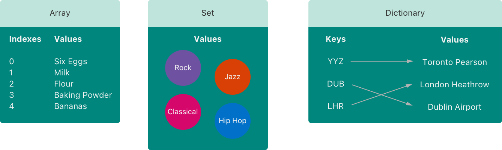
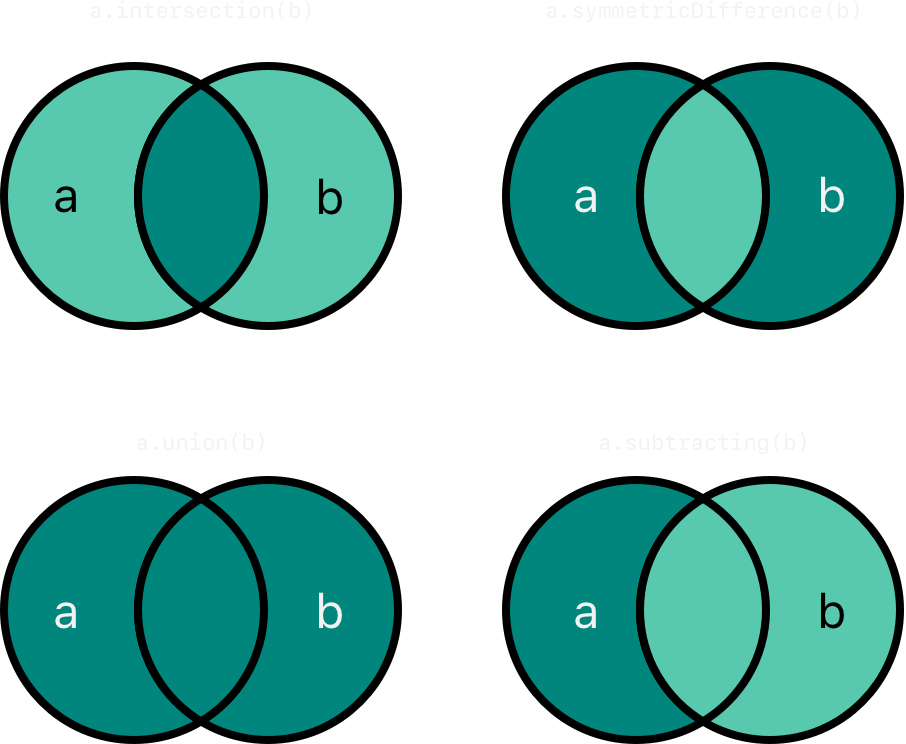
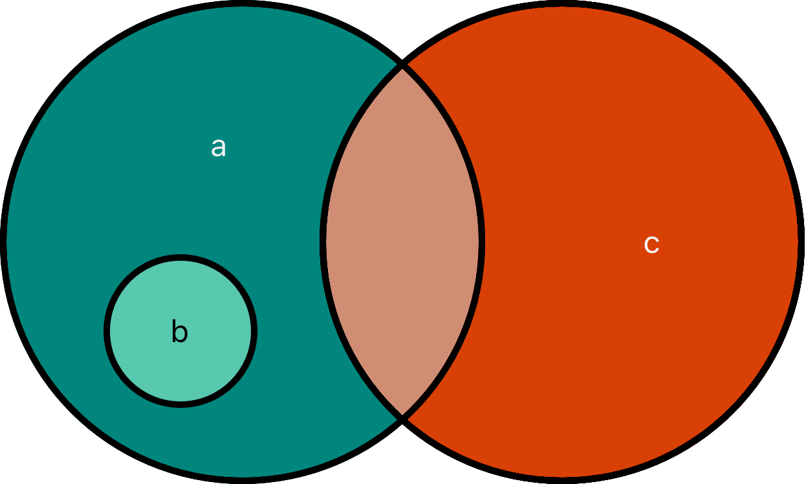

# 集合类型

<DocCaution />

<OriginalLink
  title="使用数组、集合和字典组织数据"
  value="https://docs.swift.org/swift-book/documentation/the-swift-programming-language/collectiontypes"
/>

Swift 提供了三种主要的集合类型，称为数组、集合和字典，用于存储值的集合。数组是有序的值集合。集合是唯一值的无序集合。字典是键值关联的无序集合。



Swift 中的数组、集合和字典总是清楚它们可以存储的值和键的类型。这意味着您不能错误地将错误类型的值插入到集合中。这也意味着您可以确信将从集合中检索的值类型。

:::note
Swift 的数组、集合和字典类型被实现为通用集合。有关泛型类型和集合的更多信息，请参阅 [泛型](../generics/) 。
:::

## 集合的可变性

如果您创建一个数组、一个集合或一个字典，并将其分配给一个变量，则创建的集合将是可变的。这意味着您可以在创建集合后通过添加、删除或更改集合中的项目来更改（或改变）集合。如果将数组、集合或字典分配给常量，则该集合是不可变的，并且其大小和内容无法更改。

:::note
在集合不需要更改的所有情况下创建不可变集合是一种很好的做法。这样做可以让您更轻松地推理您的代码，并使 Swift 编译器能够优化您创建的集合的性能。
:::

## 数组

数组将相同类型的值存储在有序列表中。同一个值可以在数组的不同位置多次出现。

:::note
Swift 的 Array 类型桥接到 Foundation 的 NSArray 类。

有关使用 ArrayFoundation 和 Cocoa 的更多信息，请参阅在 Array 和 NSArray 之间桥接。
:::

## 数组类型速记语法

Swift 数组的类型完整写为 `Array<Element>` ，其中 Element 是允许数组存储的值的类型。您还可以将数组的类型以简写形式写为 `[Element]`. 尽管这两种形式在功能上是相同的，但在提及数组类型时，首选简写形式并在本指南中通篇使用。

## 创建一个空数组

您可以使用初始化语法创建特定类型的空数组：

```swift
var someInts: [Int] = []
print("someInts is of type [Int] with \(someInts.count) items.")
// Prints "someInts is of type [Int] with 0 items."
```

请注意，变量的类型是从初始值设定项的类型推断出来的。someInts[Int]

或者，如果上下文已经提供了类型信息，例如函数参数或已经键入的变量或常量，则可以创建一个带有空数组文字的空数组，写为（一对空的方括号）`[]`：

```swift
someInts.append(3)
// someInts now contains 1 value of type Int
someInts = []
// someInts is now an empty array, but is still of type [Int]
```

## 创建具有默认值的数组

Swift 的 Array 类型还提供了一个初始化器，用于创建一个特定大小的数组，并将其所有值设置为相同的默认值。您向此初始值设定项传递适当类型的默认值（称为 repeating）：以及该值在新数组中重复的次数（称为 count）：

```swift
var threeDoubles = Array(repeating: 0.0, count: 3)
// threeDoubles is of type [Double], and equals [0.0, 0.0, 0.0]
```

## 通过将两个数组相加来创建数组

您可以通过使用加法运算符 ( +) 将具有兼容类型的两个现有数组相加来创建一个新数组。新数组的类型是根据您加在一起的两个数组的类型推断出来的：

```swift
var anotherThreeDoubles = Array(repeating: 2.5, count: 3)
// anotherThreeDoubles is of type [Double], and equals [2.5, 2.5, 2.5]

var sixDoubles = threeDoubles + anotherThreeDoubles
// sixDoubles is inferred as [Double], and equals [0.0, 0.0, 0.0, 2.5, 2.5, 2.5]
```

## 使用数组字面量创建数组

您还可以使用数组文字来初始化数组，这是一种将一个或多个值写成数组集合的简写方式。数组文字被写成值列表，用逗号分隔，并用一对方括号括起来：

```swift
[<#value 1#>, <#value 2#>, <#value 3#>]
```

下面的例子创建了一个数组来存储值：shoppingListString

```swift
var shoppingList: [String] = ["Eggs", "Milk"]
// shoppingList has been initialized with two initial items
```

该变量被声明为“字符串值数组”，写为. 因为此特定数组指定了 的值类型，所以它只允许存储值。在这里，数组用两个值（和）初始化，写在数组文字中。`shoppingList[String]StringStringshoppingListString"Eggs""Milk"`

:::note
该数组被声明为变量（使用介绍人）而不是常量（使用介绍人），因为在下面的示例中，更多项目被添加到购物清单中。shoppingListvarlet
:::

在这种情况下，数组字面量 String 只包含两个值。这与变量声明的类型（一个只能包含值的数组）相匹配，因此允许数组文字的赋值作为使用两个初始项进行初始化的一种方式。shoppingListStringshoppingList

多亏了 Swift 的类型推断，如果您使用包含相同类型值的数组字面量对其进行初始化，则不必编写数组的类型。的初始化可以写成更短的形式：shoppingList

```swift
var shoppingList = ["Eggs", "Milk"]
```

因为数组文字中的所有值都是同一类型，Swift 可以推断这[String]是用于变量的正确类型。shoppingList

## 访问和修改数组

您可以通过数组的方法和属性，或使用下标语法来访问和修改数组。

要找出数组中的项目数，请检查其只读 count 属性：

```swift
print("The shopping list contains \(shoppingList.count) items.")
// Prints "The shopping list contains 2 items."
```

使用布尔属性作为检查属性是否等于的快捷方式：isEmptycount0

```swift
if shoppingList.isEmpty {
    print("The shopping list is empty.")
} else {
    print("The shopping list isn't empty.")
}
// Prints "The shopping list isn't empty."
```

您可以通过调用数组的方法将新项目添加到数组的末尾 `append(_:)：`

```swift
shoppingList.append("Flour")
// shoppingList now contains 3 items, and someone is making pancakes
```

或者，使用加法赋值运算符 ( ) 附加一个或多个兼容项的数组+=：

```swift
shoppingList += ["Baking Powder"]
// shoppingList now contains 4 items
shoppingList += ["Chocolate Spread", "Cheese", "Butter"]
// shoppingList now contains 7 items
```

使用下标语法从数组中检索值，在数组名称后立即在方括号内传递要检索的值的索引：

```swift
var firstItem = shoppingList[0]
// firstItem is equal to "Eggs"
```

:::note
数组中的第一项的索引为 0，而不是 1。Swift 中的数组总是从零开始索引的。
:::

您可以使用下标语法更改给定索引处的现有值：

```swift
shoppingList[0] = "Six eggs"
// the first item in the list is now equal to "Six eggs" rather than "Eggs"
```

当您使用下标语法时，您指定的索引需要有效。例如，尝试将一个项目追加到数组的末尾会导致运行时错误。

`shoppingList[shoppingList.count] = "Salt"`

您还可以使用下标语法一次更改一个值范围，即使替换值集的长度与您要替换的范围的长度不同。以下示例将"Chocolate Spread","Cheese"和替换"Butter"为"Bananas"and "Apples"：

```swift
shoppingList[4...6] = ["Bananas", "Apples"]
// shoppingList now contains 6 items
```

要在指定索引处将项目插入数组，请调用数组的方法：`insert(_:at:)`

```swift
shoppingList.insert("Maple Syrup", at: 0)
// shoppingList now contains 7 items
// "Maple Syrup" is now the first item in the list
```

对该方法的调用将在购物清单的最开头插入一个值为 的新商品，由 的索引指示。`insert(_:at:)"Maple Syrup"0`

同样，您可以使用 方法从数组中删除一个项目 remove(at:)。此方法删除指定索引处的项目并返回删除的项目（尽管如果不需要，可以忽略返回值）：

```swift
let mapleSyrup = shoppingList.remove(at: 0)
// the item that was at index 0 has just been removed
// shoppingList now contains 6 items, and no Maple Syrup
// the mapleSyrup constant is now equal to the removed "Maple Syrup" string
```

:::note
如果您尝试访问或修改超出数组现有范围的索引值，您将触发运行时错误。您可以通过将索引与数组的属性进行比较来检查索引是否有效，然后再使用它 count。数组中最大的有效索引是 count - 1 因为数组是从零开始索引的——然而，当 count 它 0（意味着数组为空）时，没有有效索引。
:::

当一个项目被移除时，数组中的任何间隙都会被关闭，因此索引处的值 0 再次等于"Six eggs"：

```swift
firstItem = shoppingList[0]
// firstItem is now equal to "Six eggs"
```

如果要从数组中删除最后一项，请使用方法而不是方法来避免查询数组的属性。与该方法一样，返回已删除的项目：`removeLast()remove(at:)countremove(at:)removeLast()`

```swift
let apples = shoppingList.removeLast()
// the last item in the array has just been removed
// shoppingList now contains 5 items, and no apples
// the apples constant is now equal to the removed "Apples" string
```

## 遍历数组

for 您可以使用-循环遍历数组中的整组值 in：

```swift
for item in shoppingList {
    print(item)
}
// Six eggs
// Milk
// Flour
// Baking Powder
// Bananas
```

如果您需要每个项目的整数索引及其值，请改用该 enumerated()方法遍历数组。对于数组中的每个项目，该 enumerated()方法返回一个由整数和项目组成的元组。整数从零开始，每一项加一；如果您枚举整个数组，这些整数与项的索引相匹配。作为迭代的一部分，您可以将元组分解为临时常量或变量：

```swift
for (index, value) in shoppingList.enumerated() {
    print("Item \(index + 1): \(value)")
}
// Item 1: Six eggs
// Item 2: Milk
// Item 3: Flour
// Item 4: Baking Powder
// Item 5: Bananas
```

for 有关-循环的更多信息 in，请参阅 For-In 循环。

## 集合

集合将相同类型的不同值存储在一个集合中，没有定义顺序。当项目的顺序不重要时，或者当您需要确保一个项目只出现一次时，您可以使用集合而不是数组。

:::note
Swift 的 Set 类型桥接到 Foundation 的 NSSet 类。

有关使用 SetFoundation 和 Cocoa 的更多信息，请参阅桥接 Set 和 NSSet。
:::

## 集合类型的哈希值

一个类型必须是可散列的才能存储在一个集合中——也就是说，该类型必须提供一种方法来为自己计算散列值。散列值是 Int 所有比较相等的对象都相同的值，这样如果 a == b，散列值 a 等于 的散列值 b。

Swift 的所有基本类型（例如 String、Int、Double 和 Bool）在默认情况下都是可哈希的，并且可以用作设置值类型或字典键类型。默认情况下，没有关联值的枚举案例值（如枚举中所述）也是可散列的。

:::note
您可以使用自己的自定义类型作为设置值类型或字典键类型，方法是使它们符合 HashableSwift 标准库中的协议。有关实现所需 hash(into:)方法的信息，请参阅 Hashable。有关遵守协议的信息，请参阅协议。
:::

## 设置类型语法

Swift 集合的类型写为 `Set<Element>`，其中 Element 是集合允许存储的类型。与数组不同，集合没有等效的简写形式。

## 创建和初始化空集

您可以使用初始化语法创建特定类型的空集：

```swift
var letters = Set<Character>()
print("letters is of type Set<Character> with \(letters.count) items.")
// Prints "letters is of type Set<Character> with 0 items."
```

:::note
从初始值设定项的类型 letters 推断变量的类型为 , 。`Set<Character>`
:::

或者，如果上下文已经提供了类型信息，例如函数参数或已经类型化的变量或常量，您可以使用空数组文字创建一个空集：

```swift
letters.insert("a")
// letters now contains 1 value of type Character
letters = []
// letters is now an empty set, but is still of type Set<Character>
```

## 使用数组字面量创建集合

您还可以使用数组字面量初始化集合，作为将一个或多个值写入集合集合的一种简写方式。

下面的示例创建了一个名为存储值的集合：favoriteGenresString

```swift
var favoriteGenres: Set<String> = ["Rock", "Classical", "Hip hop"]
// favoriteGenres has been initialized with three initial items
```

该变量被声明为“一组值”，写为. 由于此特定集合指定了 的值类型，因此它只允许存储值。此处，该集合使用三个值（、和）初始化，写在数组文字中。`favoriteGenresStringSet<String>StringStringfavoriteGenresString"Rock""Classical""Hip hop"`

:::note
该集合被声明为变量（使用介绍人）而不是常量（使用介绍人），因为在下面的示例中添加和删除了项目。favoriteGenresvarlet
:::

不能仅从数组文字中推断出集合类型，因此 Set 必须显式声明该类型。但是，由于 Swift 的类型推断，如果您使用仅包含一种类型值的数组字面量对其进行初始化，则不必编写集合元素的类型。的初始化可以写成更短的形式：favoriteGenres

```swift
var favoriteGenres: Set = ["Rock", "Classical", "Hip hop"]
```

因为数组文字中的所有值都是同一类型，Swift 可以推断这 `Set<String>` 是用于变量的正确类型。favoriteGenres

## 访问和修改集合

您可以通过其方法和属性访问和修改一个集合。

要找出集合中的项目数，请检查其只读 count 属性：

```swift
print("I have \(favoriteGenres.count) favorite music genres.")
// Prints "I have 3 favorite music genres."
```

使用布尔属性作为检查属性是否等于的快捷方式：isEmptycount0

```swift
if favoriteGenres.isEmpty {
    print("As far as music goes, I'm not picky.")
} else {
    print("I have particular music preferences.")
}
// Prints "I have particular music preferences."
```

您可以通过调用集合的方法将新项目添加到集合中 insert(\_:)：

```swift
favoriteGenres.insert("[Tool J]")
// favoriteGenres now contains 4 items
```

您可以通过调用集合的 `remove(_:)` 方法从集合中删除一个项目，如果该项目是集合的成员，该方法将删除该项目，并返回删除的值，或者 nil 如果集合不包含它则返回。或者，可以使用其方法删除集合中的所有项目。removeAll()

```swift
if let removedGenre = favoriteGenres.remove("Rock") {
    print("\(removedGenre)? I'm over it.")
} else {
    print("I never much cared for that.")
}
// Prints "Rock? I'm over it."
```

要检查集合是否包含特定项目，请使用 `contains(_:)` 方法。

```swift
if favoriteGenres.contains("Funk") {
    print("I get up on the good foot.")
} else {
    print("It's too funky in here.")
}
// Prints "It's too funky in here."
```

迭代一个集合

for 您可以使用-循环迭代集合中的值 in。

```swift
for genre in favoriteGenres {
    print("\(genre)")
}
// Classical
// [Tool J]
// Hip hop
```

for 有关-循环的更多信息 in，请参阅 For-In 循环。

Swift 的 Set 类型没有定义的顺序。要以特定顺序迭代集合的值，请使用 方法 sorted()，该方法将集合的元素作为使用 `<` 运算符排序的数组返回。

```swift
for genre in favoriteGenres.sorted() {
    print("\(genre)")
}
// Classical
// Hip hop
// [Tool J]
```

## 执行集合运算

您可以高效地执行基本的集合操作，例如将两个集合组合在一起，确定两个集合有哪些共同的值，或者确定两个集合是否包含全部、部分或不包含相同的值。

## 基本集合运算

下图描绘了两个集合——a 和 b——以及由阴影区域表示的各种集合操作的结果。



- 使用该 `intersection(_:)` 方法创建一个仅包含两个集合共有的值的新集合。
- 使用该方法创建一个新集合，其中包含任一集合中的值，但不能同时包含两个集合中的值。`symmetricDifference(_:)`
- 使用该 `union(_:)` 方法创建一个包含两个集合中所有值的新集合。
- 使用该 `subtracting(_:)` 方法创建一个新集合，其值不在指定集合中。

```swift
let oddDigits: Set = [1, 3, 5, 7, 9]
let evenDigits: Set = [0, 2, 4, 6, 8]
let singleDigitPrimeNumbers: Set = [2, 3, 5, 7]

oddDigits.union(evenDigits).sorted()
// [0, 1, 2, 3, 4, 5, 6, 7, 8, 9]
oddDigits.intersection(evenDigits).sorted()
// []
oddDigits.subtracting(singleDigitPrimeNumbers).sorted()
// [1, 9]
oddDigits.symmetricDifference(singleDigitPrimeNumbers).sorted()
// [1, 2, 9]
```

## 设置成员资格和平等

下图描绘了三个集合 —a 和— 重叠区域表示集合之间共享的元素 b。cSeta 是 set 的超集 b，因为 a 包含 中的所有元素 b。相反，setb 是 set 的子集 a，因为 中的所有元素 b 也都包含在 中 a。Setb 和 set 彼此不相交，因为它们没有共同的 c 元素。



- 使用“等于”运算符 ( ==) 来确定两个集合是否包含所有相同的值。
- 使用该方法确定一个集合的所有值是否都包含在指定的集合中。`isSubset(of:)`
- 使用该方法确定一个集合是否包含指定集合中的所有值。`isSuperset(of:)`
- 使用或方法确定一个集合是子集还是超集，但不等于指定集合。`isStrictSubset(of:)` `isStrictSuperset(of:)`
- 使用该方法确定两个集合是否没有共同的值。`isDisjoint(with:)`

```swift
let houseAnimals: Set = ["🐶", "🐱"]
let farmAnimals: Set = ["🐮", "🐔", "🐑", "🐶", "🐱"]
let cityAnimals: Set = ["🐦", "🐭"]

houseAnimals.isSubset(of: farmAnimals)
// true
farmAnimals.isSuperset(of: houseAnimals)
// true
farmAnimals.isDisjoint(with: cityAnimals)
// true
```

## 字典

字典存储集合中相同类型的键和相同类型的值之间的关联，没有定义顺序。每个值都与一个唯一的键相关联，该键充当该值在字典中的标识符。与数组中的项目不同，字典中的项目没有指定的顺序。当您需要根据标识符查找值时，您可以使用字典，这与现实世界中使用字典查找特定单词定义的方式大致相同。

:::note
Swift 的 Dictionary 类型桥接到 Foundation 的 `NSDictionary` 类。

有关使用 DictionaryFoundation 和 Cocoa 的更多信息，请参阅 Bridging Between Dictionary 和 NSDictionary。
:::

## 字典类型速记语法

Swift 字典的类型完整写为 `Dictionary<Key, Value>`，其中 Key 是可用作字典键的值的类型，Value 是字典为这些键存储的值的类型。

:::note
字典 Key 类型必须符合 Hashable 协议，就像集合的值类型一样。
:::

您还可以将字典的类型简写为[Key: Value]. 尽管这两种形式在功能上是相同的，但在提及字典类型时，首选简写形式并在本指南中通篇使用。

## 创建一个空字典

与数组一样，您可以 Dictionary 使用初始化语法创建特定类型的空：

```swift
var namesOfIntegers: [Int: String] = [:]
// namesOfIntegers is an empty [Int: String] dictionary
```

此示例创建一个空字典类型 `[Int: String]` 来存储人类可读的整数值名称。它的键是 type Int，它的值是 type String。

如果上下文已经提供了类型信息，你可以用一个空的字典字面量创建一个空字典，写成[:]（一对方括号内的一个冒号）：

```swift
namesOfIntegers[16] = "sixteen"
// namesOfIntegers now contains 1 key-value pair
namesOfIntegers = [:]
// namesOfIntegers is once again an empty dictionary of type [Int: String]
```

## 使用字典文字创建字典

您还可以使用字典字面量初始化字典，它与前面看到的数组字面量具有相似的语法。字典文字是一种将一个或多个键值对写成 Dictionary 集合的简写方式。

键值对是键和值的组合。在字典文字中，每个键值对中的键和值由冒号分隔。键值对写成一个列表，用逗号分隔，用一对方括号括起来：

```swift
[<#key 1#>: <#value 1#>, <#key 2#>: <#value 2#>, <#key 3#>: <#value 3#>]
```

下面的示例创建了一个字典来存储国际机场的名称。在这个字典中，键是三个字母的国际航空运输协会代码，值是机场名称：

```swift
var airports: [String: String] = ["YYZ": "Toronto Pearson", "DUB": "Dublin"]
```

字典 airports 被声明为具有 类型 `[String: String]`，这意味着“一个 Dictionary 其键为 类型 String，其值也为 类型 String”的对象。

:::note
字典 airports 被声明为变量（使用介绍人 var），而不是常量（使用 let 介绍人），因为在下面的例子中更多的机场被添加到字典中。
:::

字典 airports 使用包含两个键值对的字典文字进行初始化。第一对有一个键"YYZ"和一个值"Toronto Pearson"。第二对有一个键"DUB"和一个值"Dublin"。

这个字典文字包含两 String: String 对。这个键值类型匹配 airports 变量声明的类型（一个只有 String 键和 String 值的字典），所以字典文字的赋值被允许作为用 airports 两个初始项初始化字典的一种方式。

与数组一样，如果使用其键和值具有一致类型的字典文字对其进行初始化，则不必编写字典的类型。的初始化 airports 可以写成更短的形式：

```swift
var airports = ["YYZ": "Toronto Pearson", "DUB": "Dublin"]
```

因为字面量中的所有键都属于同一类型，同样所有值也属于同一类型，Swift 可以推断这是用于字典的 `[String: String]` 正确类型 airports。

## 访问和修改字典

您可以通过字典的方法和属性，或使用下标语法来访问和修改字典。

Dictionary 与数组一样，您可以通过检查其只读 count 属性来找出 a 中的项目数：

```swift
print("The airports dictionary contains \(airports.count) items.")
// Prints "The airports dictionary contains 2 items."
```

使用布尔属性作为检查属性是否等于的快捷方式：`isEmptycount0`

```swift
if airports.isEmpty {
    print("The airports dictionary is empty.")
} else {
    print("The airports dictionary isn't empty.")
}
// Prints "The airports dictionary isn't empty."
```

您可以使用下标语法将新项目添加到字典中。使用适当类型的新键作为下标索引，并分配适当类型的新值：

```swift
airports["LHR"] = "London"
// the airports dictionary now contains 3 items
```

您还可以使用下标语法来更改与特定键关联的值：

```swift
airports["LHR"] = "London Heathrow"
// the value for "LHR" has been changed to "London Heathrow"
```

作为下标的替代方法，使用字典的方法来设置或更新特定键的值。与上面的下标示例一样，如果键不存在，则该方法会设置一个值，如果该键已存在，则更新该值。然而，与下标不同的是，该方法在执行更新后返回旧值。这使您能够检查是否发生了更新。`updateValue(_:forKey:)updateValue(_:forKey:)updateValue(_:forKey:)`

该方法返回字典值类型的可选值。例如，对于存储值的字典，该方法返回 type 或“optional ”的值。此可选值包含该键的旧值，如果在更新之前存在，或者如果不存在任何值：`updateValue(_:forKey:)StringString?Stringnil`

```swift
if let oldValue = airports.updateValue("Dublin Airport", forKey: "DUB") {
    print("The old value for DUB was \(oldValue).")
}
// Prints "The old value for DUB was Dublin."
```

您还可以使用下标语法从字典中检索特定键的值。因为可以请求不存在值的键，所以字典的下标返回字典值类型的可选值。如果字典包含所请求键的值，则下标返回一个可选值，其中包含该键的现有值。否则，下标返回 nil：

```swift
if let airportName = airports["DUB"] {
    print("The name of the airport is \(airportName).")
} else {
    print("That airport isn't in the airports dictionary.")
}
// Prints "The name of the airport is Dublin Airport."
```

`nil` 您可以使用下标语法通过为该键分配值来从字典中删除键值对：

```swift
airports["APL"] = "Apple International"
// "Apple International" isn't the real airport for APL, so delete it
airports["APL"] = nil
// APL has now been removed from the dictionary
```

或者，使用 方法从字典中删除键值对。此方法删除键值对（如果存在）并返回删除的值，如果不存在则返回：`removeValue(forKey:) nil`

```swift
if let removedValue = airports.removeValue(forKey: "DUB") {
    print("The removed airport's name is \(removedValue).")
} else {
    print("The airports dictionary doesn't contain a value for DUB.")
}
// Prints "The removed airport's name is Dublin Airport."
```

## 遍历字典

for 您可以使用-循环遍历字典中的键值对 in。字典中的每个项目都作为元组返回(key, value)，您可以将元组的成员分解为临时常量或变量作为迭代的一部分：

```swift
for (airportCode, airportName) in airports {
    print("\(airportCode): \(airportName)")
}
// LHR: London Heathrow
// YYZ: Toronto Pearson
```

for 有关-循环的更多信息 in，请参阅 For-In 循环。

keys 您还可以通过访问其和属性来检索字典键或值的可迭代集合 values：

```swift
for airportCode in airports.keys {
    print("Airport code: \(airportCode)")
}
// Airport code: LHR
// Airport code: YYZ

for airportName in airports.values {
    print("Airport name: \(airportName)")
}
// Airport name: London Heathrow
// Airport name: Toronto Pearson
```

如果您需要将字典的键或值与采用实例的 API 一起使用，请使用 or 属性 Array 初始化一个新数组：keysvalues

```swift
let airportCodes = [String](airports.keys)
// airportCodes is ["LHR", "YYZ"]

let airportNames = [String](airports.values)
// airportNames is ["London Heathrow", "Toronto Pearson"]
```

Swift 的 Dictionary 类型没有定义的顺序。要以特定顺序遍历字典的键或值，请使用 `sorted()` 其 keysorvalues 属性上的方法。
