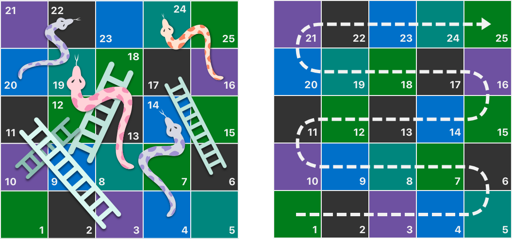
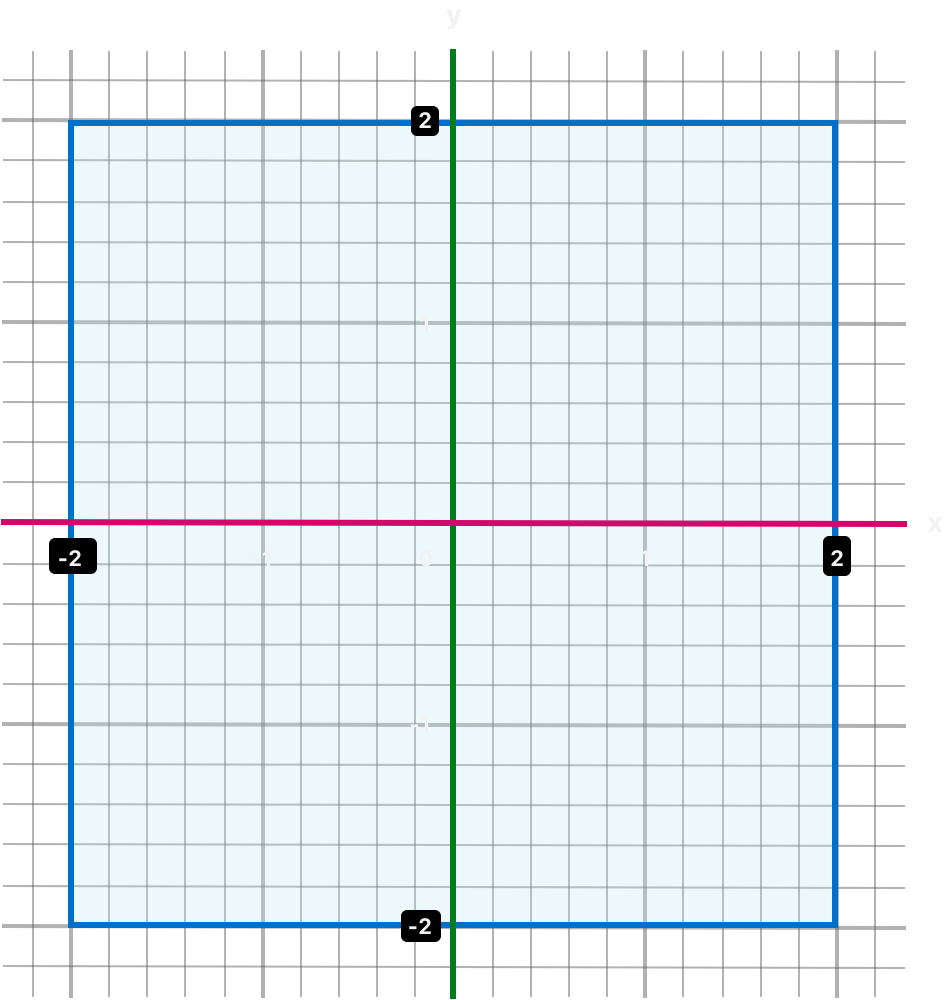
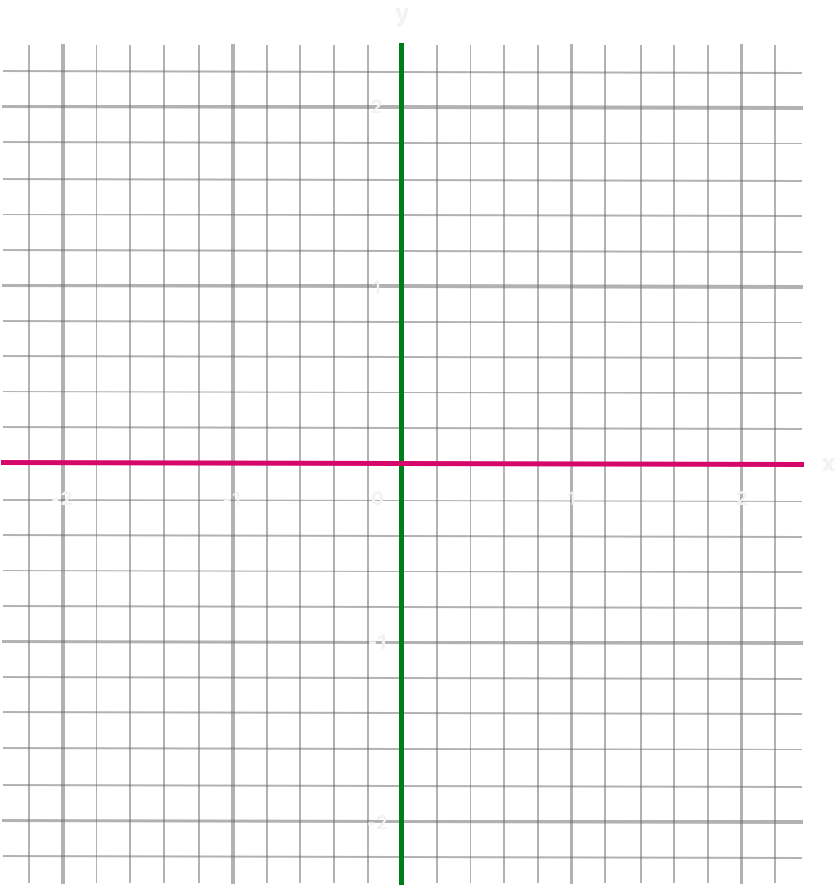
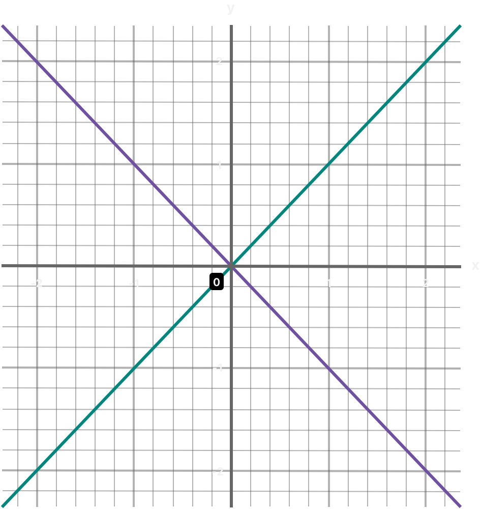

# 控制流

<ToBePolishedAfterTranslation />

<OriginalSource
  title="Control Flow"
  url="https://docs.swift.org/swift-book/documentation/the-swift-programming-language/controlflow"
  summary="使用分支、循环和提前退出来构建代码"
/>

Swift 提供了多种控制流语句。这些包括 while 多次执行任务的循环；if, guard, 和 switch 语句根据特定条件执行不同的代码分支；和语句，例如 breakandcontinue 将执行流转移到代码中的另一点。

Swift 还提供了一个 for-in 循环，可以轻松迭代数组、字典、范围、字符串和其它序列。

Swift 的 switch 语句比许多类 C 语言中的对应语句强大得多。案例可以匹配许多不同的模式，包括区间匹配、元组和特定类型的转换。案例中的匹配值 switch 可以绑定到临时常量或变量以在案例主体内使用，复杂的匹配条件可以用 where 每个案例的子句来表达。

## For-In 循环

你可以使用 for-in 循环遍历序列，例如数组中的项目、数字范围或字符串中的字符。

该示例使用 for-in 循环迭代数组中的项目：

```swift
let names = ["Anna", "Alex", "Brian", "Jack"]
for name in names {
    print("Hello, \(name)!")
}
// Hello, Anna!
// Hello, Alex!
// Hello, Brian!
// Hello, Jack!
```

你还可以遍历字典以访问其键值对。(key, value)迭代字典时，字典中的每个项目都作为元组返回，你可以将元组的成员分解为明确命名的常量，以便在-循环(key, value)体内使用。在下面的代码示例中，字典的键被分解为名为 的常量，字典的值被分解为名为 的常量。forinanimalNamelegCount

```swift
let numberOfLegs = ["spider": 8, "ant": 6, "cat": 4]
for (animalName, legCount) in numberOfLegs {
    print("\(animalName)s have \(legCount) legs")
}
// cats have 4 legs
// ants have 6 legs
// spiders have 8 legs
```

a 的内容 Dictionary 本质上是无序的，迭代它们并不能保证检索它们的顺序。特别是，你将项目插入 a 的顺序 Dictionary 并没有定义它们被迭代的顺序。有关数组和字典的更多信息，请参阅集合类型。

你还可以使用 for-in 带有数字范围的循环。该示例打印五次表中的前几个条目：

```swift
for index in 1...5 {
    print("\(index) times 5 is \(index * 5)")
}
// 1 times 5 is 5
// 2 times 5 is 10
// 3 times 5 is 15
// 4 times 5 is 20
// 5 times 5 is 25
```

1 被迭代的序列是从到 的数字范围 5，包括闭范围运算符 ( ) 所示...。的值 index 设置为范围 ( 1) 中的第一个数字，并执行循环内的语句。在这种情况下，循环只包含一个语句，它从 5 次表中为 的当前值打印一个条目 index。执行该语句后，更新 的值 index 以包含范围 ( 2) 中的第二个值，并再次调用该函数。这个过程一直持续到到达范围的末端。print(\_:separator:terminator:)

在上面的示例中，index 是一个常量，其值在循环的每次迭代开始时自动设置。因此，index 不必在使用前声明。它通过包含在循环声明中而隐式声明，不需要 let 声明关键字。

如果不需要序列中的每个值，可以使用下划线代替变量名来忽略这些值。

```swift
let base = 3
let power = 10
var answer = 1
for _ in 1...power {
    answer *= base
}
print("\(base) to the power of \(power) is \(answer)")
// Prints "3 to the power of 10 is 59049"
```

上面的示例计算一个数的值的另一个次方（在本例中 3 为 的次方 10）。它使用以 开头和结尾的封闭范围，将 的起始值 1（即 的 3 次方 0）乘以 10 次。对于此计算，每次通过循环的单独计数器值都是不必要的——代码只是执行循环正确的次数。用于代替循环变量的下划线字符 ( ) 会导致忽略各个值，并且在循环的每次迭代期间不提供对当前值的访问。3110\_

在某些情况下，你可能不想使用包含两个端点的封闭范围。考虑在表盘上绘制每一分钟的刻度线。你想画 60 刻度线，从 0 分钟开始。使用半开范围运算符 ( `..<`) 包括下限但不包括上限。有关范围的更多信息，请参阅范围运算符。

```swift
let minutes = 60
for tickMark in 0..<minutes {
    // render the tick mark each minute (60 times)
}
```

有些用户可能希望在他们的 UI 中使用更少的刻度线。他们可能更喜欢每 5 分钟一分。使用该功能跳过不需要的标记。stride(from:to:by:)

```swift
let minuteInterval = 5
for tickMark in stride(from: 0, to: minutes, by: minuteInterval) {
    // render the tick mark every 5 minutes (0, 5, 10, 15 ... 45, 50, 55)
}
```

也可以使用封闭范围，方法是使用：`stride(from:through:by:)`

```swift
let hours = 12
let hourInterval = 3
for tickMark in stride(from: 3, through: hours, by: hourInterval) {
    // render the tick mark every 3 hours (3, 6, 9, 12)
}
```

上面的示例使用 for-in 循环来迭代范围、数组、字典和字符串。但是，你可以使用此语法迭代任何集合，包括你自己的类和集合类型，只要这些类型符合 Sequence 协议即可。

## 循环

循环 while 执行一组语句，直到条件变为 false。当在第一次迭代开始之前不知道迭代次数时，最好使用这些类型的循环。Swift 提供了两种 while 循环：

- while 在每次循环开始时评估其条件。
- repeat-while 在每次循环结束时评估其条件。

## 尽管

循环 while 从评估单个条件开始。如果条件是 true，则重复一组语句，直到条件变为 false。

这是循环的一般形式 while：

```swift
while <#condition#> {
   <#statements#>
}
```

该示例玩一个简单的蛇梯子游戏（也称为 Chutes and Ladders）：



游戏规则如下：

- 棋盘有 25 个方格，目标是落在 25 个方格之上或之后。
- 玩家的起始方块是"方块零"，就在棋盘的左下角附近。
- 每一轮，你掷一个六面骰子并按照上面虚线箭头指示的水平路径移动该数量的方块。
- 如果你的回合在梯子的底部结束，你就向上移动那个梯子。
- 如果你的回合在一条蛇的头上结束，你就沿着那条蛇向下移动。

游戏板由一组值表示 Int。它的大小基于一个名为 的常量，该常量用于初始化数组并在示例后面的部分检查获胜条件。因为玩家从棋盘开始，在"零方格"上，棋盘初始化为 26 个零值，而不是 25 个。finalSquareInt

```swift
let finalSquare = 25
var board = [Int](repeating: 0, count: finalSquare + 1)
```

然后将一些方块设置为具有更具体的蛇和梯子值。带有梯子底座的方块有一个正数可以让你在棋盘上向上移动，而带有蛇头的方块有一个负数可以让你在棋盘上向下移动。

```swift
board[03] = +08; board[06] = +11; board[09] = +09; board[10] = +02
board[14] = -10; board[19] = -11; board[22] = -02; board[24] = -08
```

方块 3 包含梯子的底部，可将你移动到方块 11。为了表示这一点，board[03]等于+08，它相当于（和 8 之间的差值）的整数值。为了对齐值和语句，一元加号运算符 ( ) 明确地与一元减号运算符 ( ) 一起使用，小于的数字用零填充。（这两种风格技术都不是绝对必要的，但它们会导致更整洁的代码。）311+i-i10

```swift
var square = 0
var diceRoll = 0
while square < finalSquare {
    // roll the dice
    diceRoll += 1
    if diceRoll == 7 { diceRoll = 1 }
    // move by the rolled amount
    square += diceRoll
    if square < board.count {
        // if we're still on the board, move up or down for a snake or a ladder
        square += board[square]
    }
}
print("Game over!")
```

上面的示例使用了一种非常简单的掷骰子方法。它不是生成一个随机数，而是从一个值开始。每次通过循环时，递增 1，然后检查它是否变得太大。每当此返回值等于 时，骰子掷骰变得太大并重置为值。结果是一系列始终为, , , , , ,等的值。diceRoll0whilediceRoll71diceRoll12345612

掷骰子后，玩家向前移动一个方格。掷骰子可能已将玩家移动到第 25 格之外，在这种情况下游戏结束。为了应对这种情况，代码会检查小于数组属性的值。如果有效，则将存储的值添加到当前值，以使玩家在任何梯子或蛇上上下移动。diceRollsquareboardcountsquareboard[square]square

:::note
如果不执行此检查，board[square]可能会尝试访问数组边界之外的值 board，这会触发运行时错误。
:::

当前 while 循环执行然后结束，并检查循环条件以查看是否应再次执行循环。如果玩家已经移动到或超过 square number 25，则循环的条件评估为 false 并且游戏结束。

在这种情况下，循环 while 是合适的，因为在循环开始时游戏的长度并不清楚 while。相反，循环会一直执行到满足特定条件为止。

## 重复

循环的另一种变体 while，称为 repeat-循环，在考虑循环的条件之前 while，首先执行一次循环块。然后它继续重复循环，直到条件为。false

:::note
repeatSwift 中的-循环 while 类似于其它语言中的 do-while 循环。
:::

repeat 这是-循环的一般形式 while：

```swift
repeat {
   <#statements#>
} while <#condition#>
```

这里又是蛇与梯子的例子，写成一个 repeat-while 循环而不是一个 while 循环。、、和的值的初始化方式与循环完全相同。`finalSquareboardsquarediceRollwhile`

```swift
let finalSquare = 25
var board = [Int](repeating: 0, count: finalSquare + 1)
board[03] = +08; board[06] = +11; board[09] = +09; board[10] = +02
board[14] = -10; board[19] = -11; board[22] = -02; board[24] = -08
var square = 0
var diceRoll = 0
```

在这个版本的游戏中，循环中的第一个动作是检查梯子或蛇。棋盘上没有阶梯可以让玩家直接到达第 25 格，因此不可能通过爬上阶梯来赢得比赛。因此，将检查蛇或梯子作为循环中的第一个动作是安全的。

游戏开始时，玩家处于"零格"。board[0]总是等于 0 并且没有效果。

```swift
repeat {
    // move up or down for a snake or ladder
    square += board[square]
    // roll the dice
    diceRoll += 1
    if diceRoll == 7 { diceRoll = 1 }
    // move by the rolled amount
    square += diceRoll
} while square < finalSquare
print("Game over!")
```

代码检查蛇和梯子后，掷骰子，玩家向前移动方格。当前循环执行结束。diceRoll

循环的条件 ( ) 与之前相同，但这次直到循环的第一次运行结束时才对其求值。-循环的结构比前面例子中的循环更适合这个游戏。在上面的-循环中，总是在循环条件确认仍在板上后立即执行。此行为消除了在前面描述的游戏的循环版本中看到的数组边界检查的需要。while square < finalSquarerepeatwhilewhilerepeatwhilesquare += board[square]whilesquarewhile

## 条件语句

根据特定条件执行不同的代码片段通常很有用。你可能希望在发生错误时运行一段额外的代码，或者在值变得过高或过低时显示一条消息。为此，你将部分代码设置为有条件的。

Swift 提供了两种方式来为你的代码添加条件分支：ifstatement 和 switchstatement。通常，你使用该 if 语句来评估只有少数可能结果的简单条件。该 switch 语句更适合具有多种可能排列的更复杂的条件，并且在模式匹配可以帮助选择要执行的适当代码分支的情况下很有用。

## 如果

在最简单的形式中，if 语句只有一个 if 条件。仅当该条件为 时，它才执行一组语句 true。

```swift
var temperatureInFahrenheit = 30
if temperatureInFahrenheit <= 32 {
    print("It's very cold. Consider wearing a scarf.")
}
// Prints "It's very cold. Consider wearing a scarf."
```

上面的示例检查温度是否小于或等于 32 华氏度（水的冰点）。如果是，则打印一条消息。否则，不会打印任何消息，代码会在 if 语句的右大括号之后继续执行。

该 if 语句可以提供一组替代语句，称为 else 子句，用于 if 条件为 的情况 false。这些语句由关键字指示 else。

```swift
temperatureInFahrenheit = 40
if temperatureInFahrenheit <= 32 {
    print("It's very cold. Consider wearing a scarf.")
} else {
    print("It's not that cold. Wear a t-shirt.")
}
// Prints "It's not that cold. Wear a t-shirt."
```

这两个分支之一总是被执行。由于温度已升高到 40 华氏度，不再冷到建议戴围巾，因此 else 触发了分支。

你可以将多个 if 语句链接在一起以考虑其它子句。

```swift
temperatureInFahrenheit = 90
if temperatureInFahrenheit <= 32 {
    print("It's very cold. Consider wearing a scarf.")
} else if temperatureInFahrenheit >= 86 {
    print("It's really warm. Don't forget to wear sunscreen.")
} else {
    print("It's not that cold. Wear a t-shirt.")
}
// Prints "It's really warm. Don't forget to wear sunscreen."
```

在这里，添加了一个附加 if 声明以响应特别温暖的温度。最后一个 else 子句保留下来，它会打印对既不太热也不太冷的任何温度的响应。

但是，最后一个 else 子句是可选的，如果不需要完成条件集，则可以将其排除。

```swift
temperatureInFahrenheit = 72
if temperatureInFahrenheit <= 32 {
    print("It's very cold. Consider wearing a scarf.")
} else if temperatureInFahrenheit >= 86 {
    print("It's really warm. Don't forget to wear sunscreen.")
}
```

由于温度既不太冷也不太热而无法触发 if 或 else if 条件，因此不会打印任何消息。

## 转变

语句 switch 考虑一个值并将其与几种可能的匹配模式进行比较。然后它根据成功匹配的第一个模式执行适当的代码块。一个 switch 语句提供了一个替代语句 if 来响应多个潜在状态。

在其最简单的形式中，switch 语句将一个值与一个或多个相同类型的值进行比较。

```swift
switch <#some value to consider#> {
case <#value 1#>:
    <#respond to value 1#>
case <#value 2#>,
    <#value 3#>:
    <#respond to value 2 or 3#>
default:
    <#otherwise, do something else#>
}
```

每个 switch 语句都包含多个可能的案例，每个案例都以 case 关键字开头。除了与特定值进行比较之外，Swift 还为每种情况提供了多种方法来指定更复杂的匹配模式。这些选项将在本章后面介绍。

就像语句的主体一样 if，每个 case 都是代码执行的一个单独分支。该 switch 语句确定应选择哪个分支。此过程称为打开正在考虑的值。

每一条 switch 陈述都必须详尽无遗。也就是说，所考虑的类型的每个可能值都必须与其中一种情况相匹配 switch。如果不适合为每个可能的值提供一个案例，你可以定义一个默认案例来涵盖任何未明确说明的值。此默认情况由关键字指示 default，并且必须始终出现在最后。

该示例使用一条 switch 语句来考虑名为 的单个小写字符：someCharacter

```swift
let someCharacter: Character = "z"
switch someCharacter {
case "a":
    print("The first letter of the alphabet")
case "z":
    print("The last letter of the alphabet")
default:
    print("Some other character")
}
// Prints "The last letter of the alphabet"
```

该 switch 语句的第一个案例与英文字母表的第一个字母匹配，a 第二个案例与最后一个字母匹配 z。因为 switch 对于每个可能的字符都必须有一个大小写，而不仅仅是每个字母字符，所以这个 switch 语句使用一个大小写来匹配除和 default 之外的所有字符。该条款确保声明是详尽无遗的。azswitch

## 没有隐式失败

switch 与 C 和 Objective-C 中的语句相反， switchSwift 中的语句默认情况下不会从每个案例的底部落入下一个案例。相反，整个语句在第一个匹配案例完成 switch 后立即结束执行，而不需要显式语句。这使得该语句比 C 中的语句更安全、更易于使用，并避免错误地执行多个 case。switchbreakswitchswitch

:::note
尽管 break 在 Swift 中不是必需的，但你可以使用 break 语句来匹配和忽略特定案例，或者在案例完成执行之前中断匹配的案例。有关详细信息，请参阅在 Switch 语句中中断。
:::

每个案例的主体必须包含至少一个可执行语句。编写以下代码是无效的，因为第一种情况是空的：

```swift
let anotherCharacter: Character = "a"
switch anotherCharacter {
case "a": // Invalid, the case has an empty body
case "A":
    print("The letter A")
default:
    print("Not the letter A")
}
// This will report a compile-time error.
```

与 C 中的语句不同 switch，此 switch 语句不会同时匹配"a"和"A"。case "a":相反，它报告不包含任何可执行语句的编译时错误。这种方法避免了从一个案例到另一个案例的意外失败，并使代码更安全，其意图更清晰。

要使 a 具有与和 都 switch 匹配的单个大小写，请将两个值组合成一个复合大小写，并用逗号分隔这些值。"a""A"

```swift
let anotherCharacter: Character = "a"
switch anotherCharacter {
case "a", "A":
    print("The letter A")
default:
    print("Not the letter A")
}
// Prints "The letter A"
```

为了可读性，一个复合案例也可以写成多行。有关复合案例的更多信息，请参阅复合案例。

:::note
要在特定案例结束时显式失败 switch，请使用 fallthrough 关键字，如 Fallthrough 中所述。
:::

## 区间匹配

可以检查个案中的值 switch 是否包含在区间中。该示例使用数字区间为任意大小的数字提供自然语言计数：

```swift
let approximateCount = 62
let countedThings = "moons orbiting Saturn"
let naturalCount: String
switch approximateCount {
case 0:
    naturalCount = "no"
case 1..<5:
    naturalCount = "a few"
case 5..<12:
    naturalCount = "several"
case 12..<100:
    naturalCount = "dozens of"
case 100..<1000:
    naturalCount = "hundreds of"
default:
    naturalCount = "many"
}
print("There are \(naturalCount) \(countedThings).")
// Prints "There are dozens of moons orbiting Saturn."
```

在上面的示例中，在语句中进行评估。每个将该值与一个数字或间隔进行比较。因为 的值介于 12 和 100 之间，所以被赋值，并且执行被转移出语句。approximateCountswitchcaseapproximateCountnaturalCount"dozens of"switch

## 元组

你可以使用元组来测试同一 switch 语句中的多个值。元组的每个元素都可以针对不同的值或值区间进行测试。或者，使用下划线字符 ( \_)（也称为通配符模式）来匹配任何可能的值。

下面的示例采用 (x, y) 点，表示为 类型的简单元组(Int, Int)，并将其分类在示例后面的图表上。

```swift
let somePoint = (1, 1)
switch somePoint {
case (0, 0):
    print("\(somePoint) is at the origin")
case (_, 0):
    print("\(somePoint) is on the x-axis")
case (0, _):
    print("\(somePoint) is on the y-axis")
case (-2...2, -2...2):
    print("\(somePoint) is inside the box")
default:
    print("\(somePoint) is outside of the box")
}
// Prints "(1, 1) is inside the box"
```



该 switch 语句确定该点是在原点 (0, 0)、在红色 x 轴上、在绿色 y 轴上、在以原点为中心的蓝色 4×4 框内还是在框外。

与 C 不同，Swift 允许多个 switchcase 考虑相同的一个或多个值。事实上，点 (0, 0) 可以匹配该示例中的所有四种情况。但是，如果可能有多个匹配项，则始终使用第一个匹配项。点 (0, 0) 将 case (0, 0)首先匹配，因此所有其它匹配情况将被忽略。

## 值绑定

案例 switch 可以将它匹配的一个或多个值命名为临时常量或变量，以供在案例主体中使用。此行为称为值绑定，因为值绑定到案例主体内的临时常量或变量。

下面的示例采用 (x, y) 点，表示为 type 的元组(Int, Int)，并将其分类到下图：

```swift
let anotherPoint = (2, 0)
switch anotherPoint {
case (let x, 0):
    print("on the x-axis with an x value of \(x)")
case (0, let y):
    print("on the y-axis with a y value of \(y)")
case let (x, y):
    print("somewhere else at (\(x), \(y))")
}
// Prints "on the x-axis with an x value of 2"
```



该 `switch` 语句确定该点是在红色 x 轴上、在绿色 y 轴上还是在其它地方（两个轴上都没有）。

这三种 switch 情况声明了占位符常量 xand y，它们暂时从 中获取一个或两个元组值。第一种情况匹配任何值为 的点，并将该点的值赋给临时常量。类似地，第二种情况匹配任何值为 的点，并将该点的值分配给临时常量。anotherPointcase (let x, 0)y0xxcase (0, let y)x0yy

声明临时常量后，它们可以在案例的代码块中使用。在这里，它们用于打印点的分类。

此 switch 声明没有案例 default。最后一种情况 case let (x, y)，声明了一个包含两个可以匹配任何值的占位符常量的元组。因为始终是两个值的元组，所以这种情况匹配所有可能的剩余值，并且不需要情况来使语句详尽无遗。anotherPointdefaultswitch

## 在哪里

案例 switch 可以使用 where 子句来检查附加条件。

下面的示例对下图中的 (x, y) 点进行分类：

```swift
let yetAnotherPoint = (1, -1)
switch yetAnotherPoint {
case let (x, y) where x == y:
    print("(\(x), \(y)) is on the line x == y")
case let (x, y) where x == -y:
    print("(\(x), \(y)) is on the line x == -y")
case let (x, y):
    print("(\(x), \(y)) is just some arbitrary point")
}
// Prints "(1, -1) is on the line x == -y"
```



该 switch 语句确定该点是在绿色对角线上 where 上 x == y，还是在紫色对角线上 where 上 x == -y，或者两者都不在。

这三种 switch 情况声明了占位符常量 xand y，它们暂时采用来自 的两个元组值。这些常量用作子句的一部分，以创建动态过滤器。仅当子句的条件对该值的计算结果为时，该案例才与当前值匹配。yetAnotherPointwhereswitchpointwheretrue

与前面的示例一样，最后的 case 匹配所有可能的剩余值，因此 default 不需要 case 来使 switch 语句详尽无遗。

## 复合案例

共享同一主体的多个 switch case 可以通过在 之后编写多个模式来组合 case，每个模式之间有一个逗号。如果任何模式匹配，则认为大小写匹配。如果列表很长，可以将模式写成多行。例如：

```swift
let someCharacter: Character = "e"
switch someCharacter {
case "a", "e", "i", "o", "u":
    print("\(someCharacter) is a vowel")
case "b", "c", "d", "f", "g", "h", "j", "k", "l", "m",
    "n", "p", "q", "r", "s", "t", "v", "w", "x", "y", "z":
    print("\(someCharacter) is a consonant")
default:
    print("\(someCharacter) isn't a vowel or a consonant")
}
// Prints "e is a vowel"
```

该 switch 语句的第一个大小写匹配英语中的所有五个小写元音。同样，它的第二种情况匹配所有小写英语辅音。最后，default 大小写匹配任何其它字符。

复合案例还可以包括值绑定。复合案例的所有模式都必须包含同一组值绑定，并且每个绑定都必须从复合案例中的所有模式中获取相同类型的值。这确保了无论复合案例的哪一部分匹配，案例主体中的代码始终可以访问绑定的值，并且该值始终具有相同的类型。

```swift
let stillAnotherPoint = (9, 0)
switch stillAnotherPoint {
case (let distance, 0), (0, let distance):
    print("On an axis, \(distance) from the origin")
default:
    print("Not on an axis")
}
// Prints "On an axis, 9 from the origin"
```

上面 case 有两种模式：(let distance, 0)匹配 x 轴上的点和(0, let distance)匹配 y 轴上的点。两种模式都包括绑定 fordistance 并且 distance 在两种模式中都是一个整数——这意味着主体中的代码 case 始终可以访问 的值 distance。

## 控制转移报表

控制转移语句通过将控制权从一段代码转移到另一段代码来更改代码的执行顺序。Swift 有五个控制转移语句：

- continue
- break
- fallthrough
- return
- throw

、和语句 continue 如下所述。该语句在函数中进行了描述，该语句在使用抛出函数传播错误中进行了描述。breakfallthroughreturnthrow

## 继续

该 continue 语句告诉循环停止它正在做的事情，并在循环的下一次迭代开始时重新开始。它说"我完成了当前的循环迭代"而没有完全离开循环。

以下示例从小写字符串中删除所有元音和空格以创建一个神秘的拼图短语：

```swift
let puzzleInput = "great minds think alike"
var puzzleOutput = ""
let charactersToRemove: [Character] = ["a", "e", "i", "o", "u", " "]
for character in puzzleInput {
    if charactersToRemove.contains(character) {
        continue
    }
    puzzleOutput.append(character)
}
print(puzzleOutput)
// Prints "grtmndsthnklk"
```

上面的代码 continue 在匹配元音字母或空格时调用关键字，导致循环的当前迭代立即结束并直接跳到下一次迭代的开始。

## 休息

该 break 语句立即结束整个控制流语句的执行。当你想比其它情况更早终止 or 循环语句的执行时，break 可以在 or 循环语句中使用该语句。switchswitch

## 中断循环语句

当在循环语句内使用时，break 立即结束循环的执行并将控制转移到循环右大括号 ( }) 之后的代码。不会执行循环当前迭代的更多代码，也不会启动循环的进一步迭代。

## 中断 Switch 语句

在语句内部使用时 switch，break 会导致 switch 语句立即结束执行并将控制权转移到 switch 语句右大括号 ( }) 之后的代码。

此行为可用于匹配和忽略 switch 语句中的一个或多个案例。因为 Swift 的 switch 声明是详尽的并且不允许空的 case，所以有时需要故意匹配和忽略 case 以明确你的意图。为此，你可以将 break 语句写成要忽略的案例的整个主体。当 case 与语句匹配时 switch，breakcase 中的语句 switch 立即结束语句的执行。

:::note
仅包含注释的案例 switch 将报告为编译时错误。评论不是陈述，也不会导致 switch 案例被忽略。始终使用 break 语句来忽略 switch 大小写。
:::

以下示例打开一个 Character 值并确定它是否代表四种语言之一的数字符号。为简洁起见，多个值包含在一个 switch 案例中。

```swift
let numberSymbol: Character = "三"  // Chinese symbol for the number 3
var possibleIntegerValue: Int?
switch numberSymbol {
case "1", "١", "一", "๑":
    possibleIntegerValue = 1
case "2", "٢", "二", "๒":
    possibleIntegerValue = 2
case "3", "٣", "三", "๓":
    possibleIntegerValue = 3
case "4", "٤", "四", "๔":
    possibleIntegerValue = 4
default:
    break
}
if let integerValue = possibleIntegerValue {
    print("The integer value of \(numberSymbol) is \(integerValue).")
} else {
    print("An integer value couldn't be found for \(numberSymbol).")
}
// Prints "The integer value of 三 is 3."
```

该示例检查数字 to 以确定它是拉丁文、阿拉伯文、中文还是泰文符号。如果找到匹配项，则语句的一个 case 将一个可选变量 called 设置为适当的整数值。numberSymbol14switchInt?possibleIntegerValue

语句完成执行后 switch，该示例使用可选绑定来确定是否找到值。由于是可选类型，该变量具有隐式初始值，因此仅当语句的前四种情况之一将其设置为实际值时，可选绑定才会成功。possibleIntegerValuenilpossibleIntegerValueswitch

Character 因为在上面的示例中列出每个可能的值是不切实际的，所以一个 defaultcase 处理任何不匹配的字符。该 default 案例不需要执行任何操作，因此它以单个 break 语句作为主体编写。一旦 default 大小写匹配，break 语句就结束 switch 语句的执行，代码从 if let 语句继续执行。

## 失败

在 Swift 中，switch 语句不会从每个案例的底部落入下一个案例。也就是说，switch 只要第一个匹配的 case 完成，整个语句就完成了它的执行。break 相比之下，C 要求你在每个 case 的末尾插入一个显式语句 switch 以防止漏掉。避免默认 fallthrough 意味着 Swiftswitch 语句比它们在 C 中的对应语句更简洁和可预测，因此它们避免了 switch 错误地执行多个案例。

如果你需要 C 风格的 fallthrough 行为，你可以使用关键字根据具体情况选择加入此行为 fallthrough。下面的示例用于 fallthrough 创建数字的文本描述。

```swift
let integerToDescribe = 5
var description = "The number \(integerToDescribe) is"
switch integerToDescribe {
case 2, 3, 5, 7, 11, 13, 17, 19:
    description += " a prime number, and also"
    fallthrough
default:
    description += " an integer."
}
print(description)
// Prints "The number 5 is a prime number, and also an integer."
```

该示例声明一个新 String 变量 calleddescription 并为其分配初始值。该函数然后考虑使用语句的值。如果 的值是列表中的质数之一，该函数将文本附加到 的末尾，以注明该数是质数。然后它也使用关键字"落入"案例中。该案例在描述的末尾添加了一些额外的文本，并且陈述是完整的。integerToDescribeswitchintegerToDescribedescriptionfallthroughdefaultdefaultswitch

除非 的值在已知质数列表中，否则它与第一种情况根本不匹配。因为没有其它具体案例，所以被案例匹配。integerToDescribeswitchintegerToDescribedefault

switch 语句执行完毕后，使用该函数打印数字的描述。在该示例中，该数字被正确识别为素数。print(\_:separator:terminator:)5

:::note
关键字 fallthrough 不会检查 switch 导致执行落入的案例的案例条件。关键字 fallthrough 只是导致代码执行直接移动到下一个 case（或 case）块内的语句 default，就像 C 的标准 switch 语句行为一样。
:::

## 标签声明

在 Swift 中，你可以将循环和条件语句嵌套在其它循环和条件语句中，以创建复杂的控制流结构。但是，循环和条件语句都可以使用该 break 语句来提前结束它们的执行。break 因此，明确表示要终止语句的循环或条件语句有时很有用。同样，如果你有多个嵌套循环，明确 continue 说明语句应该影响哪个循环会很有用。

为实现这些目标，你可以使用语句标签标记循环语句或条件语句。对于条件语句，你可以使用带有语句的语句标签 break 来结束带标签的语句的执行。break 对于循环语句，你可以使用带有 or 语句的语句标签 continue 来结束或继续执行带标签的语句。

带标签的语句是通过将标签放在与语句的介绍关键字相同的行上，后跟一个冒号来表示的。这是循环语法的示例 while，尽管所有循环和语句的原理都是相同的 switch：

```swift
<#label name#>: while <#condition#> {
   <#statements#>
}
```

下面的示例使用带有标记循环的 breakand 语句，用于你在本章前面看到的蛇与梯子游戏的改编版本。这一次，游戏有一个额外的规则：continuewhile

- 要获胜，你必须准确降落在 25 号方格上。

如果一次特定的骰子掷骰会使你超出 25 格，则你必须再次掷骰，直到掷出落在 25 格所需的确切数字。

游戏板和以前一样。


、、和的值以与之前相同的方式初始化：finalSquareboardsquarediceRoll

```swift
let finalSquare = 25
var board = [Int](repeating: 0, count: finalSquare + 1)
board[03] = +08; board[06] = +11; board[09] = +09; board[10] = +02
board[14] = -10; board[19] = -11; board[22] = -02; board[24] = -08
var square = 0
var diceRoll = 0
```

这个版本的游戏使用 while 循环和 switch 语句来实现游戏的逻辑。该 while 循环有一个语句标签 called 表明它是贪吃蛇游戏的主游戏循环。gameLoop

循环 while 的条件是, 以反映你必须正好落在第 25 格上。while square != finalSquare

```swift
gameLoop: while square != finalSquare {
    diceRoll += 1
    if diceRoll == 7 { diceRoll = 1 }
    switch square + diceRoll {
    case finalSquare:
        // diceRoll will move us to the final square, so the game is over
        break gameLoop
    case let newSquare where newSquare > finalSquare:
        // diceRoll will move us beyond the final square, so roll again
        continue gameLoop
    default:
        // this is a valid move, so find out its effect
        square += diceRoll
        square += board[square]
    }
}
print("Game over!")
```

在每个循环开始时掷骰子。循环不是立即移动玩家，而是使用 switch 语句来考虑移动的结果并确定是否允许移动：

- 如果掷骰子将玩家移到最后一个方块，则游戏结束。该语句将控制转移到循环外的第一行代码，从而结束游戏。break gameLoopwhile
- 如果掷骰子将玩家移到最后一个方格之外，则移动无效，玩家需要再次掷骰子。该语句结束当前循环迭代并开始循环的下一次迭代。continue gameLoopwhile
- 在所有其它情况下，掷骰子都是有效的举动。玩家向前移动方块，游戏逻辑检查是否有任何蛇和梯子。然后循环结束，控制返回到决定是否需要另一轮的条件。diceRollwhile

:::note
如果 break 上面的语句没有使用标签，它会跳出语句，而不是语句。使用标签可以明确应该终止哪个控制语句。gameLoopswitchwhilegameLoop

调用跳转到循环的下一次迭代时，并非绝对需要使用标签。游戏中只有一个循环，因此对于该语句将影响哪个循环没有歧义。但是，在声明中使用标签并没有什么坏处。这样做与标签与声明一起使用是一致的，并且有助于使游戏的逻辑更清晰易读和理解。gameLoopcontinue gameLoopcontinuegameLoopcontinuebreak
:::

## 早退

语句 guard 和语句一样 if，根据表达式的布尔值执行语句。你使用 guard 语句来要求条件必须为真，以便 guard 执行语句之后的代码。与语句不同 if，guard 语句总是有一个子句——如果条件不为真，则执行子句 else 中的代码。else

```swift
func greet(person: [String: String]) {
    guard let name = person["name"] else {
        return
    }

    print("Hello \(name)!")

    guard let location = person["location"] else {
        print("I hope the weather is nice near you.")
        return
    }

    print("I hope the weather is nice in \(location).")
}

greet(person: ["name": "John"])
// Prints "Hello John!"
// Prints "I hope the weather is nice near you."
greet(person: ["name": "Jane", "location": "Cupertino"])
// Prints "Hello Jane!"
// Prints "I hope the weather is nice in Cupertino."
```

如果 `guard` 满足语句的条件，代码将在 guard 语句的右大括号后继续执行。使用可选绑定作为条件的一部分赋值的任何变量或常量都可用于该语句 guard 所在的代码块的其余部分。

如果不满足该条件，else 则执行分支内的代码。该分支必须转移控制以退出出现该语句的代码块 guard。它可以使用诸如 return, break, continue, or 之类的控制转移语句来执行此操作 throw，也可以调用不返回的函数或方法，例如.fatalError(\_:file:line:)

与使用 guard 语句进行相同的检查相比，使用需求语句可以提高代码的可读性 if。它允许你编写通常执行的代码而无需将其包装在一个 else 块中，并且它允许你将处理违反需求的代码保留在需求旁边。

## 检查 API 可用性

Swift 内置支持检查 API 可用性，这可确保你不会意外使用在给定部署目标上不可用的 API。

编译器使用 SDK 中的可用性信息来验证代码中使用的所有 API 在项目指定的部署目标上是否可用。如果你尝试使用不可用的 API，Swift 会在编译时报告错误。

你可以在 or 语句中使用可用性条件来有条件地执行代码块，具体取决于你要使用的 API 在运行时是否可用。当编译器验证该代码块中的 API 是否可用时，它会使用来自可用性条件的信息。ifguard

```swift
if #available(iOS 10, macOS 10.12, *) {
    // Use iOS 10 APIs on iOS, and use macOS 10.12 APIs on macOS
} else {
    // Fall back to earlier iOS and macOS APIs
}
```

上面的可用性条件指定在 iOS 中，语句主体 if 仅在 iOS 10 及更高版本中执行；在 macOS 中，仅适用于 macOS 10.12 及更高版本。最后一个参数\*是必需的，它指定在任何其它平台上，主体 if 在你的目标指定的最小部署目标上执行。

在其一般形式中，可用性条件采用平台名称和版本列表。你使用平台名称，例如、、和— 有关完整列表，请参阅声明属性。除了指定主要版本号（如 iOS 8 或 macOS 10.10）之外，你还可以指定次要版本号（如 iOS 11.2.6 和 macOS 10.13.3）。iOSmacOSwatchOStvOS

```swift
if #available(<#platform name#> <#version#>, <#...#>, *) {
    <#statements to execute if the APIs are available#>
} else {
    <#fallback statements to execute if the APIs are unavailable#>
}
```

当你将可用性条件与 guard 语句一起使用时，它会优化用于该代码块中其余代码的可用性信息。

```swift
@available(macOS 10.12, *)
struct ColorPreference {
    var bestColor = "blue"
}

func chooseBestColor() -> String {
    guard #available(macOS 10.12, *) else {
       return "gray"
    }
    let colors = ColorPreference()
    return colors.bestColor
}
```

在上面的示例中，该结构需要 macOS 10.12 或更高版本。该功能以可用性保护开始。如果平台版本太旧而无法使用，它会回退到始终可用的行为。声明后，你可以使用需要 macOS 10.12 或更高版本的 API。`ColorPreferencechooseBestColor()` `ColorPreferenceguard`

除了 `#available`，Swift 还支持使用不可用条件进行相反的检查。例如，以下两个检查做同样的事情：

```swift
if #available(iOS 10, *) {
} else {
    // Fallback code
}

if #unavailable(iOS 10) {
    // Fallback code
}
```

`#unavailable` 当检查仅包含回退代码时，使用该表单有助于使你的代码更具可读性。
