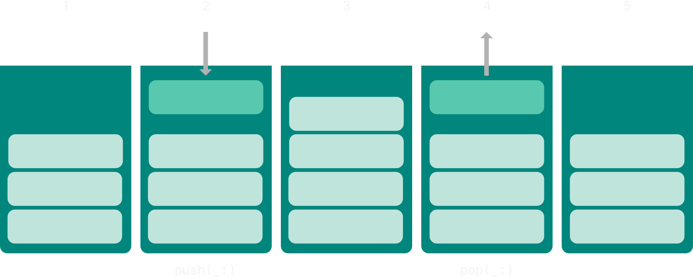
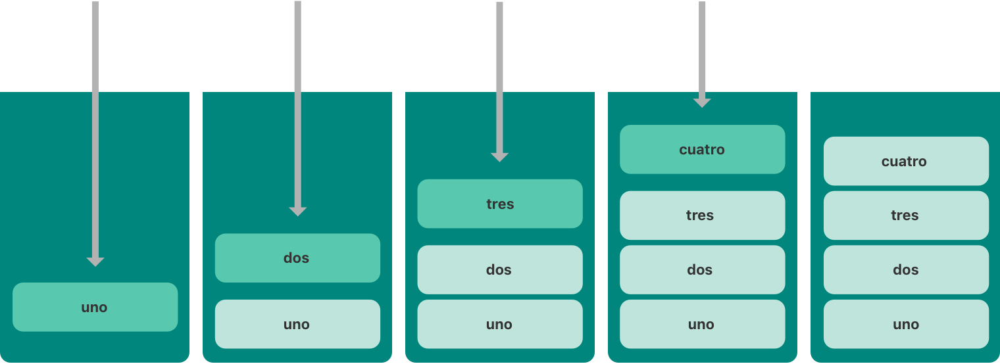
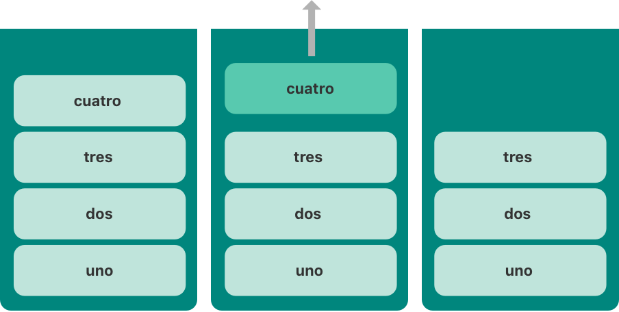

# 泛型

<ToBePolishedAfterTranslation />

<OriginalSource
  title="Generics"
  url="https://docs.swift.org/swift-book/documentation/the-swift-programming-language/generics"
  summary="编写适用于多种类型的代码并指定这些类型的要求"
/>

通用代码使你能够根据你定义的要求编写灵活、可重用的函数和类型，这些函数和类型可以与任何类型一起使用。你可以编写避免重复并以清晰、抽象的方式表达其意图的代码。

泛型是 Swift 最强大的特性之一，大部分 Swift 标准库都是用泛型代码构建的。事实上，你在整个《语言指南》中一直在使用泛型，即使你没有意识到这一点。例如，Swift 的 Array 和 Dictionary 类型都是泛型集合。你可以创建一个包含 Int 值的数组，或者一个包含 String 值的数组，或者实际上是一个可以在 Swift 中创建的任何其它类型的数组。同样，你可以创建一个字典来存储任何指定类型的值，并且对该类型可以是什么没有限制。

## 泛型解决的问题

这是一个名为 的标准非泛型函数，它交换两个值：swapTwoInts(_:_:)Int

```swift
func swapTwoInts(_ a: inout Int, _ b: inout Int) {
    let temporaryA = a
    a = b
    b = temporaryA
}
```

此函数使用输入输出参数来交换 a 和的值 b，如输入输出参数中所述。

该函数将 的原始值交换为，并将 的原始值交换为。你可以调用此函数来交换两个变量中的值：swapTwoInts(_:_:)baabInt

```swift
var someInt = 3
var anotherInt = 107
swapTwoInts(&someInt, &anotherInt)
print("someInt is now \(someInt), and anotherInt is now \(anotherInt)")
// Prints "someInt is now 107, and anotherInt is now 3"
```

该函数很有用，但它只能与值一起使用。如果要交换两个值，或者两个值，就得写更多的函数，比如下面的 and 函数：swapTwoInts(_:_:)IntStringDoubleswapTwoStrings(_:_:)swapTwoDoubles(_:_:)

```swift
func swapTwoStrings(_ a: inout String, _ b: inout String) {
    let temporaryA = a
    a = b
    b = temporaryA
}

func swapTwoDoubles(_ a: inout Double, _ b: inout Double) {
    let temporaryA = a
    a = b
    b = temporaryA
}
```

你可能已经注意到、和函数的主体是相同的。唯一的区别是它们接受的值的类型（、和）。swapTwoInts(_:_:)swapTwoStrings(_:_:)swapTwoDoubles(_:_:)IntStringDouble

编写交换任何类型的两个值的单个函数更有用，也更灵活。通用代码使你能够编写这样的函数。（这些函数的通用版本定义如下。）

:::note
a 在所有三个函数中，和的类型 b 必须相同。如果 a 和 b 不是同一类型，则无法交换它们的值。Swift 是一种类型安全的语言，并且不允许（例如）一个类型的变量 String 和一个类型的变量 Double 相互交换值。尝试这样做会导致编译时错误。
:::

## 通用函数

泛型函数适用于任何类型。这是上面函数的通用版本，称为：swapTwoInts(_:_:)swapTwoValues(_:_:)

```swift
func swapTwoValues<T>(_ a: inout T, _ b: inout T) {
    let temporaryA = a
    a = b
    b = temporaryA
}
```

函数体与函数体相同。但是，第一行与略有不同。下面是第一行的比较：swapTwoValues(_:_:)swapTwoInts(_:_:)swapTwoValues(_:_:)swapTwoInts(_:_:)

```swift
func swapTwoInts(_ a: inout Int, _ b: inout Int)
func swapTwoValues<T>(_ a: inout T, _ b: inout T)
```

该函数的通用版本使用占位符类型名称（T 在本例中称为 , ）而不是实际类型名称（例如 Int、String 或 Double）。占位符类型名称没有说明 T 必须是什么，但它确实说明两者 a 和 b 必须是相同的类型 T，无论 T 代表什么。T 每次调用该函数时都会确定要代替的实际类型。swapTwoValues(_:_:)

泛型函数和非泛型函数之间的另一个区别是泛型函数的名称 ( ) 后跟尖括号 ( ) 内的占位符类型名称 ( )。括号告诉 Swift 这是函数定义中的占位符类型名称。因为是一个占位符，Swift 不会寻找名为.`swapTwoValues(_:_:)T<T>TswapTwoValues(_:_:)TT`

现在可以用与 相同的方式调用该函数，只是它可以传递任何类型的两个值，只要这两个值彼此的类型相同即可。每次调用时，要使用的类型都是根据传递给函数的值的类型推断出来的。swapTwoValues(_:_:)swapTwoIntsswapTwoValues(_:_:)T

在下面的两个例子中，分别 T 推断为 Int 和 String：

```swift
var someInt = 3
var anotherInt = 107
swapTwoValues(&someInt, &anotherInt)
// someInt is now 107, and anotherInt is now 3

var someString = "hello"
var anotherString = "world"
swapTwoValues(&someString, &anotherString)
// someString is now "world", and anotherString is now "hello"
```

:::note
上面定义的函数的灵感来自一个名为 的通用函数，它是 Swift 标准库的一部分，并自动可供你在应用程序中使用。如果你在自己的代码中需要该函数的行为，你可以使用 Swift 现有的函数而不是提供自己的实现。swapTwoValues(_:_:)swapswapTwoValues(_:_:)swap(_:_:)
:::

## 类型参数

在上面的示例中，占位符类型是类型参数的示例。类型参数指定并命名占位符类型，并紧跟在函数名称之后，位于一对匹配的尖括号（例如）之间。`swapTwoValues(_:_:)T<T>`

一旦你指定了一个类型参数，你就可以用它来定义函数参数的类型（比如函数的 和 a 参数 b），或者作为函数的返回类型，或者作为函数体内的类型注解。在每种情况下，无论何时调用函数，类型参数都会被替换为实际类型。（在上面的例子中，第一次调用函数时被替换，第二次调用时被替换。）swapTwoValues(_:_:)swapTwoValues(_:_:)TIntString

你可以通过在尖括号中写入多个类型参数名称来提供多个类型参数，并以逗号分隔。

## 命名类型参数

在大多数情况下，类型参数具有描述性名称，例如 `Keyand ValueinDictionary<Key, Value>` 和 `Elementin Array<Element>`，它告诉读者类型参数与其使用的泛型类型或函数之间的关系。但是，当它们之间没有有意义的关系时, 传统上使用单个字母命名它们，例如 T, U, 和 V，例如 T 在上面的函数中。swapTwoValues(_:_:)

:::note
始终为类型参数提供大写驼峰命名（例如 Tand ）以指示它们是类型的占位符，而不是值。MyTypeParameter
:::

## 通用类型

除了泛型函数之外，Swift 还允许你定义自己的泛型类型。这些是可以与任何类型一起使用的自定义类、结构和枚举，其方式与 Array 和类似 Dictionary。

本节向你展示如何编写一个名为 Stack. 堆栈是一组有序的值，类似于数组，但具有比 Swift 类型更受限制的操作集 Array。数组允许在数组中的任何位置插入和删除新项。然而，堆栈只允许将新项目附加到集合的末尾（称为将新值推入堆栈）。类似地，堆栈只允许从集合的末尾删除项目（称为从堆栈弹出值）。

:::note
类使用堆栈的概念在其导航层次结构中对视图控制器进行建模。你调用类方法将视图控制器添加（或推送）到导航堆栈，并调用它的方法从导航堆栈中删除（或弹出）视图控制器。当你需要严格的“后进先出”方法来管理集合时，堆栈是一种有用的集合模型。UINavigationControllerUINavigationControllerpushViewController(_:animated:)popViewControllerAnimated(_:)
:::

下图显示了堆栈的推送和弹出行为：



1. 当前堆栈上有三个值。
2. 第四个值被压入栈顶。
3. 堆栈现在有四个值，最近的一个在顶部。
4. 堆栈中的顶部项目被弹出。
5. 弹出一个值后，堆栈再次保存三个值。

以下是如何编写堆栈的非泛型版本，在本例中为 `Int` 值堆栈：

```swift
struct IntStack {
    var items: [Int] = []
    mutating func push(_ item: Int) {
        items.append(item)
    }
    mutating func pop() -> Int {
        return items.removeLast()
    }
}
```

此结构使用一个 Array 名为的属性 items 将值存储在堆栈中。Stack 提供了两个方法，push 和 pop，用于将值压入和压出堆栈。这些方法被标记为 mutating，因为它们需要修改（或改变）结构的 items 数组。

但是，上面显示的类型只能与值一起使用。定义一个通用结构会更有用，它可以管理任何类型值的堆栈。IntStackInt Stack

这是相同代码的通用版本：

```swift
struct Stack<Element> {
    var items: [Element] = []
    mutating func push(_ item: Element) {
        items.append(item)
    }
    mutating func pop() -> Element {
        return items.removeLast()
    }
}
```

请注意 的泛型版本 Stack 与非泛型版本在本质上是相同的，但使用的是类型参数 calledElement 而不是实际类型的 Int. 此类型参数写在 `<Element>` 紧跟在结构名称之后的一对尖括号 ( ) 内。

Element 为稍后提供的类型定义占位符名称。Element 这种未来类型可以在结构定义中的任何地方引用。在这种情况下，Element 在三个地方用作占位符：

- 创建一个名为 的属性 items，该属性使用类型为空的值数组进行初始化 Element
- 指定该 push(\_:)方法有一个名为 的参数 item，该参数的类型必须为 Element
- 指定方法返回的值 pop()将是类型的值 Element

因为它是泛型类型，Stack 所以可以用于在 Swift 中创建任何有效类型的堆栈，方式与 Array 和类似 Dictionary。

Stack 你可以通过在尖括号内写入要存储在堆栈中的类型来创建新实例。例如，要创建一个新的字符串堆栈，你可以编写 `Stack<String>()`：

```swift
var stackOfStrings = Stack<String>()
stackOfStrings.push("uno")
stackOfStrings.push("dos")
stackOfStrings.push("tres")
stackOfStrings.push("cuatro")
// the stack now contains 4 strings
```

下面是将这四个值压入堆栈后的样子：stackOfStrings



从堆栈中弹出一个值会删除并返回顶部值，"cuatro"：

```swift
let fromTheTop = stackOfStrings.pop()
// fromTheTop is equal to "cuatro", and the stack now contains 3 strings
```

以下是堆栈在弹出其最高值后的样子：



## 扩展泛型

当你扩展泛型类型时，你不提供类型参数列表作为扩展定义的一部分。相反，原始类型定义中的类型参数列表在扩展主体中可用，并且原始类型参数名称用于引用原始定义中的类型参数。

以下示例扩展泛型 Stack 类型以添加名为 的只读计算属性，该属性返回堆栈中的顶部项目而不将其从堆栈中弹出：topItem

````swift
extension Stack {
    var topItem: Element? {
        return items.isEmpty ? nil : items[items.count - 1]
    }
}
···

该属性返回 type 的可选值。如果堆栈为空，则返回；如果堆栈不为空，则返回数组中的最后一项。topItemElementtopItemniltopItemitems

请注意，此扩展没有定义类型参数列表。相反，Stack类型的现有类型参数名称Element用于扩展中以指示计算属性的可选类型。topItem

计算属性现在可以与任何实例一起使用来访问和查询其顶部项目而无需删除它。topItemStack

```swift
if let topItem = stackOfStrings.topItem {
    print("The top item on the stack is \(topItem).")
}
// Prints "The top item on the stack is tres."
````

通用类型的扩展还可以包括扩展类型的实例必须满足的要求才能获得新功能，如下面的带有通用 Where 子句的扩展中所讨论的。

## 类型约束

函数和类型可以与任何类型一起使用。但是，有时对可与泛型函数和泛型类型一起使用的类型强制执行某些类型约束很有用。类型约束指定类型参数必须从特定类继承，或符合特定协议或协议组合。swapTwoValues(_:_:)Stack

例如，Swift 的 Dictionary 类型对可以用作字典键的类型进行了限制。如字典中所述，字典键的类型必须是可哈希的。也就是说，它必须提供一种使自己具有唯一可表示性的方法。Dictionary 需要它的键是可散列的，以便它可以检查它是否已经包含特定键的值。如果没有这个要求，Dictionary 就无法判断是否应该插入或替换特定键的值，也无法为字典中已有的给定键找到值。

此要求通过对键类型的类型约束强制执行 Dictionary，它指定键类型必须符合 Hashable 协议，这是 Swift 标准库中定义的特殊协议。默认情况下，Swift 的所有基本类型（例如 String、Int、Double 和 Bool）都是可哈希的。有关使你自己的自定义类型符合 Hashable 协议的信息，请参阅符合 Hashable 协议。

你可以在创建自定义泛型类型时定义自己的类型约束，这些约束提供了泛型编程的大部分功能。抽象概念如 Hashable 根据概念特征而不是具体类型来描述类型。

## 类型约束语法

你可以通过将单个类或协议约束放在类型参数名称之后并以冒号分隔作为类型参数列表的一部分来编写类型约束。泛型函数类型约束的基本语法如下所示（尽管泛型类型的语法相同）：

```swift
func someFunction<T: SomeClass, U: SomeProtocol>(someT: T, someU: U) {
    // function body goes here
}
```

上面的假设函数有两个类型参数。第一个类型参数 T 有一个类型约束，要求 T 是 的子类。第二个类型参数具有类型约束，需要遵守协议。SomeClassUUSomeProtocol

## 类型约束实战

这是一个名为 的非泛型函数，它被赋予了一个要查找的值和一个值数组，用于查找它。该函数返回一个可选值，如果找到它，它将是数组中第一个匹配字符串的索引，或者如果找不到该字符串：findIndex(ofString:in:)StringStringfindIndex(ofString:in:)Intnil

```swift
func findIndex(ofString valueToFind: String, in array: [String]) -> Int? {
    for (index, value) in array.enumerated() {
        if value == valueToFind {
            return index
        }
    }
    return nil
}
```

该函数可用于在字符串数组中查找字符串值：`findIndex(ofString:in:)`

```swift
let strings = ["cat", "dog", "llama", "parakeet", "terrapin"]
if let foundIndex = findIndex(ofString: "llama", in: strings) {
    print("The index of llama is \(foundIndex)")
}
// Prints "The index of llama is 2"
```

然而，查找数组中值的索引的原则不仅仅对字符串有用。你可以通过将任何提及的字符串替换为某种类型的值来编写与通用函数相同的功能 T。

以下是你可能希望编写名为 的通用版本的方式。请注意，此函数的返回类型仍然是，因为该函数返回一个可选的索引号，而不是数组中的可选值。但是请注意——这个函数不能编译，原因在示例后面解释：findIndex(ofString:in:)findIndex(of:in:)Int?

```swift
func findIndex<T>(of valueToFind: T, in array:[T]) -> Int? {
    for (index, value) in array.enumerated() {
        if value == valueToFind {
            return index
        }
    }
    return nil
}
```

这个函数不能像上面写的那样编译。问题在于相等性检查“ ”。并非 Swift 中的每个类型都可以与等于运算符 ( ) 进行比较。例如，如果你创建自己的类或结构来表示复杂的数据模型，那么 Swift 无法为你猜测该类或结构的“等于”的含义。因此，无法保证此代码适用于所有可能的类型，并且当你尝试编译代码时会报告相应的错误。if value == valueToFind==T

然而，一切并没有丢失。Swift 标准库定义了一个名为 的协议 Equatable，它要求任何符合标准的类型实现等于运算符 ( ==) 和不等于运算符 ( !=) 来比较该类型的任意两个值。Swift 的所有标准类型都自动支持该 Equatable 协议。

Equatable 可以安全地与该函数一起使用的任何类型，因为它保证支持等于运算符。为了表达这一事实，你在定义函数时将类型约束写为类型参数定义的一部分：findIndex(of:in:)Equatable

```swift
func findIndex<T: Equatable>(of valueToFind: T, in array:[T]) -> Int? {
    for (index, value) in array.enumerated() {
        if value == valueToFind {
            return index
        }
    }
    return nil
}
```

for 的单一类型参数写为，意思是“任何符合协议的类型”。`findIndex(of:in:)T: EquatableTEquatable`

该函数现在可以成功编译并且可以与任何类型一起使用，例如或：findIndex(of:in:)EquatableDoubleString

```swift
let doubleIndex = findIndex(of: 9.3, in: [3.14159, 0.1, 0.25])
// doubleIndex is an optional Int with no value, because 9.3 isn't in the array
let stringIndex = findIndex(of: "Andrea", in: ["Mike", "Malcolm", "Andrea"])
// stringIndex is an optional Int containing a value of 2
```

## 关联类型

定义协议时，有时将一个或多个关联类型声明为协议定义的一部分很有用。关联类型为用作协议一部分的类型提供占位符名称。在采用协议之前，不会指定用于该关联类型的实际类型。关联类型用关键字指定 associatedtype。

## 关联类型在行动

下面是一个名为 的协议示例 Container，它声明了一个名为 的关联类型 Item：

```swift
protocol Container {
    associatedtype Item
    mutating func append(_ item: Item)
    var count: Int { get }
    subscript(i: Int) -> Item { get }
}
```

该 Container 协议定义了任何容器必须提供的三个必需功能：

- 必须可以使用一种 `append(_:)` 方法将新项目添加到容器中。
- 必须可以通过 count 返回 Int 值的属性访问容器中项目的计数。
- 必须可以使用带有 Int 索引值的下标检索容器中的每个项目。

该协议未指定容器中的项目应如何存储或允许的类型。该协议仅指定任何类型必须提供的三位功能才能被视为 Container. 只要满足这三个要求，符合类型就可以提供额外的功能。

任何符合 Container 协议的类型都必须能够指定它存储的值的类型。具体来说，它必须确保只有正确类型的项被添加到容器中，并且必须清楚其下标返回的项的类型。

为了定义这些要求，Container 协议需要一种方法来引用容器将包含的元素的类型，而无需知道该类型对于特定容器是什么。协议 Container 需要指定传递给方法的任何值 append(\_:)必须与容器的元素类型具有相同的类型，并且容器的下标返回的值将与容器的元素类型具有相同的类型。

为实现这一点，Container 协议声明了一个名为 的关联类型 Item，写为 associatedtype Item。该协议没有定义什么 Item 是——该信息留给任何符合的类型来提供。尽管如此，Item 别名提供了一种方法来引用 a 中的项目类型 Container，并定义用于 append(\_:)方法和下标的类型，以确保 Container 强制执行 any 的预期行为。

这是上面泛型类型中的非泛型类型的一个版本，经过改编以符合协议：IntStackContainer

```swift
struct IntStack: Container {
    // original IntStack implementation
    var items: [Int] = []
    mutating func push(_ item: Int) {
        items.append(item)
    }
    mutating func pop() -> Int {
        return items.removeLast()
    }
    // conformance to the Container protocol
    typealias Item = Int
    mutating func append(_ item: Int) {
        self.push(item)
    }
    var count: Int {
        return items.count
    }
    subscript(i: Int) -> Int {
        return items[i]
    }
}
```

该类型实现了协议的所有三个要求，并且在每种情况下都包装了该类型现有功能的一部分以满足这些要求。IntStackContainerIntStack

此外，指定对于 的此实现，适合使用的是 的一种类型。的定义将抽象类型转变为协议实现的具体类型。IntStackContainerItemInttypealias Item = IntItemIntContainer

多亏了 Swift 的类型推断，你实际上不需要声明一个具体的 ItemofInt 作为定义的一部分。因为符合协议的所有要求，Swift 可以推断出合适的使用，只需查看方法的参数类型和下标的返回类型。事实上，如果你从上面的代码中删除该行，一切仍然有效，因为很清楚应该使用什么类型。IntStackIntStackContainerItemappend(\_:)itemtypealias Item = IntItem

你还可以使泛型 Stack 类型符合 Container 协议：

```swift
struct Stack<Element>: Container {
    // original Stack<Element> implementation
    var items: [Element] = []
    mutating func push(_ item: Element) {
        items.append(item)
    }
    mutating func pop() -> Element {
        return items.removeLast()
    }
    // conformance to the Container protocol
    mutating func append(_ item: Element) {
        self.push(item)
    }
    var count: Int {
        return items.count
    }
    subscript(i: Int) -> Element {
        return items[i]
    }
}
```

这次 `Element` 使用类型参数作为 `append(_:)` 方法参数的类型 `item` 和下标的返回类型。因此，Swift 可以推断这 Element 是适合用作 Item 此特定容器的类型。

## 扩展现有类型以指定关联类型

你可以扩展现有类型以添加对协议的一致性，如使用扩展添加协议一致性中所述。这包括具有关联类型的协议。

Swift 的 Array 类型已经提供了一个 append(\_:)方法、一个 count 属性和一个带有索引的下标 Int 来检索它的元素。这三种能力符合协议的要求 Container。这意味着你只需声明 Array 采用协议即可扩展以符合协议。你可以使用空扩展来执行此操作，如使用扩展声明采用协议中所述：ContainerArray

```swift
extension Array: Container {}
```

Array 的现有 `append(_:)` 方法和下标使 Swift 能够推断出要使用的适当类型 for Item，就像 Stack 上面的泛型类型一样。定义此扩展名后，你可以将 anyArray 用作 Container.

## 向关联类型添加约束

你可以将类型约束添加到协议中的关联类型，以要求符合类型满足这些约束。例如，以下代码定义了一个版本 Container，要求容器中的项目是可等化的。

```swift
protocol Container {
    associatedtype Item: Equatable
    mutating func append(_ item: Item)
    var count: Int { get }
    subscript(i: Int) -> Item { get }
}
```

为了符合这个版本 Container，容器的 Item 类型必须符合协议 Equatable。

## 在其关联类型的约束中使用协议

协议可以作为其自身要求的一部分出现。例如，这里有一个细化 Container 协议的协议，增加了一个方法的要求 suffix(_:)。该 suffix(_:)方法从容器的末尾返回给定数量的元素，并将它们存储在该 Suffix 类型的实例中。

```swift
protocol SuffixableContainer: Container {
    associatedtype Suffix: SuffixableContainer where Suffix.Item == Item
    func suffix(_ size: Int) -> Suffix
}
```

在此协议中，Suffix 是关联类型，如上例 Item 中的类型 Container。Suffix 有两个约束：它必须符合协议（当前正在定义的协议），并且它的类型必须与容器的类型相同。约束是一个泛型子句，在下面的带有泛型 Where 子句的关联类型中进行了讨论。SuffixableContainerItemItemItemwhere

这是对上述通用类型 Stack 的类型的扩展，它增加了对协议的一致性：SuffixableContainer

```swift
extension Stack: SuffixableContainer {
    func suffix(_ size: Int) -> Stack {
        var result = Stack()
        for index in (count-size)..<count {
            result.append(self[index])
        }
        return result
    }
    // Inferred that Suffix is Stack.
}
var stackOfInts = Stack<Int>()
stackOfInts.append(10)
stackOfInts.append(20)
stackOfInts.append(30)
let suffix = stackOfInts.suffix(2)
// suffix contains 20 and 30
```

在上面的示例中，Suffixfor 的关联类型 Stack 也是 Stack，因此 on 的后缀操作 Stack 返回 another Stack。或者，符合的类型可以具有与其自身不同的类型——这意味着后缀操作可以返回不同的类型。例如，下面是添加一致性的非泛型类型的扩展，使用作为其后缀类型而不是：`SuffixableContainerSuffixIntStackSuffixableContainerStack<Int>IntStack`

```swift
extension IntStack: SuffixableContainer {
    func suffix(_ size: Int) -> Stack<Int> {
        var result = Stack<Int>()
        for index in (count-size)..<count {
            result.append(self[index])
        }
        return result
    }
    // Inferred that Suffix is Stack<Int>.
}
```

## 通用 Where 子句

类型约束，如类型约束中所述，使你能够定义与泛型函数、下标或类型关联的类型参数的要求。

定义关联类型的要求也很有用。你可以通过定义一个通用的 where 子句来做到这一点。泛型 where 子句使你能够要求关联类型必须符合特定协议，或者特定类型参数和关联类型必须相同。泛型 where 子句以 where 关键字开头，后面是关联类型的约束或类型与关联类型之间的相等关系。你 where 在类型或函数主体的左大括号之前编写一个通用子句。

下面的示例定义了一个名为 的通用函数，它检查两个实例是否以相同的顺序包含相同的项目。如果所有项目都匹配，该函数返回一个布尔值，如果不匹配则返回一个值。allItemsMatchContainertruefalse

要检查的两个容器不必是同一类型的容器（尽管它们可以），但它们必须装有相同类型的物品。此要求通过类型约束和通用子句的组合来表达 where：

```swift
func allItemsMatch<C1: Container, C2: Container>
        (_ someContainer: C1, _ anotherContainer: C2) -> Bool
        where C1.Item == C2.Item, C1.Item: Equatable {

    // Check that both containers contain the same number of items.
    if someContainer.count != anotherContainer.count {
        return false
    }

    // Check each pair of items to see if they're equivalent.
    for i in 0..<someContainer.count {
        if someContainer[i] != anotherContainer[i] {
            return false
        }
    }

    // All items match, so return true.
    return true
}
```

这个函数有两个参数，叫做和。参数类型为，参数类型为。和都是函数调用时要确定的两种容器类型的类型参数。someContaineranotherContainersomeContainerC1anotherContainerC2C1C2

对函数的两个类型参数提出以下要求：

- C1 必须符合 Container 协议（写为 C1: Container）。
- C2 还必须符合 Container 协议（写为 C2: Container）。
- for 必须与 forItem 相同 C1（写为）。ItemC2C1.Item == C2.Item
- for 必须符合协议 Item（写为）。C1EquatableC1.Item: Equatable

第一和第二个要求在函数的类型参数列表中定义，第三和第四个要求在函数的泛型 where 子句中定义。

这些要求意味着：

- someContainer 是类型的容器 C1。
- anotherContainer 是类型的容器 C2。
- someContainer 并包含相同类型的项目。anotherContainer
- 可以使用不等于运算符 ( ) 检查中的项目，看它们是否彼此不同。someContainer!=

第三和第四个要求结合起来意味着也可以与操作员一起检查中的项目，因为它们与 中的项目完全相同。anotherContainer!=someContainer

这些要求使函数能够比较两个容器，即使它们属于不同的容器类型。allItemsMatch(_:_:)

该函数首先检查两个容器是否包含相同数量的项目。如果它们包含不同数量的项目，则它们无法匹配，函数返回。allItemsMatch(_:_:)false

进行此检查后，该函数使用-循环和半开范围运算符 ( )迭代所有项目。对于每个项目，该函数检查来自的项目是否不等于 中的相应项目。如果两项不相等，则两个容器不匹配，函数返回。someContainerforin..<someContaineranotherContainerfalse

如果循环结束时没有发现不匹配，则两个容器匹配，函数返回 true。

以下是该函数的实际效果：allItemsMatch(_:_:)

```swift
var stackOfStrings = Stack<String>()
stackOfStrings.push("uno")
stackOfStrings.push("dos")
stackOfStrings.push("tres")

var arrayOfStrings = ["uno", "dos", "tres"]

if allItemsMatch(stackOfStrings, arrayOfStrings) {
    print("All items match.")
} else {
    print("Not all items match.")
}
// Prints "All items match."
```

上面的示例创建了一个 Stack 实例来存储 String 值，并将三个字符串压入堆栈。该示例还创建了一个实例，该 Array 实例使用包含与堆栈相同的三个字符串的数组文字进行初始化。尽管堆栈和数组属于不同类型，但它们都符合协议 Container，并且都包含相同类型的值。因此，你可以使用这两个容器作为参数来调用该函数。在上面的示例中，该函数正确地报告了两个容器中的所有项目都匹配。allItemsMatch(_:_:)allItemsMatch(_:_:)

## 带有通用 Where 子句的扩展

你还可以使用通用 where 子句作为扩展的一部分。下面的示例扩展了 Stack 前面示例的通用结构以添加一个方法。isTop(\_:)

```swift
extension Stack where Element: Equatable {
    func isTop(_ item: Element) -> Bool {
        guard let topItem = items.last else {
            return false
        }
        return topItem == item
    }
}
```

这个新方法首先检查堆栈是否为空，然后将给定的项目与堆栈的最顶层项目进行比较。如果你尝试在没有泛型子句的情况下执行此操作，则会遇到问题： 的实现使用运算符，但 的定义不要求其项是可相等的，因此使用该运算符会导致编译时错误。使用通用子句可以让你向扩展添加新要求，以便扩展仅在堆栈中的项可相等时才添加方法。isTop(_:)whereisTop(_:)==Stack==whereisTop(\_:)

下面是该方法的实际效果：isTop(\_:)

```swift
if stackOfStrings.isTop("tres") {
    print("Top element is tres.")
} else {
    print("Top element is something else.")
}
// Prints "Top element is tres."
```

如果你尝试在其元素不可等同的堆栈上调用该方法，则会出现编译时错误。isTop(\_:)

```swift
struct NotEquatable { }
var notEquatableStack = Stack<NotEquatable>()
let notEquatableValue = NotEquatable()
notEquatableStack.push(notEquatableValue)
notEquatableStack.isTop(notEquatableValue)  // Error
```

你可以使用 where 带有协议扩展的通用子句。下面的示例扩展了 Container 前面示例的协议以添加一个方法。startsWith(\_:)

```swift
extension Container where Item: Equatable {
    func startsWith(_ item: Item) -> Bool {
        return count >= 1 && self[0] == item
    }
}
```

该方法首先确保容器中至少有一个项目，然后检查容器中的第一个项目是否与给定的项目相匹配。这种新方法可以用于任何符合协议的类型，包括上面使用的堆栈和数组，只要容器的项是可等化的。startsWith(_:)startsWith(_:)Container

```swift
if [9, 9, 9].startsWith(42) {
    print("Starts with 42.")
} else {
    print("Starts with something else.")
}
// Prints "Starts with something else."
```

where 上面例子中的泛型子句需要 Item 符合一个协议，但你也可以写一个泛型 where 子句，要求 Item 是一个特定的类型。例如：

```swift
extension Container where Item == Double {
    func average() -> Double {
        var sum = 0.0
        for index in 0..<count {
            sum += self[index]
        }
        return sum / Double(count)
    }
}
print([1260.0, 1200.0, 98.6, 37.0].average())
// Prints "648.9"
```

此示例向类型为 的 average()容器添加一个方法。它遍历容器中的项目以将它们相加，然后除以容器的计数以计算平均值。它显式地将计数从 转换为能够进行浮点除法。ItemDoubleIntDouble

你可以在作为扩展一部分的通用子句中包含多个要求 where，就像你 where 在其它地方编写的通用子句中所做的那样。用逗号分隔列表中的每个要求。

## 上下文 Where 子句

当你已经在泛型类型的上下文中工作时，你可以将泛型 where 子句编写为没有自己的泛型类型约束的声明的一部分。例如，你可以 where 在泛型类型的下标或泛型类型扩展中的方法上编写泛型子句。该 Container 结构是通用的，where 下面示例中的子句指定必须满足哪些类型约束才能使这些新方法在容器上可用。

```swift
extension Container {
    func average() -> Double where Item == Int {
        var sum = 0.0
        for index in 0..<count {
            sum += Double(self[index])
        }
        return sum / Double(count)
    }
    func endsWith(_ item: Item) -> Bool where Item: Equatable {
        return count >= 1 && self[count-1] == item
    }
}
let numbers = [1260, 1200, 98, 37]
print(numbers.average())
// Prints "648.75"
print(numbers.endsWith(37))
// Prints "true"
```

此示例在项目为整数时添加一个 average()方法，并在项目可相等时添加一个方法。这两个函数都包含一个泛型子句，该子句将类型约束添加到的原始声明中的泛型类型参数。ContainerendsWith(\_:)whereItemContainer

如果你想在不使用上下文 where 子句的情况下编写此代码，你可以编写两个扩展，一个用于每个通用 where 子句。上面的示例和下面的示例具有相同的行为。

```swift
extension Container where Item == Int {
    func average() -> Double {
        var sum = 0.0
        for index in 0..<count {
            sum += Double(self[index])
        }
        return sum / Double(count)
    }
}
extension Container where Item: Equatable {
    func endsWith(_ item: Item) -> Bool {
        return count >= 1 && self[count-1] == item
    }
}
```

在这个使用上下文子句的示例版本中，和的 where 实现都在同一个扩展中，因为每个方法的通用子句都说明了使该方法可用所需满足的要求。将这些要求移动到扩展的通用子句中，使这些方法在相同情况下可用，但每个要求都需要一个扩展。average()endsWith(\_:)wherewhere

## 具有通用 Where 子句的关联类型

where 你可以在关联类型上包含通用子句。例如，假设你想要制作一个 Container 包含迭代器的版本，就像 Sequence 协议在标准库中使用的一样。你是这样写的：

```swift
protocol Container {
    associatedtype Item
    mutating func append(_ item: Item)
    var count: Int { get }
    subscript(i: Int) -> Item { get }

    associatedtype Iterator: IteratorProtocol where Iterator.Element == Item
    func makeIterator() -> Iterator
}
```

通用子句 whereonIterator 要求迭代器必须遍历与容器项具有相同项类型的元素，而不管迭代器的类型如何。该函数提供对容器迭代器的访问。makeIterator()

where 对于从另一个协议继承的协议，你可以通过在协议声明中包含通用子句来向继承的关联类型添加约束。例如，下面的代码声明了一个需要遵守的协议：ComparableContainerItemComparable

```swift
protocol ComparableContainer: Container where Item: Comparable { }
```

## 通用下标

下标可以是通用的，它们可以包含通用 where 子句。你在 之后的尖括号内写占位符类型名称，并在下标正文的左大括号之前 subscript 写一个通用子句。where 例如：

```swift
extension Container {
    subscript<Indices: Sequence>(indices: Indices) -> [Item]
            where Indices.Iterator.Element == Int {
        var result: [Item] = []
        for index in indices {
            result.append(self[index])
        }
        return result
    }
}
```

该 Container 协议的扩展添加了一个下标，该下标采用一系列索引并返回一个包含每个给定索引处的项目的数组。此通用下标受到如下约束：

尖括号中的通用参数 Indices 必须是符合 Sequence 标准库协议的类型。

下标采用单个参数 ，indices 它是该 Indices 类型的一个实例。

泛型 where 子句要求序列的迭代器必须遍历 type 的元素 Int。这确保了序列中的索引与用于容器的索引的类型相同。

综合起来，这些约束意味着为参数传递的值 indices 是一个整数序列。
