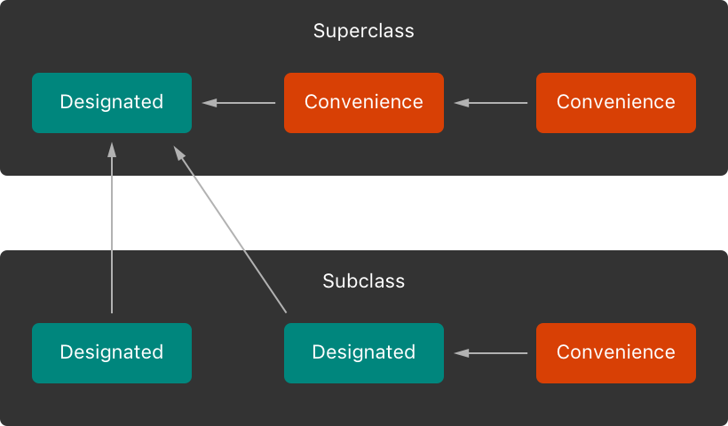
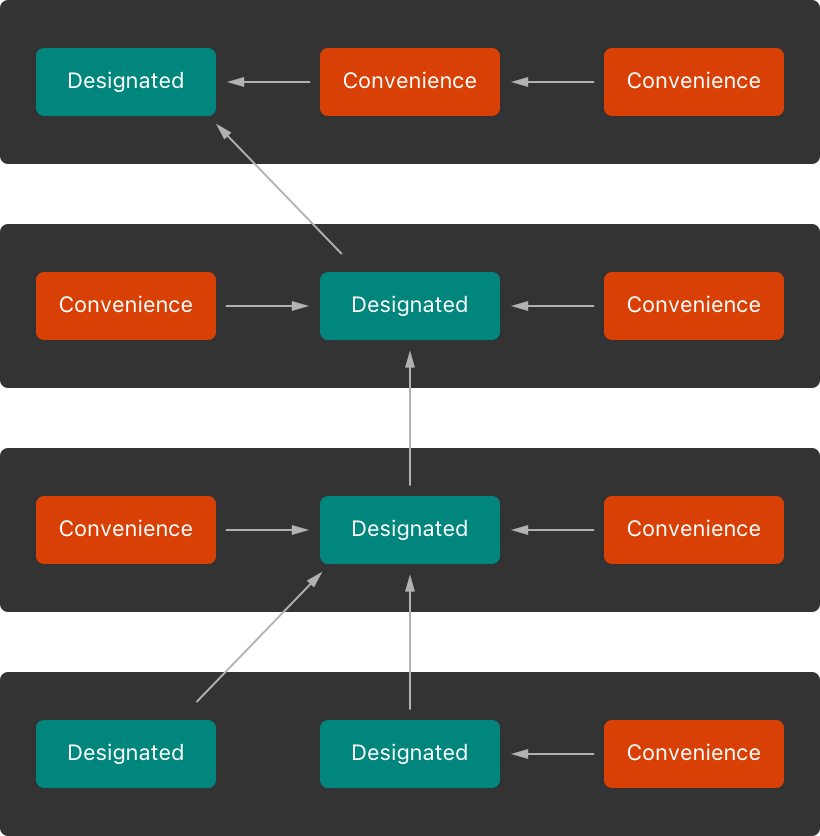
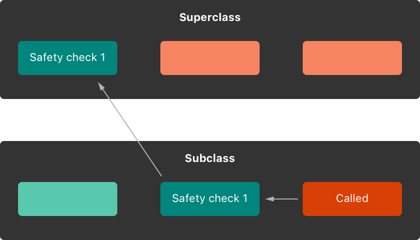
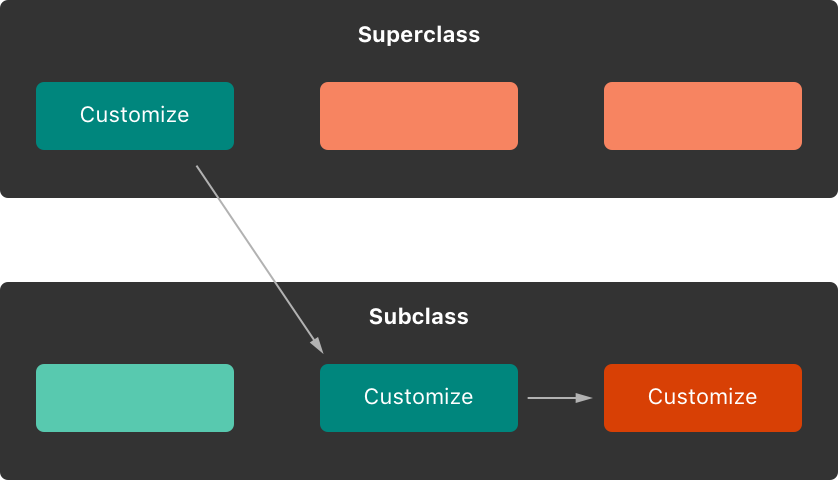
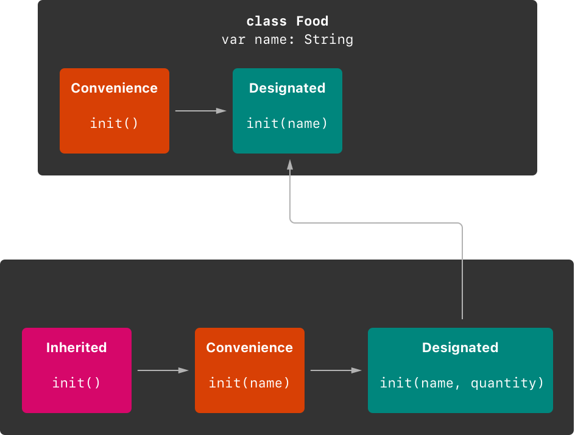
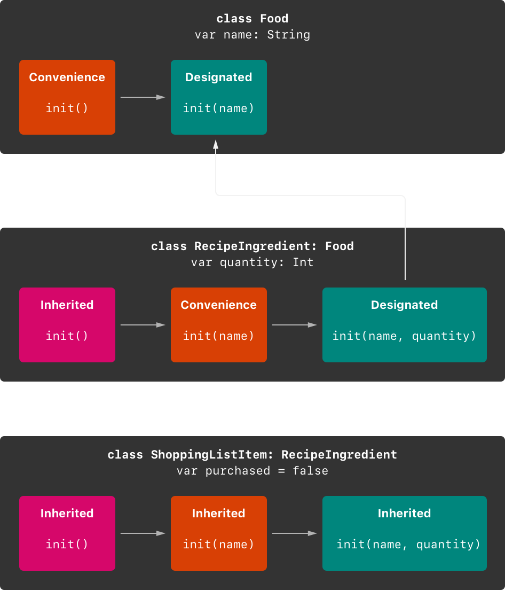

# 初始化

<ToBePolishedAfterTranslation />

<OriginalSource
  title="Initialization"
  url="https://docs.swift.org/swift-book/documentation/the-swift-programming-language/initialization"
  summary="为类型的存储属性设置初始值并执行一次性设置"
/>

初始化是准备类、结构或枚举的实例以供使用的过程。此过程涉及为该实例上的每个存储属性设置初始值，并在新实例准备好使用之前执行所需的任何其它设置或初始化。

你可以通过定义初始化器来实现此初始化过程，初始化器类似于可以调用以创建特定类型的新实例的特殊方法。与 Objective-C 初始化器不同，Swift 初始化器不返回值。它们的主要作用是确保某个类型的新实例在首次使用之前得到正确初始化。

类类型的实例也可以实现 deinitializer ，它在该类的实例被释放之前执行任何自定义清理。有关反初始化器的更多信息，请参阅反初始化。

## 设置存储属性的初始值

在创建该类或结构的实例时，类和结构必须将其所有存储的属性设置为适当的初始值。存储的属性不能处于不确定状态。

你可以在初始化器中为存储的属性设置初始值，或者通过分配默认属性值作为属性定义的一部分。这些操作在以下部分中描述。

:::note
当你为存储属性分配默认值或在初始化器中设置其初始值时，该属性的值将直接设置，而无需调用任何属性观察器。
:::

## 初始化器

调用初始化器来创建特定类型的新实例。在最简单的形式中，初始化器就像一个没有参数的实例方法，使用关键字编写 init：

```swift
init() {
    // perform some initialization here
}
```

下面的示例定义了一个新的结构体，用于 Fahrenheit 存储以华氏度表示的温度。该 Fahrenheit 结构具有一个存储属性 ，temperature 其类型为 Double：

```swift
struct Fahrenheit {
    var temperature: Double
    init() {
        temperature = 32.0
    }
}
var f = Fahrenheit()
print("The default temperature is \(f.temperature)° Fahrenheit")
// Prints "The default temperature is 32.0° Fahrenheit"
```

该结构定义了一个 init 没有参数的初始化器，它使用值（水的冰点华氏度）来初始化存储的温度。32.0

## 默认属性值

你可以从初始化器中设置存储属性的初始值，如上所示。或者，指定默认属性值作为属性声明的一部分。你可以通过在定义属性时为其分配初始值来指定默认属性值。

:::note
如果属性始终采用相同的初始值，请提供默认值而不是在初始化器中设置值。最终结果是相同的，但默认值将属性的初始化与其声明更紧密地联系在一起。它使初始化器更短、更清晰，并使你能够从属性的默认值推断属性的类型。默认值还使你更容易利用默认初始化器和初始化器继承，如本章后面所述。
:::

你可以通过在声明属性时 Fahrenheit 为其属性提供默认值，以更简单的形式编写上面的结构：temperature

```swift
struct Fahrenheit {
    var temperature = 32.0
}
```

## 自定义初始化

你可以使用输入参数和可选属性类型自定义初始化过程，或者通过在初始化期间分配常量属性来自定义初始化过程，如以下部分所述。

## 初始化参数

你可以提供初始化参数作为初始化器定义的一部分，以定义自定义初始化过程的值的类型和名称。初始化参数具有与函数和方法参数相同的功能和语法。

以下示例定义了一个名为 的结构 Celsius，它存储以摄氏度表示的温度。该 Celsius 结构实现了两个名为和的自定义初始化器，它们使用来自不同温标的值初始化该结构的新实例：init(fromFahrenheit:)init(fromKelvin:)

```swift
struct Celsius {
    var temperatureInCelsius: Double
    init(fromFahrenheit fahrenheit: Double) {
        temperatureInCelsius = (fahrenheit - 32.0) / 1.8
    }
    init(fromKelvin kelvin: Double) {
        temperatureInCelsius = kelvin - 273.15
    }
}
let boilingPointOfWater = Celsius(fromFahrenheit: 212.0)
// boilingPointOfWater.temperatureInCelsius is 100.0
let freezingPointOfWater = Celsius(fromKelvin: 273.15)
// freezingPointOfWater.temperatureInCelsius is 0.0
```

第一个初始化器有一个初始化参数，其参数标签为，参数名称为。第二个初始化器有一个初始化参数，其参数标签为，参数名称为。两个初始化器都将它们的单个参数转换为相应的 Celsius 值，并将该值存储在名为 的属性中。fromFahrenheitfahrenheitfromKelvinkelvintemperatureInCelsius

## 参数名称和参数标签

与函数和方法参数一样，初始化参数可以具有在初始化器主体中使用的参数名称和调用初始化器时使用的参数标签。

然而，初始化器不像函数和方法那样在括号前有一个标识函数名。因此，初始化器参数的名称和类型在识别应调用哪个初始化器方面起着特别重要的作用。正因为如此，如果你没有提供，Swift 会为初始化器中的每个参数提供一个自动参数标签。

以下示例定义了一个名为 的结构 Color，具有三个常量属性 red，分别为 green、 和 blue。这些属性存储一个介于和之间的值，以指示颜色中红色、绿色和蓝色的数量。0.01.0

ColorDouble 为其红色、绿色和蓝色组件提供具有三个适当命名的类型参数的初始化器。Color 还提供了第二个带有单个 white 参数的初始化器，用于为所有三个颜色分量提供相同的值。

```swift
struct Color {
    let red, green, blue: Double
    init(red: Double, green: Double, blue: Double) {
        self.red   = red
        self.green = green
        self.blue  = blue
    }
    init(white: Double) {
        red   = white
        green = white
        blue  = white
    }
}
```

Color 通过为每个初始化器参数提供命名值，两个初始化器都可用于创建新实例：

```swift
let magenta = Color(red: 1.0, green: 0.0, blue: 1.0)
let halfGray = Color(white: 0.5)
```

请注意，不使用参数标签就无法调用这些初始化器。如果定义了参数标签，则必须始终在初始化器中使用它们，省略它们会导致编译时错误：

```swift
let veryGreen = Color(0.0, 1.0, 0.0)
// this reports a compile-time error - argument labels are required
```

## 没有参数标签的初始化器参数

如果你不想为初始化参数使用参数标签，请\_为该参数编写下划线 ( ) 而不是显式参数标签以覆盖默认行为。

这是上面初始化参数 Celsius 示例的扩展版本，带有一个额外的初始化器，用于从已经在摄氏度范围内的值创建一个新实例：CelsiusDouble

```swift
struct Celsius {
    var temperatureInCelsius: Double
    init(fromFahrenheit fahrenheit: Double) {
        temperatureInCelsius = (fahrenheit - 32.0) / 1.8
    }
    init(fromKelvin kelvin: Double) {
        temperatureInCelsius = kelvin - 273.15
    }
    init(_ celsius: Double) {
        temperatureInCelsius = celsius
    }
}
let bodyTemperature = Celsius(37.0)
// bodyTemperature.temperatureInCelsius is 37.0
```

初始化器调用的意图很明确，不需要参数标签。因此，将此初始化器编写为可以通过提供未命名值来调用它是合适的。Celsius(37.0)init(\_ celsius: Double)Double

## 可选属性类型

如果你的自定义类型有一个逻辑上允许"无值"的存储属性——可能是因为它的值不能在初始化期间设置，或者因为它在以后的某个时间点被允许具有"无值"——用一个声明该属性可选类型。可选类型的属性会自动初始化为值 nil，表明该属性在初始化期间有意设置为"尚无值"。

以下示例定义了一个名为 的类，其中包含一个名为 的可选属性：SurveyQuestionStringresponse

```swift
class SurveyQuestion {
    var text: String
    var response: String?
    init(text: String) {
        self.text = text
    }
    func ask() {
        print(text)
    }
}
let cheeseQuestion = SurveyQuestion(text: "Do you like cheese?")
cheeseQuestion.ask()
// Prints "Do you like cheese?"
cheeseQuestion.response = "Yes, I do like cheese."
```

调查问题的答案在被询问之前是未知的，因此该 response 属性声明为 类型 String?，或"可选 String"。当初始化 的 nil 新实例时，它会自动分配默认值，意思是"还没有字符串"。SurveyQuestion

## 在初始化期间分配常量属性

你可以在初始化期间的任何时候为常量属性赋值，只要在初始化完成时将其设置为确定的值即可。一旦为常量属性分配了值，就不能再对其进行修改。

:::note
对于类实例，常量属性只能由引入它的类在初始化期间修改。它不能被子类修改。
:::

你可以修改上面的示例，为问题的属性使用常量属性而不是变量属性，以表明一旦创建了实例，问题就不会改变。即使该属性现在是一个常量，它仍然可以在类的初始化器中设置：SurveyQuestiontextSurveyQuestiontext

```swift
class SurveyQuestion {
    let text: String
    var response: String?
    init(text: String) {
        self.text = text
    }
    func ask() {
        print(text)
    }
}
let beetsQuestion = SurveyQuestion(text: "How about beets?")
beetsQuestion.ask()
// Prints "How about beets?"
beetsQuestion.response = "I also like beets. (But not with cheese.)"
```

## 默认构造器

Swift 为任何为其所有属性提供默认值的结构或类提供默认初始化器，并且不提供至少一个初始化器本身。默认初始化器只是创建一个新实例，并将其所有属性设置为默认值。

该示例定义了一个名为 的类，它封装了购物清单中商品的名称、数量和购买状态：ShoppingListItem

```swift
class ShoppingListItem {
    var name: String?
    var quantity = 1
    var purchased = false
}
var item = ShoppingListItem()
```

因为该类的所有属性都有默认值，并且因为它是一个没有超类的基类，所以自动获得一个默认初始化器实现，该实现创建一个新实例，并将其所有属性设置为默认值。（该属性是一个可选属性，因此它会自动接收默认值，即使该值未写入代码中。）上面的示例使用类的默认初始化器来创建类的新实例初始化语法，写为，并将这个新实例分配给一个名为 的变量。ShoppingListItemShoppingListItemnameStringnilShoppingListItemShoppingListItem()item

## 结构类型的成员初始化器

如果结构类型没有定义任何自己的自定义初始化器，它们会自动接收成员初始化器。与默认初始化器不同，该结构接收成员初始化器，即使它存储了没有默认值的属性。

memberwise initializer 是初始化新结构实例的成员属性的一种简写方式。新实例属性的初始值可以按名称传递给成员初始化器。

下面的示例定义了一个名为 的结构，它 Size 具有两个名为 width 和 的属性 height。这两个属性都被推断为 Double 通过分配默认值 的类型。0.0

该 Size 结构自动接收一个成员初始化器，你可以使用它来初始化一个新实例：init(width:height:)Size

```swift
struct Size {
    var width = 0.0, height = 0.0
}
let twoByTwo = Size(width: 2.0, height: 2.0)
```

调用成员初始化器时，可以省略任何具有默认值的属性的值。在上面的示例中，Size 结构的 height 和 width 属性都有一个默认值。你可以省略一个属性或两个属性，并且初始化器对你省略的任何内容使用默认值。例如：

```swift
let zeroByTwo = Size(height: 2.0)
print(zeroByTwo.width, zeroByTwo.height)
// Prints "0.0 2.0"

let zeroByZero = Size()
print(zeroByZero.width, zeroByZero.height)
// Prints "0.0 0.0"
```

## 值类型的初始化委托

初始化器可以调用其它初始化器来执行实例的部分初始化。此过程称为初始化器委托，可避免跨多个初始化器重复代码。

对于值类型和类类型，初始化器委托如何工作以及允许何种形式的委托的规则是不同的。值类型（结构和枚举）不支持继承，因此它们的初始化器委托过程相对简单，因为它们只能委托给自己提供的另一个初始化器。但是，类可以从其它类继承，如继承中所述。这意味着类有额外的责任来确保它们继承的所有存储属性在初始化期间都被分配了合适的值。这些职责在下面的类继承和初始化中进行了描述。

对于值类型，你可以在编写自己的自定义初始化器时引用相同值类型的其它初始化器。你只能从初始化器中调用。self.initself.init

请注意，如果你为值类型定义自定义初始化器，你将无法再访问该类型的默认初始化器（或成员初始化器，如果它是结构）。此约束可防止使用其中一个自动初始化器的人意外规避在更复杂的初始化器中提供的额外基本设置的情况。

:::note
如果你希望你的自定义值类型可以使用默认构造器和成员构造器以及你自己的自定义构造器进行初始化，请将你的自定义构造器写在扩展中，而不是作为值类型原始实现的一部分。有关详细信息，请参阅扩展。
:::

下面的示例定义了一个自定义 Rect 结构来表示一个几何矩形。Size 该示例需要两个名为 and 的支持结构 Point，它们都为其所有属性提供默认值：0.0

```swift
struct Size {
    var width = 0.0, height = 0.0
}
struct Point {
    var x = 0.0, y = 0.0
}
```

你可以 `Rect` 通过以下三种方式之一初始化以下结构 - 使用其默认的零初始化 origin 和 size 属性值，提供特定的原点和大小，或提供特定的中心点和大小。这些初始化选项由三个自定义初始化器表示，它们是 Rect 结构定义的一部分：

```swift
struct Rect {
    var origin = Point()
    var size = Size()
    init() {}
    init(origin: Point, size: Size) {
        self.origin = origin
        self.size = size
    }
    init(center: Point, size: Size) {
        let originX = center.x - (size.width / 2)
        let originY = center.y - (size.height / 2)
        self.init(origin: Point(x: originX, y: originY), size: size)
    }
}
```

第一个 Rect 初始化器 ,init()在功能上与结构在没有自己的自定义初始化器的情况下会收到的默认初始化器相同。这个初始化器有一个空体，由一对空的大括号表示{}。调用此初始化器会返回一个 Rect 实例，该实例的 origin 和属性均使用其属性定义的默认 size 值进行初始化：Point(x: 0.0, y: 0.0)Size(width: 0.0, height: 0.0)

```swift
let basicRect = Rect()
// basicRect's origin is (0.0, 0.0) and its size is (0.0, 0.0)
```

第二个 Rect 初始化器 ,在功能上与结构在没有自己的自定义初始化器的情况下会收到的成员初始化器相同。这个初始化器简单地将和参数值分配给适当的存储属性：init(origin:size:)originsize

```swift
let originRect = Rect(origin: Point(x: 2.0, y: 2.0),
    size: Size(width: 5.0, height: 5.0))
// originRect's origin is (2.0, 2.0) and its size is (5.0, 5.0)
```

第三个 Rect 初始化器稍微复杂一些。它首先根据一个点和一个值计算一个合适的原点。然后它调用（或委托）初始化器，初始化器将新的原点和大小值存储在适当的属性中：init(center:size:)centersizeinit(origin:size:)

```swift
let centerRect = Rect(center: Point(x: 4.0, y: 4.0),
    size: Size(width: 3.0, height: 3.0))
// centerRect's origin is (2.5, 2.5) and its size is (3.0, 3.0)
```

初始化器可以将新值分配给适当的属性本身。但是，对于初始化器来说，利用已经提供该功能的现有初始化器会更方便（并且意图更清晰） 。init(center:size:)originsizeinit(center:size:)

:::note
有关编写该示例而无需自己定义 init()和初始化器的替代方法，请参阅扩展。init(origin:size:)
:::

## 类继承和初始化

类的所有存储属性（包括该类从其超类继承的任何属性）都必须在初始化期间分配一个初始值。

Swift 为类类型定义了两种初始化器，以帮助确保所有存储的属性都接收到一个初始值。这些被称为指定初始化器和便利初始化器。

## 指定构造器和便利构造器

指定初始化器是类的主要初始化器。一个指定的初始化器完全初始化该类引入的所有属性，并调用一个适当的超类初始化器来继续超类链上的初始化过程。

类往往只有很少的指定初始化器，一个类只有一个是很常见的。指定的初始化器是"漏斗"点，初始化通过这些点发生，并且初始化过程通过它继续向上超类链。

每个类都必须至少有一个指定的初始化器。在某些情况下，通过从超类继承一个或多个指定的初始化器来满足这一要求，如下面的自动初始化器继承中所述。

便利初始化器是次要的，支持类的初始化器。你可以定义一个便利构造器来调用与便利构造器相同的类中的指定构造器，并将指定构造器的一些参数设置为默认值。你还可以定义便利初始化器来为特定用例或输入值类型创建该类的实例。

如果你的类不需要它们，你不必提供便利的初始化器。只要通向通用初始化模式的快捷方式可以节省时间或使类的初始化在意图上更清晰，就可以创建便利初始化器。

## 指定初始化器和便利初始化器的语法

类的指定初始化器的编写方式与值类型的简单初始化器相同：

```swift
init(<#parameters#>) {
   <#statements#>
}
```

便利初始化器以相同的风格编写，但修饰器 convenience 放在 init 关键字之前，以空格分隔：

```swift
convenience init(<#parameters#>) {
   <#statements#>
}
```

## 类类型的初始化委托

为了简化指定构造器和便捷构造器之间的关系，Swift 对构造器之间的委托调用应用了以下三个规则：

**规则 1**：

- 指定构造器必须调用其直接超类中的指定构造器。

**规则 2**：

- 便利构造器必须调用同一个类中的另一个构造器。

**规则 3**：

- 便利构造器最终必须调用指定构造器。

记住这一点的一个简单方法是：

- 指定的初始化器必须始终向上委托。
- 便利初始化器必须始终委托 across。

这些规则如下图所示：



在这里，超类有一个指定的初始化器和两个方便的初始化器。一个便利构造器调用另一个便利构造器，后者又调用单个指定构造器。这满足上面的规则 2 和 3。超类本身没有进一步的超类，因此规则 1 不适用。

图中的子类有两个指定的初始化器和一个便利的初始化器。便利构造器必须调用两个指定构造器之一，因为它只能调用同一类中的另一个构造器。这满足上面的规则 2 和 3。两个指定构造器都必须调用超类中的单个指定构造器，以满足上面的规则 1。

:::note
这些规则不会影响你的类的用户如何创建每个类的实例。上图中的任何初始化器都可用于创建它们所属类的完全初始化实例。这些规则只影响你如何编写类的初始化器的实现。
:::

下图显示了四个类的更复杂的类层次结构。它说明了此层次结构中的指定初始化器如何充当类初始化的"漏斗"点，从而简化了链中类之间的相互关系：



## 两阶段初始化

Swift 中的类初始化是一个两阶段过程。在第一阶段，每个存储的属性都由引入它的类分配一个初始值。一旦确定了每个存储属性的初始状态，第二阶段就开始了，每个类都有机会在新实例被认为可以使用之前进一步定制其存储属性。

使用两阶段初始化过程使初始化安全，同时仍然为类层次结构中的每个类提供完全的灵活性。两阶段初始化防止属性值在初始化之前被访问，并防止属性值被另一个初始化器意外地设置为不同的值。

:::note
Swift 的两阶段初始化过程类似于 Objective-C 中的初始化。主要区别在于，在第 1 阶段，Objective-C 将零值或空值（例如 0 或 nil）分配给每个属性。Swift 的初始化流程更加灵活，因为它允许你设置自定义初始值，并且可以处理具有 0 或 nil 不是有效默认值的类型。
:::

Swift 的编译器执行四项有用的安全检查，以确保两阶段初始化无误地完成：

**安全检查 1**：

- 指定初始化器必须确保在它委托给超类初始化器之前初始化其类引入的所有属性。

如上所述，只有在已知其所有存储属性的初始状态后，才认为对象的内存已完全初始化。为了满足这个规则，一个指定的初始化器必须确保在它向链上移交之前它自己的所有属性都被初始化。

**安全检查 2**：

- 在为继承的属性赋值之前，指定构造器必须委托给超类构造器。否则，指定初始化器分配的新值将作为其自身初始化的一部分被超类覆盖。

**安全检查 3**：

- 在为任何属性（包括由同一类定义的属性）赋值之前，便利构造器必须委托给另一个构造器。否则，便利初始化器分配的新值将被其自身类的指定初始化器覆盖。

**安全检查 4**：

- self 在初始化的第一阶段完成之前，初始化器不能调用任何实例方法、读取任何实例属性的值或作为值进行引用。

在第一阶段结束之前，类实例并不完全有效。只有在第一阶段结束时已知类实例有效时，才能访问属性，只能调用方法。

基于上述四项安全检查，以下是两阶段初始化的结果：

**阶段 1**

- 在类上调用指定的或便利的初始化器。
- 为该类的新实例分配内存。内存尚未初始化。
- 该类的指定初始化器确认该类引入的所有存储属性都有值。这些存储属性的内存现已初始化。
- 指定的初始化器将其交给超类初始化器来为其自己的存储属性执行相同的任务。
- 这将继续类继承链，直到到达链的顶部。
- 一旦到达链的顶部，并且链中的最终类已确保其所有存储的属性都有值，则认为实例的内存已完全初始化，阶段 1 完成。

**阶段 2**

- 从链的顶部向下工作，链中的每个指定初始化器都可以选择进一步自定义实例。初始化器现在可以访问 self 和修改它的属性，调用它的实例方法等等。
- 最后，链中的任何便利初始化器都可以选择自定义实例并使用 self.

以下是第 1 阶段如何为假设的子类和超类寻找初始化调用：



在该示例中，初始化从调用子类上的便捷初始化器开始。这个便利初始化器还不能修改任何属性。它委托给同一个类的指定初始化器。

根据安全检查 1，指定初始化器确保子类的所有属性都有一个值。然后它调用其超类上的指定初始化器以继续初始化链。

超类的指定初始化器确保所有超类属性都有一个值。没有更多的超类需要初始化，因此不需要进一步的委托。

一旦超类的所有属性都有初始值，它的内存就被认为是完全初始化的，阶段 1 就完成了。

以下是第 2 阶段如何查找相同的初始化调用：



超类的指定初始化器现在有机会进一步自定义实例（尽管不是必须的）。

一旦超类的指定构造器完成，子类的指定构造器就可以执行额外的定制（尽管同样，它不必这样做）。

最后，一旦子类的指定构造器完成，最初调用的便利构造器就可以执行额外的定制。

## 初始化器继承和覆盖

与 Objective-C 中的子类不同，Swift 子类默认不继承它们的超类初始化器。Swift 的方法防止了这样一种情况，即来自超类的简单初始化器被更专业的子类继承，并用于创建未完全或正确初始化的子类的新实例。

:::note
超类初始化器在某些情况下会被继承，但只有在安全且适当的情况下才会这样做。有关详细信息，请参阅下面的自动初始化器继承。
:::

如果你希望自定义子类呈现一个或多个与其超类相同的初始化器，你可以在子类中提供这些初始化器的自定义实现。

当你编写与超类指定初始化器匹配的子类初始化器时，你实际上是在提供该指定初始化器的覆盖。override 因此，你必须在子类的初始化器定义之前编写修饰器。即使你正在覆盖自动提供的默认初始化器，也是如此，如默认初始化器中所述。

与重写的属性、方法或下标一样，override 修饰器的存在会提示 Swift 检查超类是否具有匹配的指定初始化器来重写，并验证重写初始化器的参数是否已按预期指定。

:::note
在重写超类的指定构造器时，你总是要写 override 修饰器，即使你的子类的构造器实现是一个便利构造器。
:::

相反，如果你编写的子类初始化器与超类便捷初始化器相匹配，则你的子类永远不能直接调用该超类便捷初始化器，按照上面类类型的初始化器委派中描述的规则。因此，你的子类没有（严格来说）提供对超类初始化器的覆盖。因此，override 在提供超类便利初始化器的匹配实现时，你无需编写修饰器。

下面的示例定义了一个名为 Vehicle. 该基类声明了一个名为 的存储属性，其默认值为。该属性由调用的计算属性使用，以创建车辆特性的描述：numberOfWheelsInt0numberOfWheelsdescriptionString

```swift
class Vehicle {
    var numberOfWheels = 0
    var description: String {
        return "\(numberOfWheels) wheel(s)"
    }
}
```

该类 `Vehicle` 为其唯一存储的属性提供默认值，并且本身不提供任何自定义初始化器。因此，它会自动接收默认初始化器，如默认初始化器中所述。默认初始化器（如果可用）始终是类的指定初始化器，可用于创建具有以下属性的新 Vehicle 实例：numberOfWheels0

```swift
let vehicle = Vehicle()
print("Vehicle: \(vehicle.description)")
// Vehicle: 0 wheel(s)
```

下一个示例定义了 Vehiclecalled 的子类 Bicycle：

```swift
class Bicycle: Vehicle {
    override init() {
        super.init()
        numberOfWheels = 2
    }
}
```

子 Bicycle 类定义了一个自定义的指定初始化器，init(). 此指定构造器与 的超类中的指定构造器相匹配 Bicycle，因此 Bicycle 此构造器的版本用修饰器标记 override。

的 init()初始化器 Bicycle 通过调用 开始，调用该类的超类的默认初始化器。这确保继承的属性在有机会修改属性之前被初始化。调用 后， 的原始值被替换为新值。super.init()BicycleVehiclenumberOfWheelsVehicleBicyclesuper.init()numberOfWheels2

如果你创建 的一个实例 Bicycle，你可以调用其继承的 description 计算属性来查看其属性是如何更新的：numberOfWheels

```swift
let bicycle = Bicycle()
print("Bicycle: \(bicycle.description)")
// Bicycle: 2 wheel(s)
```

如果子类初始化器在初始化过程的第 2 阶段不执行自定义，并且超类具有同步的零参数指定初始化器，则可以在为子类的所有存储属性赋值后省略对 的调用。如果超类的初始化器是异步的，则需要显式编写。super.init()await super.init()

该示例定义了 的另一个子类 Vehicle，称为 Hoverboard。在其初始化器中，该类 Hoverboard 仅设置其 color 属性。此初始化器不是显式调用，而是依赖于对其超类的初始化器的隐式调用来完成该过程。super.init()

```swift
class Hoverboard: Vehicle {
    var color: String
    init(color: String) {
        self.color = color
        // super.init() implicitly called here
    }
    override var description: String {
        return "\(super.description) in a beautiful \(color)"
    }
}
```

的实例 Hoverboard 使用初始化器提供的默认轮子数 Vehicle。

```swift
let hoverboard = Hoverboard(color: "silver")
print("Hoverboard: \(hoverboard.description)")
// Hoverboard: 0 wheel(s) in a beautiful silver
```

:::note
子类在初始化时可以修改继承的变量属性，但不能修改继承的常量属性。
:::

## 自动初始化器继承

如上所述，默认情况下，子类不继承它们的超类初始化器。但是，如果满足某些条件，超类初始化器会自动继承。在实践中，这意味着你不需要在许多常见场景中编写初始化器覆盖，并且可以在安全的情况下以最小的努力继承你的超类初始化器。

假设你为在子类中引入的任何新属性提供默认值，则适用以下两个规则：

**规则 1**

- 如果你的子类没有定义任何指定的初始化器，它会自动继承其超类的所有指定初始化器。

**规则 2**

- 如果你的子类提供了其所有超类指定初始化器的实现——通过按照规则 1 继承它们，或者通过提供自定义实现作为其定义的一部分——那么它会自动继承所有超类便利初始化器。

即使你的子类添加了更多便利初始化器，这些规则也适用。

:::note
作为满足规则 2 的一部分，子类可以将超类指定构造器实现为子类便利构造器。
:::

## 指定初始化器和便利初始化器的实际应用

下面的例子展示了指定构造器、便利构造器和自动构造器继承的作用。Food 该示例定义了名为、和的三个类的层次结构，并演示了它们的初始化器如何交互。RecipeIngredientShoppingListItem

层次结构中的基类称为 Food，这是一个简单的类，用于封装食品的名称。该类 Food 引入了一个 String 名为 call 的属性 name，并提供了两个用于创建 Food 实例的初始化器：

```swift
class Food {
    var name: String
    init(name: String) {
        self.name = name
    }
    convenience init() {
        self.init(name: "[Unnamed]")
    }
}
```

下图显示了该类的初始化链 Food：


类没有默认的成员初始化器，因此该类 Food 提供了一个指定的初始化器，它接受一个名为 name. 此初始化器可用于创建 Food 具有特定名称的新实例：

```swift
let namedMeat = Food(name: "Bacon")
// namedMeat's name is "Bacon"
```

`init(name: String)` 类的初始化器作为 Food 指定初始化器提供，因为它确保新 Food 实例的所有存储属性都被完全初始化。该类 Food 没有超类，因此 `init(name: String)` 不需要调用初始化器来完成其初始化。`super.init()`

该类 Food 还提供了一个不带参数的便捷初始化器 init()。初始化器通过委托给具有以下值的类 init()来为新食物提供默认占位符名称：Foodinit(name: String)name[Unnamed]

```swift
let mysteryMeat = Food()
// mysteryMeat's name is "[Unnamed]"
```

Food 层次结构中的第二个类是 called 的子类。该课程对烹饪食谱中的成分进行建模。它引入了一个名为（除了它继承自的属性）的属性，并定义了两个用于创建实例的初始化器：RecipeIngredientRecipeIngredientIntquantitynameFoodRecipeIngredient

```swift
class RecipeIngredient: Food {
    var quantity: Int
    init(name: String, quantity: Int) {
        self.quantity = quantity
        super.init(name: name)
    }
    override convenience init(name: String) {
        self.init(name: name, quantity: 1)
    }
}
```

下图显示了该类的初始化链：RecipeIngredient



该类有一个指定的初始化器，可用于填充新实例的所有属性。此初始化器首先将传递的参数分配给属性，这是. 这样做之后，初始化器委托给类的初始化器。此过程满足上述两阶段初始化的安全检查 1 。RecipeIngredientinit(name: String, quantity: Int)RecipeIngredientquantityquantityRecipeIngredientinit(name: String)Food

RecipeIngredient 还定义了一个方便的初始化器 init(name: String)，用于单独按名称创建实例。此便利初始化器假定任何在没有明确数量的情况下创建的实例的数量。这个便利初始化器的定义使得实例的创建更加快捷方便，并且在创建多个单数量实例时避免了代码重复。这个便利初始化器简单地委托给类的指定初始化器，传入一个值.RecipeIngredient1RecipeIngredientRecipeIngredientRecipeIngredientquantity1

init(name: String)提供的便捷初始化器采用与指定初始化器相同的参数。因为这个便利构造器覆盖了其超类中的指定构造器，所以它必须用修饰器标记（如构造器继承和覆盖中所述）。RecipeIngredientinit(name: String) Foodoverride

尽管将初始化器作为便利初始化器提供，但仍然提供了其超类的所有指定初始化器的实现。因此，也自动继承其超类的所有便利初始化器。RecipeIngredientinit(name: String)RecipeIngredientRecipeIngredient

在该示例中，超类 for 是，它有一个名为 的便利初始化器。因此，此初始化器由 继承。继承版本的功能与版本完全相同，只是它委托给版本而不是版本。RecipeIngredientFoodinit()RecipeIngredientinit()FoodRecipeIngredientinit(name: String)Food

所有这三个初始化器都可用于创建新实例：RecipeIngredient

```swift
let oneMysteryItem = RecipeIngredient()
let oneBacon = RecipeIngredient(name: "Bacon")
let sixEggs = RecipeIngredient(name: "Eggs", quantity: 6)
```

层次结构中的第三个也是最后一个类是 called 的子类。该类对出现在购物清单中的配方成分进行建模。RecipeIngredientShoppingListItemShoppingListItem

购物清单中的每一项都以"未购买"开始。为了表示这一事实，引入了一个名为 的布尔属性，其默认值为。还添加了一个计算属性，它提供了一个实例的文本描述：ShoppingListItempurchasedfalseShoppingListItemdescriptionShoppingListItem

```swift
class ShoppingListItem: RecipeIngredient {
    var purchased = false
    var description: String {
        var output = "\(quantity) x \(name)"
        output += purchased ? " ✔" : " ✘"
        return output
    }
}
```

:::note
ShoppingListItem 没有定义初始化器来为 提供初始值 purchased，因为购物清单中的项目（如此处建模）始终未购买。
:::

因为它为它引入的所有属性提供了一个默认值并且它自己没有定义任何初始化器，所以自动从它的超类继承所有指定的和方便的初始化器。ShoppingListItem

下图显示了所有三个类的整体初始化链：



你可以使用所有三个继承的初始化器来创建一个新实例：ShoppingListItem

```swift
var breakfastList = [
    ShoppingListItem(),
    ShoppingListItem(name: "Bacon"),
    ShoppingListItem(name: "Eggs", quantity: 6),
]
breakfastList[0].name = "Orange juice"
breakfastList[0].purchased = true
for item in breakfastList {
    print(item.description)
}
// 1 x Orange juice ✔
// 1 x Bacon ✘
// 6 x Eggs ✘
```

在这里，一个名为的新数组是从包含三个新实例的数组文字创建的。数组的类型被推断为。数组创建完成后，数组开头的名称由变为，标记为已购买。打印数组中每个项目的描述表明它们的默认状态已按预期设置。breakfastListShoppingListItem[ShoppingListItem]ShoppingListItem"[Unnamed]""Orange juice"

## 失败的初始化器

有时定义初始化可能失败的类、结构或枚举很有用。此失败可能由无效的初始化参数值、缺少所需的外部资源或阻止初始化成功的某些其它情况触发。

为了应对可能失败的初始化条件，定义一个或多个可失败的初始化器作为类、结构或枚举定义的一部分。init 你可以通过在关键字 ( )之后放置一个问号来编写可失败的初始化器 init?。

:::note
你不能使用相同的参数类型和名称定义可失败和不可失败的初始化器。
:::

可失败初始化器创建它初始化类型的可选值。你 return nil 在可失败初始化器中编写以指示可以触发初始化失败的点。

:::note
严格来说，初始化器不返回值。相反，它们的作用是确保 self 在初始化结束时已完全正确地初始化。虽然你写 return nil 触发初始化失败，但是你没有使用 return 关键字来表示初始化成功。
:::

例如，可失败初始化器是为数字类型转换而实现的。为确保数字类型之间的转换准确地保持值，请使用 init(exactly:)初始化器。如果类型转换不能保持值，则初始化器失败。

```swift
let wholeNumber: Double = 12345.0
let pi = 3.14159

if let valueMaintained = Int(exactly: wholeNumber) {
    print("\(wholeNumber) conversion to Int maintains value of \(valueMaintained)")
}
// Prints "12345.0 conversion to Int maintains value of 12345"

let valueChanged = Int(exactly: pi)
// valueChanged is of type Int?, not Int

if valueChanged == nil {
    print("\(pi) conversion to Int doesn't maintain value")
}
// Prints "3.14159 conversion to Int doesn't maintain value"
```

下面的示例定义了一个名为 的结构 Animal，它具有一个 String 名为 的常量属性 species。该 Animal 结构还定义了一个带有单个参数的可失败初始化器，称为 species. 此初始化器检查 species 传递给初始化器的值是否为空字符串。如果找到空字符串，则会触发初始化失败。否则，species 设置属性的值，并且初始化成功：

```swift
struct Animal {
    let species: String
    init?(species: String) {
        if species.isEmpty { return nil }
        self.species = species
    }
}
```

你可以使用这个可失败的初始化器来尝试初始化一个新 Animal 实例并检查初始化是否成功：

```swift
let someCreature = Animal(species: "Giraffe")
// someCreature is of type Animal?, not Animal

if let giraffe = someCreature {
    print("An animal was initialized with a species of \(giraffe.species)")
}
// Prints "An animal was initialized with a species of Giraffe"
如果将空字符串值传递给可失败初始化器的species参数，则初始化器会触发初始化失败：

let anonymousCreature = Animal(species: "")
// anonymousCreature is of type Animal?, not Animal

if anonymousCreature == nil {
    print("The anonymous creature couldn't be initialized")
}
// Prints "The anonymous creature couldn't be initialized"
```

:::note
检查空字符串值（例如""rather than ）与检查是否指示缺少可选"Giraffe"值不同。在上面的示例中，空字符串 ( ) 是有效的、非可选的。但是，动物将空字符串作为其属性值是不合适的。为了模拟此限制，如果发现空字符串，可失败初始化器将触发初始化失败。nil String""Stringspecies
:::

## 枚举的失败初始化器

你可以使用可失败初始化器来根据一个或多个参数选择合适的枚举案例。如果提供的参数与适当的枚举案例不匹配，则初始化器可能会失败。

下面的示例定义了一个名为 的枚举，具有三种可能的状态（、和）。可失败初始化器用于为表示温度符号的值找到合适的枚举情况：TemperatureUnitkelvincelsiusfahrenheitCharacter

```swift
enum TemperatureUnit {
    case kelvin, celsius, fahrenheit
    init?(symbol: Character) {
        switch symbol {
        case "K":
            self = .kelvin
        case "C":
            self = .celsius
        case "F":
            self = .fahrenheit
        default:
            return nil
        }
    }
}
```

你可以使用此可失败初始化器为三种可能的状态选择适当的枚举情况，并在参数与这些状态之一不匹配时导致初始化失败：

```swift
let fahrenheitUnit = TemperatureUnit(symbol: "F")
if fahrenheitUnit != nil {
    print("This is a defined temperature unit, so initialization succeeded.")
}
// Prints "This is a defined temperature unit, so initialization succeeded."

let unknownUnit = TemperatureUnit(symbol: "X")
if unknownUnit == nil {
    print("This isn't a defined temperature unit, so initialization failed.")
}
// Prints "This isn't a defined temperature unit, so initialization failed."
```

## 具有原始值的枚举的失败初始化器

具有原始值的枚举会自动接收一个可失败的初始化器，它接受一个称为适当原始值类型的参数，如果找到一个匹配的枚举案例，则选择一个匹配的枚举案例，或者如果不存在匹配值，则触发初始化失败。init?(rawValue:)rawValue

你可以重写上面的示例以使用类型的原始值并利用初始化器：TemperatureUnitCharacterinit?(rawValue:)

```swift
enum TemperatureUnit: Character {
    case kelvin = "K", celsius = "C", fahrenheit = "F"
}

let fahrenheitUnit = TemperatureUnit(rawValue: "F")
if fahrenheitUnit != nil {
    print("This is a defined temperature unit, so initialization succeeded.")
}
// Prints "This is a defined temperature unit, so initialization succeeded."

let unknownUnit = TemperatureUnit(rawValue: "X")
if unknownUnit == nil {
    print("This isn't a defined temperature unit, so initialization failed.")
}
// Prints "This isn't a defined temperature unit, so initialization failed."
```

## 初始化失败的传播

类、结构或枚举的可失败初始化器可以委托给来自同一类、结构或枚举的另一个可失败初始化器。类似地，子类的可失败构造器可以委托给超类的可失败构造器。

在任何一种情况下，如果你委托给另一个导致初始化失败的初始化器，则整个初始化过程会立即失败，并且不会执行进一步的初始化代码。

:::note
一个可失败的初始化器也可以委托给一个不可失败的初始化器。如果你需要将潜在的故障状态添加到不会失败的现有初始化过程，请使用该方法。
:::

下面的示例定义了 Productcalled 的子类。该类为在线购物车中的商品建模。引入一个名为的存储常量属性，并确保该属性的值始终至少为：CartItemCartItemCartItemquantity1

```swift
class Product {
    let name: String
    init?(name: String) {
        if name.isEmpty { return nil }
        self.name = name
    }
}

class CartItem: Product {
    let quantity: Int
    init?(name: String, quantity: Int) {
        if quantity < 1 { return nil }
        self.quantity = quantity
        super.init(name: name)
    }
}
```

的可失败初始化器首先验证它收到了一个或更多的值。如果无效，则整个初始化过程立即失败，不再执行进一步的初始化代码。同样，可失败初始化器 for 检查值，如果是空字符串，初始化器进程会立即失败。CartItemquantity1quantityProductnamename

如果你创建一个名称为非空且数量为或更多的实例，则初始化成功：CartItem1

```swift
if let twoSocks = CartItem(name: "sock", quantity: 2) {
    print("Item: \(twoSocks.name), quantity: \(twoSocks.quantity)")
}
// Prints "Item: sock, quantity: 2"
```

如果你尝试创建一个值为 的实例，初始化器会导致初始化失败：CartItemquantity0CartItem

```swift
if let zeroShirts = CartItem(name: "shirt", quantity: 0) {
    print("Item: \(zeroShirts.name), quantity: \(zeroShirts.quantity)")
} else {
    print("Unable to initialize zero shirts")
}
// Prints "Unable to initialize zero shirts"
```

同样，如果你尝试创建一个具有空值的实例，超类初始化器会导致初始化失败：CartItemnameProduct

```swift
if let oneUnnamed = CartItem(name: "", quantity: 1) {
    print("Item: \(oneUnnamed.name), quantity: \(oneUnnamed.quantity)")
} else {
    print("Unable to initialize one unnamed product")
}
// Prints "Unable to initialize one unnamed product"
```

## 覆盖一个失败的初始化器

你可以在子类中重写超类的可失败构造器，就像任何其它构造器一样。或者，你可以使用子类的非失败初始化器覆盖超类的可失败初始化器。这使你能够定义一个初始化不能失败的子类，即使超类的初始化允许失败。

请注意，如果你使用非可失败子类初始化器覆盖可失败超类初始化器，则向上委托超类初始化器的唯一方法是强制解包可失败超类初始化器的结果。

:::note
你可以使用非可失败初始化器覆盖可失败初始化器，但反之则不行。
:::

下面的示例定义了一个名为 Document. name 此类模拟一个文档，该文档可以使用非空字符串值或 的属性进行初始化 nil，但不能为空字符串：

```swift
class Document {
    var name: String?
    // this initializer creates a document with a nil name value
    init() {}
    // this initializer creates a document with a nonempty name value
    init?(name: String) {
        if name.isEmpty { return nil }
        self.name = name
    }
}
```

下一个示例定义了 Documentcalled 的子类。子类重写了. 这些覆盖确保实例具有初始值：AutomaticallyNamedDocumentAutomaticallyNamedDocumentDocumentAutomaticallyNamedDocumentname"[Untitled]"init(name:)

```swift
class AutomaticallyNamedDocument: Document {
    override init() {
        super.init()
        self.name = "[Untitled]"
    }
    override init(name: String) {
        super.init()
        if name.isEmpty {
            self.name = "[Untitled]"
        } else {
            self.name = name
        }
    }
}
```

用非失败初始化器覆盖其超类的可失败初始化器。因为以不同于其超类的方式处理空字符串情况，它的初始化器不需要失败，所以它提供了一个非失败版本的初始化器。AutomaticallyNamedDocumentinit?(name:)init(name:)AutomaticallyNamedDocument

你可以在构造器中使用强制展开来从超类中调用可失败构造器，作为子类的非失败构造器实现的一部分。例如，下面的子类始终命名为，并且它在初始化期间使用其超类中的可失败初始化器。UntitledDocument"[Untitled]"init(name:)

```swift
class UntitledDocument: Document {
    override init() {
        super.init(name: "[Untitled]")!
    }
}
```

在这种情况下，如果 init(name:)曾使用空字符串作为名称调用超类的初始化器，则强制解包操作将导致运行时错误。但是，因为它是用字符串常量调用的，所以你可以看到初始化器不会失败，因此在这种情况下不会发生运行时错误。

## 初始化！失败的初始化器

init 你通常会定义一个可失败的初始化器，它通过在关键字 ( )后面放置一个问号来创建适当类型的可选实例 init?。或者，你可以定义一个可失败的初始化器，它创建一个适当类型的隐式展开的可选实例。init 为此，请在关键字 ( )后放置感叹号 init!而不是问号。

你可以委托 frominit?到 init!，反之亦然，你可以覆盖 init?with init!，反之亦然。你也可以委托 from initto ，尽管这样做会在初始化器导致初始化失败 init!时触发断言。init!

## 必需的初始化器

required 在类初始化器的定义之前写修饰器，以指示该类的每个子类都必须实现该初始化器：

```swift
class SomeClass {
    required init() {
        // initializer implementation goes here
    }
}
```

你还必须 required 在所需初始化器的每个子类实现之前编写修饰器，以指示初始化器要求适用于链中的其它子类。override 覆盖所需的指定初始化器时，你不会编写修饰器：

```swift
class SomeSubclass: SomeClass {
    required init() {
        // subclass implementation of the required initializer goes here
    }
}
```

:::note
如果你可以使用继承的初始化器满足要求，则不必提供所需初始化器的显式实现。
:::

## 使用闭包或函数设置默认属性值

如果存储属性的默认值需要一些自定义或设置，你可以使用闭包或全局函数为该属性提供自定义默认值。每当初始化属性所属类型的新实例时，都会调用闭包或函数，并将其返回值指定为属性的默认值。

这些类型的闭包或函数通常创建一个与属性相同类型的临时值，定制该值以表示所需的初始状态，然后返回该临时值以用作属性的默认值。

以下是如何使用闭包提供默认属性值的框架概述：

```swift
class SomeClass {
    let someProperty: SomeType = {
        // create a default value for someProperty inside this closure
        // someValue must be of the same type as SomeType
        return someValue
    }()
}
```

请注意，闭包的结束花括号后跟一对空括号。这告诉 Swift 立即执行闭包。如果省略这些括号，则表示你试图将闭包本身分配给属性，而不是闭包的返回值。

:::note
如果你使用闭包来初始化属性，请记住在执行闭包时实例的其余部分尚未初始化。这意味着你无法从闭包中访问任何其它属性值，即使这些属性具有默认值。你也不能使用隐式 self 属性，或调用实例的任何方法。
:::

下面的示例定义了一个名为 的结构 Chessboard，它为国际象棋游戏的棋盘建模。国际象棋是在 8 x 8 的棋盘上进行的，棋盘上有交替的黑白方块。


为了表示这个游戏板，该 Chessboard 结构有一个名为 的属性，它是一个包含 64 个值的数组。数组中的值代表黑色方块，值代表白色方块。数组中的第一项代表棋盘左上角的方块，数组中的最后一项代表棋盘右下角的方块。boardColorsBooltruefalse

该数组使用闭包进行初始化以设置其颜色值：boardColors

```swift
struct Chessboard {
    let boardColors: [Bool] = {
        var temporaryBoard: [Bool] = []
        var isBlack = false
        for i in 1...8 {
            for j in 1...8 {
                temporaryBoard.append(isBlack)
                isBlack = !isBlack
            }
            isBlack = !isBlack
        }
        return temporaryBoard
    }()
    func squareIsBlackAt(row: Int, column: Int) -> Bool {
        return boardColors[(row * 8) + column]
    }
}
```

每当创建一个新实例时，都会执行闭包，并计算并返回 Chessboard 默认值。上例中的闭包为棋盘上的每个方块计算并设置一个名为 的临时数组中的适当颜色，并在设置完成后将此临时数组作为闭包的返回值返回。返回的数组值存储在实用程序函数中并可以查询：boardColorstemporaryBoardboardColorssquareIsBlackAt(row:column:)

```swift
let board = Chessboard()
print(board.squareIsBlackAt(row: 0, column: 1))
// Prints "true"
print(board.squareIsBlackAt(row: 7, column: 7))
// Prints "false"
```
