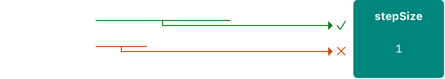
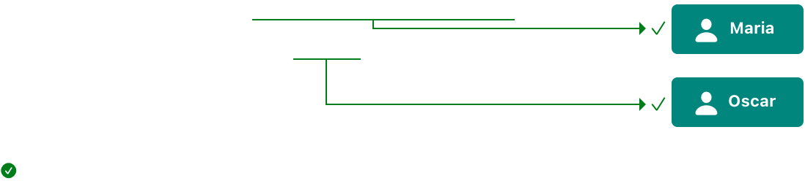
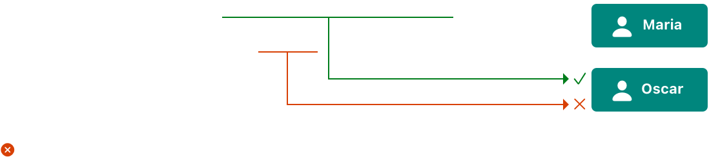

# 内存安全

<DocCaution />

<OriginalLink
  title="构建代码以避免访问内存时发生冲突"
  value="https://docs.swift.org/swift-book/documentation/the-swift-programming-language/memorysafety"
/>

默认情况下，Swift 会阻止代码中发生不安全行为。例如，Swift 确保变量在使用前被初始化，内存在被释放后不被访问，并且检查数组索引是否存在越界错误。

Swift 还确保对同一内存区域的多次访问不会发生冲突，方法是要求修改内存中某个位置的代码具有对该内存的独占访问权限。因为 Swift 自动管理内存，所以大多数时候你根本不需要考虑访问内存。但是，重要的是要了解潜在冲突可能发生的位置，这样您就可以避免编写对内存访问有冲突的代码。如果您的代码确实包含冲突，则会出现编译时或运行时错误。

## 了解内存访问冲突

当您执行诸如设置变量值或将参数传递给函数之类的操作时，就会在代码中访问内存。例如，以下代码同时包含读访问和写访问：

```swift
// A write access to the memory where one is stored.
var one = 1

// A read access from the memory where one is stored.
print("We're number \(one)!")
```

当代码的不同部分试图同时访问内存中的同一位置时，可能会发生内存访问冲突。同时多次访问内存中的某个位置可能会产生不可预测或不一致的行为。在 Swift 中，有多种方法可以修改跨越多行代码的值，从而可以尝试在其自身修改的中间访问值。

通过考虑如何更新写在一张纸上的预算，您可以看到类似的问题。更新预算分为两步：首先添加项目的名称和价格，然后更改总金额以反映当前列表中的项目。更新前后，您可以从预算中读取任何信息并得到正确答案，如下图所示。


当您向预算中添加项目时，它处于临时无效状态，因为总金额尚未更新以反映新添加的项目。在添加项目的过程中读取总金额会给您不正确的信息。

此示例还展示了您在修复内存访问冲突时可能遇到的挑战：有时有多种解决冲突的方法会产生不同的答案，而且哪个答案是正确的并不总是很明显。在此示例中，根据您是想要原始总金额还是更新后的总金额，5 美元或 320 美元可能是正确答案。在解决冲突访问之前，您必须确定它的目的是什么。

:::note
如果您编写过并发或多线程代码，那么内存访问冲突可能是一个常见的问题。但是，这里讨论的冲突访问可能发生在单个线程上，不涉及并发或多线程代码。

如果您在单个线程中对内存的访问发生冲突，Swift 保证您会在编译时或运行时遇到错误。对于多线程代码，使用 Thread Sanitizer 来帮助检测跨线程的访问冲突。
:::

## 内存访问的特点

在冲突访问的上下文中，需要考虑内存访问的三个特征：访问是读取还是写入、访问持续时间以及被访问的内存位置。具体来说，如果您有两个满足以下所有条件的访问权限，则会发生冲突：

- 至少有一个是写访问或非原子访问。
- 他们访问内存中的相同位置。
- 它们的持续时间重叠。

读取和写入访问之间的区别通常很明显：写入访问会更改内存中的位置，但读取访问不会。内存中的位置指的是正在访问的内容——例如，变量、常量或属性。内存访问的持续时间是瞬时的或长期的。

如果一个操作只使用 C 原子操作，那么它就是原子操作；否则它是非原子的。有关这些函数的列表，请参见 stdatomic(3)手册页。

如果在访问开始之后但在结束之前其他代码不可能运行，则访问是即时的。就其本质而言，两个瞬时访问不能同时发生。大多数内存访问是瞬时的。例如，下面代码清单中的所有读写访问都是瞬时的：

```swift
func oneMore(than number: Int) -> Int {
    return number + 1
}

var myNumber = 1
myNumber = oneMore(than: myNumber)
print(myNumber)
// Prints "2"
```

然而，有几种访问内存的方法，称为长期访问，跨越其他代码的执行。瞬时访问和长期访问的区别在于，在长期访问开始之后但在结束之前，其他代码可能会运行，这称为重叠。长期访问可以与其他长期访问和瞬时访问重叠。

重叠访问主要出现在使用函数和方法中的输入输出参数或结构的变异方法的代码中。使用长期访问的特定类型的 Swift 代码将在下面的部分中讨论。

## 对输入输出参数的冲突访问

函数对其所有输入输出参数具有长期写访问权。对 in-out 参数的写访问在所有非 in-out 参数都被评估后开始，并持续该函数调用的整个持续时间。如果有多个 in-out 参数，写访问的开始顺序与参数出现的顺序相同。

这种长期写入访问的一个后果是您无法访问作为输入输出传递的原始变量，即使作用域规则和访问控制以其他方式允许它 — 对原始变量的任何访问都会产生冲突。例如：

```swift
var stepSize = 1

func increment(_ number: inout Int) {
    number += stepSize
}

increment(&stepSize)
// Error: conflicting accesses to stepSize
```

在上面的代码中，是一个全局变量，通常可以从. 但是，对的读访问与对的写访问重叠。如下图，和都指向内存中的同一个位置。读写访问指的是同一个内存，它们重叠，产生冲突。stepSizeincrement(\_:)stepSizenumbernumberstepSize



解决此冲突的一种方法是制作一个显式副本：stepSize

```swift
// Make an explicit copy.
var copyOfStepSize = stepSize
increment(&copyOfStepSize)

// Update the original.
stepSize = copyOfStepSize
// stepSize is now 2
```

当您在调用 之前复制 时，很明显 的值按当前步长递增。读访问在写访问开始之前结束，因此不存在冲突。stepSizeincrement(\_:)copyOfStepSize

对 in-out 参数进行长期写访问的另一个结果是，将单个变量作为参数传递给同一函数的多个 in-out 参数会产生冲突。例如：

```swift
func balance(_ x: inout Int, _ y: inout Int) {
    let sum = x + y
    x = sum / 2
    y = sum - x
}
var playerOneScore = 42
var playerTwoScore = 30
balance(&playerOneScore, &playerTwoScore)  // OK
balance(&playerOneScore, &playerOneScore)
// Error: conflicting accesses to playerOneScore
```

上面的函数修改了它的两个参数以在它们之间平均分配总值。用和作为参数调用它不会产生冲突——有两个写访问在时间上重叠，但它们访问内存中的不同位置。相反，作为两个参数的值传递会产生冲突，因为它试图同时对内存中的同一位置执行两次写访问。balance(_:_:)playerOneScoreplayerTwoScoreplayerOneScore

:::note
因为运算符是函数，所以它们也可以长期访问它们的输入输出参数。例如，如果是一个名为 的运算符函数，写入将导致与 . 相同的冲突。balance(_:_:)<^>playerOneScore <^> playerOneScorebalance(&playerOneScore, &playerOneScore)
:::

## 方法中对自我的冲突访问

self 结构上的变异方法在方法调用期间具有写入权限。例如，考虑一个游戏，其中每个玩家都有一个生命值，它在受到伤害时会减少，而能量值会在使用特殊能力时减少。

```swift
struct Player {
    var name: String
    var health: Int
    var energy: Int

    static let maxHealth = 10
    mutating func restoreHealth() {
        health = Player.maxHealth
    }
}
```

在上面的方法中，写访问从方法的开头开始，一直持续到方法返回。在这种情况下，内部没有其他代码可以重叠访问实例的属性。下面的方法将另一个实例作为输入输出参数，从而产生了重叠访问的可能性。restoreHealth()selfrestoreHealth()PlayershareHealth(with:)Player

```swift
extension Player {
    mutating func shareHealth(with teammate: inout Player) {
        balance(&teammate.health, &health)
    }
}

var oscar = Player(name: "Oscar", health: 10, energy: 10)
var maria = Player(name: "Maria", health: 5, energy: 10)
oscar.shareHealth(with: &maria)  // OK
```

在上面的示例中，调用 Oscar 的玩家与 Maria 的玩家共享健康的方法不会引起冲突。在方法调用期间有一个写访问权限，因为它是可变方法中的值，并且在相同的持续时间内有一个写访问权限，因为它是作为输入输出参数传递的。如下图所示，它们访问内存中的不同位置。尽管这两个写访问在时间上重叠，但它们并不冲突。shareHealth(with:)oscaroscarselfmariamaria



但是，如果您将 oscar 其作为参数传递给，则会发生冲突：shareHealth(with:)

```swift
oscar.shareHealth(with: &oscar)
// Error: conflicting accesses to oscar
```

变异方法需要 self 在该方法的持续时间内具有写入权限，而 in-out 参数需要 teammate 在相同的持续时间内具有写入权限。在该方法中， 和 self 都 teammate 指向内存中的同一位置——如下图所示。两次写访问指的是同一个内存，它们重叠，产生了冲突。



## 对属性的冲突访问

结构、元组和枚举等类型由各个组成值组成，例如结构的属性或元组的元素。因为这些是值类型，改变值的任何部分都会改变整个值，这意味着对其中一个属性的读或写访问需要对整个值的读或写访问。例如，对元组元素的重叠写访问会产生冲突：

```swift
var playerInformation = (health: 10, energy: 20)
balance(&playerInformation.health, &playerInformation.energy)
// Error: conflicting access to properties of playerInformation
```

在上面的示例中，调用元组的元素会产生冲突，因为对 的写访问存在重叠。和都作为输入输出参数传递，这意味着在函数调用期间需要对它们进行写访问。在这两种情况下，对元组元素的写访问都需要对整个元组的写访问。这意味着有两个写访问的持续时间重叠，从而导致冲突。balance(_:_:)playerInformationplayerInformation.healthplayerInformation.energybalance(_:_:)playerInformation

下面的代码显示，对于存储在全局变量中的结构的属性的重叠写访问会出现相同的错误。

```swift
var holly = Player(name: "Holly", health: 10, energy: 10)
balance(&holly.health, &holly.energy)  // Error
```

实际上，大多数对结构属性的访问都可以安全地重叠。holly 例如，如果将上例中的变量更改为局部变量而不是全局变量，编译器可以证明对结构的存储属性的重叠访问是安全的：

```swift
func someFunction() {
    var oscar = Player(name: "Oscar", health: 10, energy: 10)
    balance(&oscar.health, &oscar.energy)  // OK
}
```

在上面的示例中，Oscar 的健康和能量作为两个输入输出参数传递给。编译器可以证明内存安全得以保留，因为两个存储的属性不会以任何方式交互。balance(_:_:)

对结构属性的重叠访问的限制并不总是保护内存安全所必需的。内存安全是理想的保证，但独占访问是比内存安全更严格的要求——这意味着一些代码保持内存安全，即使它违反了对内存的独占访问。如果编译器可以证明对内存的非独占访问仍然安全，则 Swift 允许此内存安全代码。具体来说，如果满足以下条件，它可以证明对结构属性的重叠访问是安全的：

- 您仅访问实例的存储属性，而不是计算属性或类属性。
- 该结构是局部变量的值，而不是全局变量。
- 该结构要么不被任何闭包捕获，要么只被非转义闭包捕获。
- 如果编译器不能证明访问是安全的，它就不允许访问。
