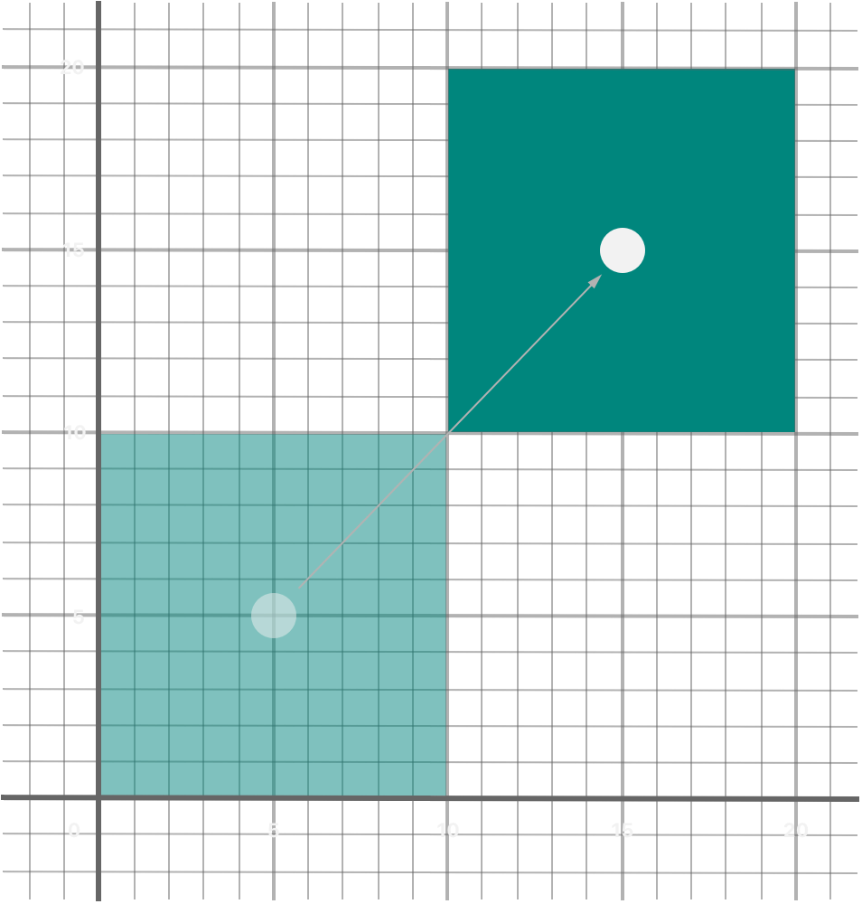
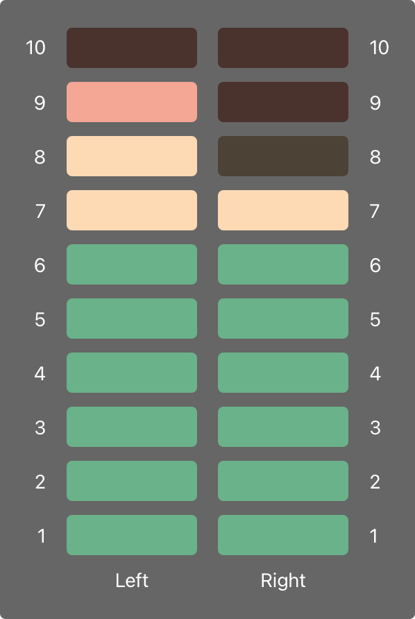

# 属性

<DocCaution />

<OriginalLink
  title="访问作为实例或类型一部分的存储值和计算值"
  value="https://docs.swift.org/swift-book/documentation/the-swift-programming-language/properties"
/>

属性将值与特定的类、结构或枚举相关联。存储属性将常量和变量值存储为实例的一部分，而计算属性计算（而不是存储）一个值。计算属性由类、结构和枚举提供。存储属性仅由类和结构提供。

存储和计算属性通常与特定类型的实例相关联。但是，属性也可以与类型本身相关联。此类属性称为类型属性。

此外，你可以定义属性观察器来监视属性值的变化，你可以使用自定义操作来响应这些变化。属性观察器可以添加到你自己定义的存储属性中，也可以添加到子类从其超类继承的属性中。

你还可以使用属性包装器在多个属性的 getter 和 setter 中重用代码。

## 存储属性

在最简单的形式中，存储属性是作为特定类或结构的实例的一部分存储的常量或变量。存储属性可以是变量存储属性（由关键字引入 var）或常量存储属性（由 let 关键字引入）。

你可以为存储属性提供默认值作为其定义的一部分，如默认属性值中所述。你还可以在初始化期间设置和修改存储属性的初始值。即使对于常量存储属性也是如此，如在初始化期间分配常量属性中所述。

下面的示例定义了一个名为 的结构，它描述了一系列整数，其范围长度在创建后不能更改：FixedLengthRange

```swift
struct FixedLengthRange {
    var firstValue: Int
    let length: Int
}
var rangeOfThreeItems = FixedLengthRange(firstValue: 0, length: 3)
// the range represents integer values 0, 1, and 2
rangeOfThreeItems.firstValue = 6
// the range now represents integer values 6, 7, and 8
```

的实例有一个名为 的变量存储属性和一个名为 的常量存储属性。在上面的示例中，在创建新范围时初始化并且此后不能更改，因为它是一个常量属性。FixedLengthRangefirstValuelengthlength

## 常量结构实例的存储属性

如果你创建结构的实例并将该实例分配给常量，则无法修改实例的属性，即使它们被声明为变量属性：

```swift
let rangeOfFourItems = FixedLengthRange(firstValue: 0, length: 4)
// this range represents integer values 0, 1, 2, and 3
rangeOfFourItems.firstValue = 6
// this will report an error, even though firstValue is a variable property
```

因为被声明为一个常量（使用关键字），所以不可能改变它的属性，即使它是一个可变属性。rangeOfFourItemsletfirstValuefirstValue

此行为是由于结构是值类型。当值类型的实例被标记为常量时，它的所有属性也是如此。

对于属于引用类型的类，情况并非如此。如果将引用类型的实例分配给常量，你仍然可以更改该实例的变量属性。

## 惰性存储属性

惰性存储属性是一种属性，其初始值直到第一次使用时才会计算。lazy 你可以通过在声明之前编写修饰符来指示惰性存储属性。

:::note
你必须始终将惰性属性声明为变量（使用关键字 var），因为在实例初始化完成之前可能无法检索其初始值。常量属性在初始化完成之前必须始终有一个值，因此不能声明为惰性的。
:::

当属性的初始值取决于外部因素时，惰性属性很有用，这些外部因素的值在实例初始化完成后才知道。当属性的初始值需要复杂或计算量大的设置时，惰性属性也很有用，除非需要或直到需要时才应执行这些设置。

下面的示例使用惰性存储属性来避免对复杂类进行不必要的初始化。此示例定义了两个名为 and 的类，但均未完整显示：DataImporterDataManager

```swift
class DataImporter {
    /*
    DataImporter is a class to import data from an external file.
    The class is assumed to take a nontrivial amount of time to initialize.
    */
    var filename = "data.txt"
    // the DataImporter class would provide data importing functionality here
}

class DataManager {
    lazy var importer = DataImporter()
    var data: [String] = []
    // the DataManager class would provide data management functionality here
}

let manager = DataManager()
manager.data.append("Some data")
manager.data.append("Some more data")
// the DataImporter instance for the importer property hasn't yet been created
```

该类有一个名为 的存储属性，它使用一个新的空值数组进行初始化。尽管未显示其其余功能，但此类的目的是管理和提供对此数据数组的访问。DataManagerdataStringDataManagerString

该类的部分功能是能够从文件中导入数据。此功能由类提供，假定需要花费大量时间进行初始化。这可能是因为实例在初始化时需要打开文件并将其内容读入内存。DataManagerDataImporterDataImporterDataImporter

因为实例可以在不从文件导入数据的情况下管理其数据，所以在创建自身时不会创建新实例。相反，在首次使用时创建实例更有意义。DataManagerDataManagerDataImporterDataManagerDataImporter

因为它标有修饰符 lazy，所以属性的实例仅在首次访问该属性时创建，例如在查询其属性时：DataImporterimporterimporterfilename

```swift
print(manager.importer.filename)
// the DataImporter instance for the importer property has now been created
// Prints "data.txt"
```

:::note
如果标记有修饰符的属性 lazy 被多个线程同时访问并且该属性尚未初始化，则不能保证该属性只会被初始化一次。
:::

## 存储的属性和实例变量

如果你有使用 Objective-C 的经验，你可能知道它提供了两种方法来将值和引用存储为类实例的一部分。除了属性之外，你还可以使用实例变量作为存储在属性中的值的后备存储。

Swift 将这些概念统一到一个属性声明中。Swift 属性没有相应的实例变量，并且不能直接访问属性的后备存储。这种方法避免了在不同上下文中如何访问值的混淆，并将属性的声明简化为一个单一的、确定的语句。有关属性的所有信息（包括其名称、类型和内存管理特征）都作为类型定义的一部分在单个位置定义。

## 计算属性

除了存储属性之外，类、结构和枚举还可以定义计算属性，这些属性实际上并不存储值。相反，它们提供了一个 getter 和一个可选的 setter 来间接检索和设置其它属性和值。

```swift
struct Point {
    var x = 0.0, y = 0.0
}
struct Size {
    var width = 0.0, height = 0.0
}
struct Rect {
    var origin = Point()
    var size = Size()
    var center: Point {
        get {
            let centerX = origin.x + (size.width / 2)
            let centerY = origin.y + (size.height / 2)
            return Point(x: centerX, y: centerY)
        }
        set(newCenter) {
            origin.x = newCenter.x - (size.width / 2)
            origin.y = newCenter.y - (size.height / 2)
        }
    }
}
var square = Rect(origin: Point(x: 0.0, y: 0.0),
    size: Size(width: 10.0, height: 10.0))
let initialSquareCenter = square.center
// initialSquareCenter is at (5.0, 5.0)
square.center = Point(x: 15.0, y: 15.0)
print("square.origin is now at (\(square.origin.x), \(square.origin.y))")
// Prints "square.origin is now at (10.0, 10.0)"
```

此示例定义了三个用于处理几何形状的结构：

- Point 封装点的 x 和 y 坐标。
- Size 封装 awidth 和 a height。
- Rect 通过原点和大小定义矩形。

该 Rect 结构还提供了一个名为 的计算属性 center。a 的当前中心位置始终可以从它的 andRect 确定，因此你不需要将中心点存储为显式值。相反，为名为 的计算变量定义自定义 getter 和 setter ，使你能够像处理真正的存储属性一样使用矩形。originsizePointRectcentercenter

上面的示例创建了一个 Rect 名为 的新变量 square。该 square 变量初始化为原点(0, 0)，宽度和高度为 10。这个方块在下图中用浅绿色方块表示。

然后通过点语法 ( ) 访问 square 变量的属性，这会导致调用 getter 以检索当前属性值。getter 不是返回现有值，而是实际计算并返回一个新值来表示正方形的中心。从上面可以看出，getter 正确地返回了一个中心点。centersquare.centercenterPoint(5, 5)

然后将该属性 center 设置为新值(15, 15)，这会将方块向上和向右移动到下图中深绿色方块所示的新位置。设置该 center 属性会调用 的 setter center，它会修改存储属性的 x 和值，并将正方形移动到新位置。yorigin



## 速记 Setter 声明

如果计算属性的设置器没有为要设置的新值定义名称，则使用默认名称。下面是利用这种速记符号的结构的替代版本：newValueRect

```swift
struct AlternativeRect {
    var origin = Point()
    var size = Size()
    var center: Point {
        get {
            let centerX = origin.x + (size.width / 2)
            let centerY = origin.y + (size.height / 2)
            return Point(x: centerX, y: centerY)
        }
        set {
            origin.x = newValue.x - (size.width / 2)
            origin.y = newValue.y - (size.height / 2)
        }
    }
}
```

## 简写 Getter 声明

如果 getter 的整个主体是单个表达式，则 getter 隐式返回该表达式。这是该结构的另一个版本 Rect，它利用了这种简写符号和 setter 的简写符号：

```swift
struct CompactRect {
    var origin = Point()
    var size = Size()
    var center: Point {
        get {
            Point(x: origin.x + (size.width / 2),
                  y: origin.y + (size.height / 2))
        }
        set {
            origin.x = newValue.x - (size.width / 2)
            origin.y = newValue.y - (size.height / 2)
        }
    }
}
```

return 从 getter 中省略 the 遵循与 return 从函数中省略相同的规则，如 Functions With an Implicit Return 中所述。

## 只读计算属性

具有 getter 但没有 setter 的计算属性称为只读计算属性。只读计算属性总是返回一个值，可以通过点语法访问，但不能设置为不同的值。

:::note
你必须使用关键字将计算属性（包括只读计算属性）声明为变量属性 var，因为它们的值不是固定的。该 let 关键字仅用于常量属性，以指示一旦将它们设置为实例初始化的一部分，它们的值就无法更改。
:::

get 你可以通过删除关键字及其大括号来简化只读计算属性的声明：

```swift
struct Cuboid {
    var width = 0.0, height = 0.0, depth = 0.0
    var volume: Double {
        return width * height * depth
    }
}
let fourByFiveByTwo = Cuboid(width: 4.0, height: 5.0, depth: 2.0)
print("the volume of fourByFiveByTwo is \(fourByFiveByTwo.volume)")
// Prints "the volume of fourByFiveByTwo is 40.0"
```

此示例定义了一个名为 的新结构，它表示具有、和属性 Cuboid 的 3D 矩形框。此结构还有一个名为 的只读计算属性，它计算并返回长方体的当前体积。可设置是没有意义的，因为关于、和 的哪些值应该用于特定值是不明确的。尽管如此，提供只读计算属性以使外部用户能够发现其当前计算量还是很有用的。widthheightdepthvolumevolumewidthheightdepthvolumeCuboid

## 物业观察员

财产观察员观察并响应财产价值的变化。每次设置属性值时都会调用属性观察器，即使新值与属性的当前值相同。

你可以在以下位置添加属性观察器：

- 你定义的存储属性
- 你继承的存储属性
- 你继承的计算属性

对于继承的属性，你可以通过在子类中覆盖该属性来添加属性观察器。对于你定义的计算属性，使用属性的设置器来观察和响应值变化，而不是尝试创建观察者。覆盖属性在覆盖中描述。

你可以选择在属性上定义其中一个或两个观察者：

- willSet 在存储值之前调用。
- didSet 在存储新值后立即调用。

如果你实现一个观察者，它会将新的属性值作为常量参数传递。作为实现的一部分，你可以为此参数指定一个名称。如果你没有在你的实现中写入参数名称和括号，则该参数可以使用默认参数名称.willSetwillSetnewValue

类似地，如果你实现一个观察者，它会传递一个包含旧属性值的常量参数。你可以命名参数或使用默认参数名称。如果你在其自己的观察者中为属性分配一个值，则你分配的新值将替换刚刚设置的值。didSetoldValuedidSet

:::note
在超类初始值设定项被调用之后，当在子类初始值设定项中设置属性时，将调用超类属性的 和观察者。在调用超类初始值设定项之前，类设置自己的属性时不会调用它们。willSetdidSet
:::

有关初始化程序委托的更多信息，请参阅值类型的初始化程序委托和类类型的初始化程序委托。

下面是一个例子和实际操作。下面的示例定义了一个名为 的新类，它跟踪一个人走路时的总步数。此类可以与来自计步器或其它计步器的输入数据一起使用，以跟踪一个人在日常生活中的锻炼情况。willSetdidSetStepCounter

```swift
class StepCounter {
    var totalSteps: Int = 0 {
        willSet(newTotalSteps) {
            print("About to set totalSteps to \(newTotalSteps)")
        }
        didSet {
            if totalSteps > oldValue  {
                print("Added \(totalSteps - oldValue) steps")
            }
        }
    }
}
let stepCounter = StepCounter()
stepCounter.totalSteps = 200
// About to set totalSteps to 200
// Added 200 steps
stepCounter.totalSteps = 360
// About to set totalSteps to 360
// Added 160 steps
stepCounter.totalSteps = 896
// About to set totalSteps to 896
// Added 536 steps
```

该类声明了 type 的属性。这是一个带有观察者的存储属性。StepCountertotalStepsIntwillSetdidSet

每当为属性分配新值时，都会调用和观察者。即使新值与当前值相同也是如此。willSetdidSettotalSteps

此示例的观察者使用自定义参数名称来表示即将到来的新值。在此示例中，它只是打印出即将设置的值。willSetnewTotalSteps

更新值后调用观察者。它将新值与旧值进行比较。如果总步数增加，则会打印一条消息以指示已采取了多少新步数。观察者不为旧值提供自定义参数名称，而是使用默认名称。didSettotalStepstotalStepsdidSetoldValue

:::note
如果将具有观察者的属性作为输入输出参数传递给函数，则始终会调用和观察者。这是因为输入输出参数的复制输入复制输出内存模型：该值总是在函数结束时写回属性。有关输入输出参数行为的详细讨论，请参阅输入输出参数。willSetdidSet
:::

## 属性包装器

属性包装器在管理属性存储方式的代码和定义属性的代码之间添加了一层分离。例如，如果你有提供线程安全检查或将其基础数据存储在数据库中的属性，则必须在每个属性上编写该代码。当你使用属性包装器时，你在定义包装器时编写一次管理代码，然后通过将其应用于多个属性来重用该管理代码。

要定义属性包装器，你需要创建一个结构、枚举或定义属性的类。在下面的代码中，该结构确保它包装的值始终包含小于或等于 12 的数字。如果你要求它存储更大的数字，它会存储 12。wrappedValueTwelveOrLess

```swift
@propertyWrapper
struct TwelveOrLess {
    private var number = 0
    var wrappedValue: Int {
        get { return number }
        set { number = min(newValue, 12) }
    }
}
```

setter 确保新值小于或等于 12，getter 返回存储的值。

:::note
上例中的声明 number 将变量标记为 private，这确保 number 仅在 的实现中使用。在其它地方编写的代码使用 的 getter 和 setter 访问值，不能直接使用。有关的信息，请参阅访问控制。TwelveOrLesswrappedValuenumberprivate
:::

通过将包装器的名称作为属性写入属性之前，你可以将包装器应用于属性。这是一个存储矩形的结构，该矩形使用属性包装器确保其尺寸始终为 12 或更小：TwelveOrLess

```swift
struct SmallRectangle {
    @TwelveOrLess var height: Int
    @TwelveOrLess var width: Int
}

var rectangle = SmallRectangle()
print(rectangle.height)
// Prints "0"

rectangle.height = 10
print(rectangle.height)
// Prints "10"

rectangle.height = 24
print(rectangle.height)
// Prints "12"
```

和属性从 的定义中获取其初始值，该值设置 height 为零。in 的 setter 将 10 视为有效值，因此将数字 10 in 存储为写入的收益。但是，24 大于允许值，因此尝试存储 24 最终设置为 12，即最大允许值。widthTwelveOrLessTwelveOrLess.numberTwelveOrLessrectangle.heightTwelveOrLessrectangle.height

将包装器应用于属性时，编译器会合成为包装器提供存储的代码和通过包装器提供对属性的访问的代码。（属性包装器负责存储包装后的值，因此没有合成代码。）你可以编写使用属性包装器行为的代码，而无需利用特殊的属性语法。例如，这是前面代码清单的一个版本，它显式地将其属性包装在结构中，而不是写为属性：SmallRectangleTwelveOrLess@TwelveOrLess

```swift
struct SmallRectangle {
    private var _height = TwelveOrLess()
    private var _width = TwelveOrLess()
    var height: Int {
        get { return _height.wrappedValue }
        set { _height.wrappedValue = newValue }
    }
    var width: Int {
        get { return _width.wrappedValue }
        set { _width.wrappedValue = newValue }
    }
}
```

和属性存储属性包装\_height 器\_width 的实例，. 属性的 getter 和 setter 并包装对属性的访问。TwelveOrLessheightwidthwrappedValue

## 为包装属性设置初始值

上面示例中的代码通过在 number 的定义中给出初始值来设置包装属性的初始值。使用此属性包装器的代码不能为被包装的属性指定不同的初始值— 例如，无法给出或初始值的定义。为了支持设置初始值或其它自定义，属性包装器需要添加一个初始化器。这是 call 的扩展版本，它定义了设置包装值和最大值的初始化器：TwelveOrLessTwelveOrLessSmallRectangleheightwidthTwelveOrLessSmallNumber

```swift
@propertyWrapper
struct SmallNumber {
    private var maximum: Int
    private var number: Int

    var wrappedValue: Int {
        get { return number }
        set { number = min(newValue, maximum) }
    }

    init() {
        maximum = 12
        number = 0
    }
    init(wrappedValue: Int) {
        maximum = 12
        number = min(wrappedValue, maximum)
    }
    init(wrappedValue: Int, maximum: Int) {
        self.maximum = maximum
        number = min(wrappedValue, maximum)
    }
}
```

的定义包括三个初始值设定项 — 、和— 下面的示例使用它们来设置包装值和最大值。有关初始化和初始化程序语法的信息，请参阅初始化。SmallNumberinit()init(wrappedValue:)init(wrappedValue:maximum:)

当你将一个包装器应用到一个属性并且你没有指定一个初始值时，Swift 使用初始化器 init()来设置包装器。例如：

```swift
struct ZeroRectangle {
    @SmallNumber var height: Int
    @SmallNumber var width: Int
}

var zeroRectangle = ZeroRectangle()
print(zeroRectangle.height, zeroRectangle.width)
// Prints "0 0"
```

该包装的实例是通过调用创建的。该初始化器中的代码使用默认值 0 和 12 设置初始包装值和初始最大值。属性包装器仍然提供所有初始值，就像前面使用的示例一样。与该示例不同，还支持在声明属性时写入这些初始值。SmallNumberheightwidthSmallNumber()TwelveOrLessSmallRectangleSmallNumber

当你为属性指定初始值时，Swift 使用初始化器来设置包装器。例如：init(wrappedValue:)

```swift
struct UnitRectangle {
    @SmallNumber var height: Int = 1
    @SmallNumber var width: Int = 1
}

var unitRectangle = UnitRectangle()
print(unitRectangle.height, unitRectangle.width)
// Prints "1 1"
```

当你= 1 使用包装器编写属性时，这将转换为对初始化程序的调用。该包装的实例是通过调用创建的。初始化程序使用此处指定的包装值，并使用默认最大值 12。init(wrappedValue:)SmallNumberheightwidthSmallNumber(wrappedValue: 1)

当你在自定义属性后面的括号中写参数时，Swift 使用接受这些参数的初始化器来设置包装器。例如，如果你提供一个初始值和一个最大值，Swift 会使用初始化器：init(wrappedValue:maximum:)

```swift
struct NarrowRectangle {
    @SmallNumber(wrappedValue: 2, maximum: 5) var height: Int
    @SmallNumber(wrappedValue: 3, maximum: 4) var width: Int
}

var narrowRectangle = NarrowRectangle()
print(narrowRectangle.height, narrowRectangle.width)
// Prints "2 3"

narrowRectangle.height = 100
narrowRectangle.width = 100
print(narrowRectangle.height, narrowRectangle.width)
// Prints "5 4"
```

包装的实例是通过调用创建的，包装的实例是通过调用创建的。SmallNumberheightSmallNumber(wrappedValue: 2, maximum: 5)widthSmallNumber(wrappedValue: 3, maximum: 4)

通过向属性包装器包含参数，你可以在包装器中设置初始状态或在创建包装器时将其它选项传递给包装器。此语法是使用属性包装器的最通用方式。你可以向属性提供你需要的任何参数，并将它们传递给初始化程序。

当你包含属性包装器参数时，你还可以使用赋值指定初始值。Swift 将赋值视为参数，并使用接受你包含的参数的初始化程序。例如：wrappedValue

```swift
struct MixedRectangle {
    @SmallNumber var height: Int = 1
    @SmallNumber(maximum: 9) var width: Int = 2
}

var mixedRectangle = MixedRectangle()
print(mixedRectangle.height)
// Prints "1"

mixedRectangle.height = 20
print(mixedRectangle.height)
// Prints "12"
```

包装的实例是通过调用创建的，它使用默认最大值 12。包装的实例是通过调用创建的。SmallNumberheightSmallNumber(wrappedValue: 1)widthSmallNumber(wrappedValue: 2, maximum: 9)

## 从属性包装器投射一个值

除了包装值之外，属性包装器还可以通过定义投影值来公开其它功能——例如，管理对数据库的访问的属性包装器可以公开其投影值的方法。投影值的名称与包装值相同，只是它以美元符号 ( ) 开头。因为你的代码无法定义以投影值开头的属性，所以永远不会干扰你定义的属性。flushDatabaseConnection()$$

在上面的示例中，如果你尝试将属性设置为太大的数字，属性包装器会在存储之前调整该数字。下面的代码将属性添加到结构中，以跟踪属性包装器是否在存储新值之前调整了属性的新值。SmallNumberprojectedValueSmallNumber

```swift
@propertyWrapper
struct SmallNumber {
    private var number: Int
    private(set) var projectedValue: Bool

    var wrappedValue: Int {
        get { return number }
        set {
            if newValue > 12 {
                number = 12
                projectedValue = true
            } else {
                number = newValue
                projectedValue = false
            }
        }
    }

    init() {
        self.number = 0
        self.projectedValue = false
    }
}
struct SomeStructure {
    @SmallNumber var someNumber: Int
}
var someStructure = SomeStructure()

someStructure.someNumber = 4
print(someStructure.$someNumber)
// Prints "false"

someStructure.someNumber = 55
print(someStructure.$someNumber)
// Prints "true"
```

写入访问包装器的预计值。存储一个像四这样的小数字后， 的值为。但是，预测值是在尝试存储一个太大的数字（例如 55）之后得出的。someStructure.$someNumbersomeStructure.$someNumberfalsetrue

属性包装器可以返回任何类型的值作为其投影值。在这个例子中，属性包装器只公开了一条信息——数字是否被调整——所以它公开了布尔值作为它的预测值。需要公开更多信息的包装器可以返回某个其它类型的实例，或者它可以返回 self 以公开包装器的实例作为其投影值。

当你从作为类型一部分的代码（如属性获取器或实例方法）访问投影值时，你可以在 self.属性名称前省略，就像访问其它属性一样。以下示例中的代码指的是围绕 heightand 的包装器的预计值 widthas $heightand $width：

```swift
enum Size {
    case small, large
}

struct SizedRectangle {
    @SmallNumber var height: Int
    @SmallNumber var width: Int

    mutating func resize(to size: Size) -> Bool {
        switch size {
        case .small:
            height = 10
            width = 20
        case .large:
            height = 100
            width = 100
        }
        return $height || $width
    }
}
```

因为属性包装器语法只是具有 getter 和 setter 的属性的语法糖，访问 height 和 width 行为与访问任何其它属性相同。例如，resize(to:)访问 height 和 width 使用它们的属性包装器中的代码。如果你调用 resize(to: .large)，则 switch case 将.large 矩形的高度和宽度设置为 100。包装器防止这些属性的值大于 12，并将投影值设置为 true，以记录它调整了它们的值的事实。在 的末尾 resize(to:)，返回语句检查$height并$width 确定属性包装器是否调整了 height 或 width。

## 全局变量和局部变量

上述计算和观察属性的能力也适用于全局变量和局部变量。全局变量是在任何函数、方法、闭包或类型上下文之外定义的变量。局部变量是在函数、方法或闭包上下文中定义的变量。

前面章节遇到的全局变量和局部变量都是存储变量。存储变量，如存储属性，为特定类型的值提供存储，并允许设置和检索该值。

但是，你还可以在全局或局部范围内定义计算变量并为存储变量定义观察者。计算变量计算它们的值，而不是存储它，它们的编写方式与计算属性相同。

:::note
全局常量和变量总是延迟计算，类似于延迟存储属性。与惰性存储属性不同，全局常量和变量不需要用修饰符标记 lazy。
:::

局部常量和变量永远不会延迟计算。

你可以将属性包装器应用于本地存储变量，但不能应用于全局变量或计算变量。例如，在下面的代码中，用作属性包装器。myNumberSmallNumber

```swift
func someFunction() {
    @SmallNumber var myNumber: Int = 0

    myNumber = 10
    // now myNumber is 10

    myNumber = 24
    // now myNumber is 12
}
```

就像你申请属性时一样，将 的值设置为 10 是有效的。因为属性包装器不允许大于 12 的值，所以它设置为 12 而不是 24。SmallNumbermyNumbermyNumber

## 类型属性

实例属性是属于特定类型实例的属性。每次创建该类型的新实例时，它都有自己的一组属性值，与任何其它实例分开。

你还可以定义属于类型本身的属性，而不属于该类型的任何一个实例。无论你创建了多少该类型的实例，这些属性都只会有一个副本。这些类型的属性称为类型属性。

类型属性可用于定义对特定类型的所有实例通用的值，例如所有实例都可以使用的常量属性（如 C 中的静态常量），或存储对所有实例通用的值的变量属性那种类型（就像 C 中的静态变量）。

存储的类型属性可以是变量或常量。计算类型属性始终声明为变量属性，与计算实例属性的方式相同。

:::note
与存储实例属性不同，你必须始终为存储类型属性提供默认值。这是因为类型本身没有可以在初始化时为存储的类型属性赋值的初始化器。
:::

存储类型属性在第一次访问时延迟初始化。它们保证只被初始化一次，即使被多个线程同时访问，它们也不需要用修饰符标记 lazy。

## 类型属性语法

在 C 和 Objective-C 中，你将与类型关联的静态常量和变量定义为全局静态变量。然而，在 Swift 中，类型属性是作为类型定义的一部分编写的，在类型的外部花括号内，并且每个类型属性都明确限定在它支持的类型范围内。

你使用关键字定义类型属性 static。对于类类型的计算类型属性，你可以改用 class 关键字来允许子类覆盖超类的实现。下面的示例显示了存储和计算类型属性的语法：

```swift
struct SomeStructure {
    static var storedTypeProperty = "Some value."
    static var computedTypeProperty: Int {
        return 1
    }
}
enum SomeEnumeration {
    static var storedTypeProperty = "Some value."
    static var computedTypeProperty: Int {
        return 6
    }
}
class SomeClass {
    static var storedTypeProperty = "Some value."
    static var computedTypeProperty: Int {
        return 27
    }
    class var overrideableComputedTypeProperty: Int {
        return 107
    }
}
```

:::note
上面的计算类型属性示例适用于只读计算类型属性，但你也可以使用与计算实例属性相同的语法定义读写计算类型属性。
:::

## 查询和设置类型属性

使用点语法查询和设置类型属性，就像实例属性一样。但是，类型属性是在 type 上查询和设置的，而不是在该类型的实例上。例如：

```swift
print(SomeStructure.storedTypeProperty)
// Prints "Some value."
SomeStructure.storedTypeProperty = "Another value."
print(SomeStructure.storedTypeProperty)
// Prints "Another value."
print(SomeEnumeration.computedTypeProperty)
// Prints "6"
print(SomeClass.computedTypeProperty)
// Prints "27"
```

下面的示例使用两个存储的类型属性作为结构的一部分，该结构为多个音频通道建模音频电平表。每个通道都有一个介于 0 和之间的整数音频电平 10。

下图说明了如何将这些音频通道中的两个组合起来以模拟立体声音频电平表。当通道的音频电平为 时 0，该通道的所有灯都不亮。当音频电平为 时 10，该通道的所有灯都会点亮。在此图中，左声道的电流电平为 9，右声道的电流电平为 7：



上述音频通道由结构实例表示：AudioChannel

```swift
struct AudioChannel {
    static let thresholdLevel = 10
    static var maxInputLevelForAllChannels = 0
    var currentLevel: Int = 0 {
        didSet {
            if currentLevel > AudioChannel.thresholdLevel {
                // cap the new audio level to the threshold level
                currentLevel = AudioChannel.thresholdLevel
            }
            if currentLevel > AudioChannel.maxInputLevelForAllChannels {
                // store this as the new overall maximum input level
                AudioChannel.maxInputLevelForAllChannels = currentLevel
            }
        }
    }
}
```

该结构定义了两个存储类型属性以支持其功能。第一个，定义了音频级别可以采用的最大阈值。这是所有实例的常数值。如果音频信号的值高于，它将被限制为该阈值（如下所述）。AudioChannelthresholdLevel10AudioChannel10

第二种类型的属性是一个名为 的变量存储属性。这会跟踪任何实例已收到的最大输入值。它以 的初始值开始。maxInputLevelForAllChannels AudioChannel0

该结构还定义了一个名为 的存储实例属性，它表示通道的当前音频级别，比例为至。AudioChannelcurrentLevel010

该属性有一个属性观察器来检查它何时被设置的值。该观察者执行两项检查：currentLeveldidSetcurrentLevel

- 如果 的新值大于允许的值，则属性观察器上限为。currentLevelthresholdLevelcurrentLevelthresholdLevel
- 如果（在任何上限之后）的新值高于任何实例先前接收到的任何值，则属性观察器将新值存储在类型属性中。currentLevel AudioChannelcurrentLevelmaxInputLevelForAllChannels

:::note
在这两个检查的第一个中，观察者设置为不同的值。但是，这不会导致再次调用观察者。didSetcurrentLevel
:::

你可以使用该结构创建两个名为和的新音频通道，以表示立体声系统的音频电平：AudioChannelleftChannelrightChannel

```swift
var leftChannel = AudioChannel()
var rightChannel = AudioChannel()
```

如果将左声道的设置为，你可以看到类型属性更新为等于：currentLevel7maxInputLevelForAllChannels7

```swift
leftChannel.currentLevel = 7
print(leftChannel.currentLevel)
// Prints "7"
print(AudioChannel.maxInputLevelForAllChannels)
// Prints "7"
```

如果你尝试将右声道的设置为，你可以看到右声道的属性上限为 的最大值，并且 type 属性更新为等于：currentLevel11currentLevel10maxInputLevelForAllChannels10

```swift
rightChannel.currentLevel = 11
print(rightChannel.currentLevel)
// Prints "10"
print(AudioChannel.maxInputLevelForAllChannels)
// Prints "10"
```
