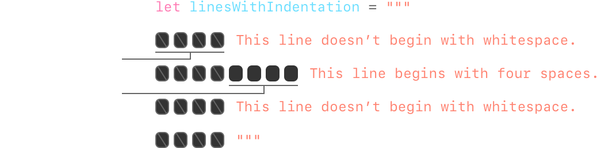

# 字符串和字符

<ToBePolishedAfterTranslation />

<OriginalSource
  title="Strings and Characters"
  url="https://docs.swift.org/swift-book/documentation/the-swift-programming-language/stringsandcharacters"
  summary="存储和操作文本"
/>

字符串是一系列字符，例如"hello, world"或"albatross"。Swift 字符串由类型表示 String。String 可以通过多种方式访问 a 的内容，包括作为 Character 值的集合。

SwiftString 和 Character 类型提供了一种快速、符合 Unicode 标准的方式来处理代码中的文本。字符串创建和操作的语法是轻量级和可读的，具有类似于 C 的字符串文字语法。字符串连接就像使用运算符组合两个字符串一样简单，字符串可变性通过在常量或变量之间进行选择来管理，+只需就像 Swift 中的任何其它值一样。你还可以使用字符串将常量、变量、文字和表达式插入到更长的字符串中，这一过程称为字符串插值。这使得创建用于显示、存储和打印的自定义字符串值变得容易。

尽管语法如此简单，但 Swift 的 String 类型是一种快速、现代的字符串实现。每个字符串都由与编码无关的 Unicode 字符组成，并支持以各种 Unicode 表示形式访问这些字符。

:::note
Swift 的 String 类型与 Foundation 的类桥接在一起 NSString。Foundation 还扩展 String 以公开由 NSString. 这意味着，如果你导入 Foundation，则无需强制转换即可访问这些 NSString 方法 String。
:::

有关使用 StringFoundation 和 Cocoa 的更多信息，请参阅 String 和 NSString 之间的桥接。

## 字符串文字

你可以 String 在代码中包含预定义值作为字符串文字。字符串文字是用双引号 ( ) 括起来的字符序列"。

使用字符串文字作为常量或变量的初始值：

```swift
let someString = "Some string literal value"
```

String 请注意，Swift 为常量推断出一种类型，因为它是用字符串文字值初始化的。someString

## 多行字符串文字

如果你需要跨越多行的字符串，请使用多行字符串文字 — 由三个双引号括起来的字符序列：

```swift
let quotation = """
The White Rabbit put on his spectacles.  "Where shall I begin,
please your Majesty?" he asked.

"Begin at the beginning," the King said gravely, "and go on
till you come to the end; then stop."
"""
```

多行字符串文字包括其左引号和右引号之间的所有行。该字符串从左引号 ( """) 之后的第一行开始，到右引号之前的行结束，这意味着下面的字符串均不以换行符开头或结尾：

```swift
let singleLineString = "These are the same."
let multilineString = """
These are the same.
"""
```

当你的源代码在多行字符串文字中包含换行符时，该换行符也会出现在字符串的值中。如果你想使用换行符使你的源代码更易于阅读，但你不希望换行符成为字符串值的一部分，请在这些行的末尾写一个反斜杠 ( ) \：

```swift
let softWrappedQuotation = """
The White Rabbit put on his spectacles.  "Where shall I begin, \
please your Majesty?" he asked.

"Begin at the beginning," the King said gravely, "and go on \
till you come to the end; then stop."
"""
```

要制作以换行符开始或结束的多行字符串文字，请写一个空行作为第一行或最后一行。例如：

```swift
let lineBreaks = """

This string starts with a line break.
It also ends with a line break.

"""
```

多行字符串可以缩进以匹配周围的代码。右引号 ( """) 之前的空格告诉 Swift 在所有其它行之前要忽略的空格。但是，如果除了右引号之前的内容之外，你还在一行的开头写入空格，那么该空格也会被包括在内。



在上面的示例中，即使缩进了整个多行字符串文字，字符串中的第一行和最后一行也不以任何空格开头。中间一行的缩进比右引号多，所以它以额外的四个空格缩进开始。

## 字符串文字中的特殊字符

字符串文字可以包含以下特殊字符：

- 转义的特殊字符 `\0`（空字符）、`\\`（反斜杠）、 （水平制表 `\t` 符 `\n`）、（换行）、`\r`（回车）、`\"`（双引号）和 `\'`（单引号）
- 任意 Unicode 标量值，写为 `\\` u{n}，其中 n 是 1-8 位十六进制数（Unicode 在下面的 Unicode 中讨论）

下面的代码显示了这些特殊字符的四个示例。该常量包含两个转义双引号。、和常量演示 Unicode 标量格式：wiseWordsdollarSignblackHeartsparklingHeart

```swift
let wiseWords = "\"Imagination is more important than knowledge\" - Einstein"
// "Imagination is more important than knowledge" - Einstein
let dollarSign = "\u{24}"        // $,  Unicode scalar U+0024
let blackHeart = "\u{2665}"      // ♥,  Unicode scalar U+2665
let sparklingHeart = "\u{1F496}" // 💖, Unicode scalar U+1F496
```

因为多行字符串文字使用三个双引号而不是一个双引号，所以你可以"在多行字符串文字中包含一个双引号 ( ) 而无需转义。要将文本包含"""在多行字符串中，请至少转义一个引号。例如：

```swift
let threeDoubleQuotationMarks = """
Escaping the first quotation mark \"""
Escaping all three quotation marks \"\"\"
"""
```

## 扩展字符串定界符

你可以将字符串文字放在扩展定界符中，以在字符串中包含特殊字符，而无需调用它们的效果。你将字符串放在引号 ( ") 内，并用数字符号 ( #) 将其括起来。例如，打印字符串文字会打印换行符转义序列 ( )，而不是跨两行打印字符串。#"Line 1\nLine 2"#\n

如果你需要字符串文字中字符的特殊效果，请匹配转义字符 ( ) 之后的字符串中数字符号的数量\。例如，如果你的字符串是并且你想换行，你可以使用 instead。同样，也断线。#"Line 1\nLine 2"##"Line 1\#nLine 2"####"Line1\###nLine2"###

使用扩展定界符创建的字符串文字也可以是多行字符串文字。你可以使用扩展定界符将文本包含"""在多行字符串中，从而覆盖结束文字的默认行为。例如：

```swift
let threeMoreDoubleQuotationMarks = #"""
Here are three more double quotes: """
"""#
```

## 初始化空字符串

要创建一个空 String 值作为构建更长字符串的起点，请将空字符串文字分配给变量或 String 使用初始化语法初始化一个新实例：

```swift
var emptyString = ""               // empty string literal
var anotherEmptyString = String()  // initializer syntax
// these two strings are both empty, and are equivalent to each other
```

通过检查其布尔属性来确定一个 String 值是否为空：isEmpty

```swift
if emptyString.isEmpty {
    print("Nothing to see here")
}
// Prints "Nothing to see here"
```

## 字符串可变性

你可以通过将特定对象分配给变量（在这种情况下可以修改）或常量（在这种情况下无法修改）来指示是否可以修改（或更改 String）：

```swift
var variableString = "Horse"
variableString += " and carriage"
// variableString is now "Horse and carriage"

let constantString = "Highlander"
constantString += " and another Highlander"
// this reports a compile-time error - a constant string cannot be modified
```

:::note
这种方法与 Objective-C 和 Cocoa 中的字符串变异不同，你可以在两个类 (NSString 和) 之间进行选择以指示字符串是否可以变异。NSMutableString
:::

## 字符串是值类型

Swift 的 String 类型是值类型。如果你创建一个新 String 值，则在将其传递给函数或方法时，或者在将其分配给常量或变量时，该 String 值会被复制。在每种情况下，都会创建现有值的新副本，并传递或分配新副本，而不是原始版本。值类型在结构和枚举是值类型中进行了描述。String

Swift 的默认复制 String 行为确保当一个函数或方法传递给你一个 String 值时，很明显你拥有那个确切的 String 值，不管它来自哪里。你可以确信你传递的字符串不会被修改，除非你自己修改它。

在幕后，Swift 的编译器优化了字符串的使用，因此只有在绝对必要时才会进行实际的复制。这意味着在使用字符串作为值类型时，你总是可以获得出色的性能。

## 使用角色

你可以通过使用-循环遍历字符串来访问 Charactera 的各个值：Stringforin

```swift
for character in "Dog!🐶" {
    print(character)
}
// D
// o
// g
// !
// 🐶
```

for-循环在 For-In 循环 in 中有描述。

Character 或者，你可以通过提供类型注释从单字符字符串文字创建独立常量或变量 Character：

```swift
let exclamationMark: Character = "!"
```

String 可以通过将 Character 值数组作为参数传递给其初始化器来构造值：

```swift
let catCharacters: [Character] = ["C", "a", "t", "!", "🐱"]
let catString = String(catCharacters)
print(catString)
// Prints "Cat!🐱"
```

## 连接字符串和字符

String 可以使用加法运算符 ( )将值相加（或串联+）以创建新 String 值：

```swift
let string1 = "hello"
let string2 = " there"
var welcome = string1 + string2
// welcome now equals "hello there"
```

你还可以使用加法赋值运算符 ( ) 将 String 值附加到现有变量：String+=

```swift
var instruction = "look over"
instruction += string2
// instruction now equals "look over there"
```

你可以使用类型的方法将 Character 值附加到变量：StringStringappend()

```swift
let exclamationMark: Character = "!"
welcome.append(exclamationMark)
// welcome now equals "hello there!"
```

:::note
你不能将 Stringor 附加 Character 到现有 Character 变量，因为 Character 值必须仅包含单个字符。
:::

如果你使用多行字符串文字来构建较长字符串的行，则你希望字符串中的每一行都以换行符结尾，包括最后一行。例如：

```swift
let badStart = """
    one
    two
    """
let end = """
    three
    """
print(badStart + end)
// Prints two lines:
// one
// twothree

let goodStart = """
    one
    two

    """
print(goodStart + end)
// Prints three lines:
// one
// two
// three
```

在上面的代码中，连接 with 会产生一个两行字符串，这不是所需的结果。因为最后一行不以换行符结尾，所以该行与第一行合并。相比之下，两行都以换行符结尾，所以当它与结果结合时，如预期的那样具有三行。badStartendbadStartendgoodStartend

## 字符串插值

字符串插值是一种通过将常量、变量、文字和表达式的值包含在字符串文字中来构造新 String 值的方法。你可以在单行和多行字符串文字中使用字符串插值。你插入到字符串文字中的每个项目都包含在一对括号中，并以反斜杠 ( \) 作为前缀：

```swift
let multiplier = 3
let message = "\(multiplier) times 2.5 is \(Double(multiplier) * 2.5)"
// message is "3 times 2.5 is 7.5"
```

在上面的示例中， 的值 multiplier 作为 插入到字符串文字中\(multiplier)。multiplier 当评估字符串插值以创建实际字符串时，此占位符将替换为实际值。

的值 multiplier 也是字符串后面较大表达式的一部分。此表达式计算 的值并将结果 ( ) 插入到字符串中。在这种情况下，表达式被写成当它包含在字符串文字中时。Double(multiplier) _ 2.57.5\(Double(multiplier) _ 2.5)

你可以使用扩展字符串定界符来创建包含字符的字符串，否则这些字符将被视为字符串插值。例如：

```swift
print(#"Write an interpolated string in Swift using \(multiplier)."#)
// Prints "Write an interpolated string in Swift using \(multiplier)."
```

要在使用扩展定界符的字符串中使用字符串插值，请将反斜杠后的数字符号数与字符串开头和结尾的数字符号数相匹配。例如：

```swift
print(#"6 times 7 is \#(6 * 7)."#)
// Prints "6 times 7 is 42."
```

:::note
你在内插字符串的括号内编写的表达式不能包含未转义的反斜杠 ( \)、回车符或换行符。但是，它们可以包含其它字符串文字。
:::

## 统一码

Unicode 是在不同书写系统中编码、表示和处理文本的国际标准。它使你能够以标准化形式表示来自任何语言的几乎任何字符，并在文本文件或网页等外部源中读取和写入这些字符。如本节所述， Swift 的 String 和 Character 类型完全符合 Unicode。

Unicode 标量值
在幕后，Swift 的原生 String 类型是从 Unicode 标量值构建的。Unicode 标量值是字符或修饰器的唯一 21 位数字，例如 U+0061( LATIN SMALL LETTER A)"a"或 U+1F425( )。FRONT-FACING BABY CHICK"🐥"

请注意，并非所有 21 位 Unicode 标量值都分配给一个字符——一些标量保留供将来分配或用于 UTF-16 编码。已分配给字符的标量值通常也有一个名称，例如上面的示例中的 LATIN SMALL LETTER A 和。FRONT-FACING BABY CHICK

## 扩展字素簇

SwiftCharacter 类型的每个实例都代表一个扩展的字素簇。扩展字素簇是一个或多个 Unicode 标量的序列，它们（组合时）产生单个人类可读字符。

这是一个例子。字母 é 可以表示为单个 Unicode 标量 é（LATIN SMALL LETTER E WITH ACUTE, 或 U+00E9）。然而，同一个字母也可以表示为一对标量——一个标准字母 e（LATIN SMALL LETTER E, 或 U+0065），后跟 COMBINING ACUTE ACCENT 标量 ( U+0301)。标 COMBINING ACUTE ACCENT 量以图形方式应用于它之前的标量，当它由 Unicode 感知文本呈现系统呈现时，将 ane 变成 an 。é

在这两种情况下，字母 é 都表示为 Character 表示扩展字素簇的单个 Swift 值。在第一种情况下，集群包含一个标量；在第二种情况下，它是两个标量的簇：

```swift
let eAcute: Character = "\u{E9}"                         // é
let combinedEAcute: Character = "\u{65}\u{301}"          // e followed by ́
// eAcute is é, combinedEAcute is é
```

扩展字素簇是一种将许多复杂脚本字符表示为单个 Character 值的灵活方式。例如，韩语字母表中的 Hangul 音节可以表示为预组合或分解序列。在 Swift 中，这两种表示都可以作为单个 Character 值：

```swift
let precomposed: Character = "\u{D55C}"                  // 한
let decomposed: Character = "\u{1112}\u{1161}\u{11AB}"   // ᄒ, ᅡ, ᆫ
// precomposed is 한, decomposed is 한
```

扩展的字形簇使用于封闭标记（例如 COMBINING ENCLOSING CIRCLE, 或 U+20DD）的标量能够将其它 Unicode 标量封闭为单个 Character 值的一部分：

```swift
let enclosedEAcute: Character = "\u{E9}\u{20DD}"
// enclosedEAcute is é⃝
```

区域指示符号的 Unicode 标量可以成对组合以形成单个 Character 值，例如 REGIONAL INDICATOR SYMBOL LETTER U( U+1F1FA) 和 REGIONAL INDICATOR SYMBOL LETTER S( U+1F1F8) 的组合：

```swift
let regionalIndicatorForUS: Character = "\u{1F1FA}\u{1F1F8}"
// regionalIndicatorForUS is 🇺🇸
```

## 计数字符

Character 要检索字符串中值的计数，请使用 count 字符串的属性：

```swift
let unusualMenagerie = "Koala 🐨, Snail 🐌, Penguin 🐧, Dromedary 🐪"
print("unusualMenagerie has \(unusualMenagerie.count) characters")
// Prints "unusualMenagerie has 40 characters"
```

请注意，Swift 对 Character 值使用扩展字素簇意味着字符串连接和修改可能并不总是影响字符串的字符数。

例如，如果你使用四个字符的单词 初始化一个新字符串 cafe，然后将 COMBINING ACUTE ACCENT( U+0301) 附加到字符串的末尾，则生成的字符串的字符数仍为 4，第四个字符为 é，而不是 e：

```swift
var word = "cafe"
print("the number of characters in \(word) is \(word.count)")
// Prints "the number of characters in cafe is 4"

word += "\u{301}"    // COMBINING ACUTE ACCENT, U+0301

print("the number of characters in \(word) is \(word.count)")
// Prints "the number of characters in café is 4"
```

## 笔记

扩展字素簇可以由多个 Unicode 标量组成。这意味着不同的字符——以及同一字符的不同表示——可能需要不同数量的内存来存储。正因为如此，Swift 中的字符在字符串表示中不会占用相同数量的内存。因此，如果不遍历字符串以确定其扩展字素簇边界，则无法计算字符串中的字符数。如果你正在处理特别长的字符串值，请注意该 count 属性必须遍历整个字符串中的 Unicode 标量以确定该字符串的字符。

该属性返回的字符数并不总是与包含相同字符的 的属性 count 相同。an 的长度基于字符串的 UTF-16 表示中 16 位代码单元的数量，而不是字符串中 Unicode 扩展字形簇的数量。lengthNSStringNSString

## 访问和修改字符串

你可以通过其方法和属性或使用下标语法来访问和修改字符串。

## 字符串索引

每个 String 值都有一个关联的索引类型, ，它对应于每个值在字符串中的位置。String.IndexCharacter

如上所述，不同的字符可能需要不同数量的内存来存储，因此为了确定哪个 Character 在特定位置，你必须从开始或结束开始迭代每个 Unicode 标量 String。出于这个原因，Swift 字符串不能被整数值索引。

使用该属性访问 a 的第一个位置。该属性是 a 中最后一个字符之后的位置。因此，该属性不是字符串下标的有效参数。如果 a 为空，则 和相等。startIndexCharacterStringendIndexStringendIndexStringstartIndexendIndex

index(before:)你可以使用 的和 index(after:)方法访问给定索引之前和之后的索引 String。要访问距离给定索引更远的索引，你可以使用该方法而不是多次调用这些方法之一。index(\_:offsetBy:)

你可以使用下标语法访问 Character 特定 String 索引处的。

```swift
let greeting = "Guten Tag!"
greeting[greeting.startIndex]
// G
greeting[greeting.index(before: greeting.endIndex)]
// !
greeting[greeting.index(after: greeting.startIndex)]
// u
let index = greeting.index(greeting.startIndex, offsetBy: 7)
greeting[index]
// a
```

尝试访问字符串范围之外的索引或 Character 字符串范围之外的索引将触发运行时错误。

```swift
greeting[greeting.endIndex] // Error
greeting.index(after: greeting.endIndex) // Error
使用该indices属性访问字符串中单个字符的所有索引。

for index in greeting.indices {
    print("\(greeting[index]) ", terminator: "")
}
// Prints "G u t e n   T a g ! "
```

:::note
你可以在符合协议的任何类型上使用 and 属性以及、和方法。这包括，如此处所示，以及集合类型，例如、和。startIndexendIndexindex(before:)index(after:)index(\_:offsetBy:)CollectionStringArrayDictionarySet
:::

## 插入和移除

要将单个字符插入指定索引处的字符串，请使用 方法，要在指定索引处插入另一个字符串的内容，请使用 方法。insert(\_:at:)insert(contentsOf:at:)

```swift
var welcome = "hello"
welcome.insert("!", at: welcome.endIndex)
// welcome now equals "hello!"

welcome.insert(contentsOf: " there", at: welcome.index(before: welcome.endIndex))
// welcome now equals "hello there!"
```

要从指定索引处的字符串中删除单个字符，请使用该 remove(at:)方法，要删除指定范围内的子字符串，请使用该方法：removeSubrange(\_:)

```swift
welcome.remove(at: welcome.index(before: welcome.endIndex))
// welcome now equals "hello there"

let range = welcome.index(welcome.endIndex, offsetBy: -6)..<welcome.endIndex
welcome.removeSubrange(range)
// welcome now equals "hello"
```

:::note
你可以对符合协议的任何类型使用、、和方法。这包括，如此处所示，以及集合类型，例如、和。insert(_:at:)insert(contentsOf:at:)remove(at:)removeSubrange(_:)RangeReplaceableCollectionStringArrayDictionarySet
:::

## 子字符串

当你从字符串中获取子字符串时——例如，使用下标或类似的方法 prefix(\_:)——结果是 的实例 Substring，而不是另一个字符串。Swift 中的子字符串具有与字符串大部分相同的方法，这意味着你可以像处理字符串一样处理子字符串。但是，与字符串不同的是，你在对字符串执行操作时仅会在很短的时间内使用子字符串。当你准备好将结果存储更长时间时，你可以将子字符串转换为 String. 例如：

```swift
let greeting = "Hello, world!"
let index = greeting.firstIndex(of: ",") ?? greeting.endIndex
let beginning = greeting[..<index]
// beginning is "Hello"

// Convert the result to a String for long-term storage.
let newString = String(beginning)
```

与字符串一样，每个子字符串都有一个内存区域，其中存储组成子字符串的字符。字符串和子字符串的区别在于，作为性能优化，子字符串可以重用用于存储原始字符串的部分内存，或用于存储另一个子字符串的部分内存。（字符串具有类似的优化，但如果两个字符串共享内存，则它们是相等的。）这种性能优化意味着你不必支付复制内存的性能成本，直到你修改字符串或子字符串。如上所述，子字符串不适合长期存储——因为它们重用了原始字符串的存储，只要使用其任何子字符串，就必须将整个原始字符串保存在内存中。

在上面的示例中，greeting 是一个字符串，这意味着它有一个内存区域，其中存储了组成该字符串的字符。因为 beginning 是 的子串 greeting，所以它重用了使用的内存 greeting。相反，是一个字符串——当它从子字符串创建时，它有自己的存储空间。下图显示了这些关系：newString


:::note
和 String 都 Substring 符合协议，这意味着字符串操作函数通常很方便接受一个值。你可以使用 a 或值调用此类函数。StringProtocolStringProtocolStringSubstring
:::

## 比较字符串

Swift 提供了三种比较文本值的方法：字符串和字符相等、前缀相等和后缀相等。

## 字符串和字符相等

使用"等于"运算符 ( ==) 和"不等于"运算符 ( !=) 检查字符串和字符是否相等，如比较运算符中所述：

```swift
let quotation = "We're a lot alike, you and I."
let sameQuotation = "We're a lot alike, you and I."
if quotation == sameQuotation {
    print("These two strings are considered equal")
}
// Prints "These two strings are considered equal"
```

如果两个 String 值（或两个 Character 值）的扩展字素簇是规范等价的，则认为它们相等。如果扩展字素簇具有相同的语言含义和外观，则它们在规范上是等价的，即使它们是由不同的 Unicode 标量在幕后组成的。

例如，LATIN SMALL LETTER E WITH ACUTE( U+00E9) 在规范上等同于 LATIN SMALL LETTER E( U+0065) 后跟 COMBINING ACUTE ACCENT( U+0301)。这两个扩展字素簇都是表示字符的有效方式 é，因此它们被认为是规范等价的：

```swift
// "Voulez-vous un café?" using LATIN SMALL LETTER E WITH ACUTE
let eAcuteQuestion = "Voulez-vous un caf\u{E9}?"

// "Voulez-vous un café?" using LATIN SMALL LETTER E and COMBINING ACUTE ACCENT
let combinedEAcuteQuestion = "Voulez-vous un caf\u{65}\u{301}?"

if eAcuteQuestion == combinedEAcuteQuestion {
    print("These two strings are considered equal")
}
// Prints "These two strings are considered equal"
```

相反，英语中使用的 LATIN CAPITAL LETTER A(U+0041 或)不等同于俄语中使用的(或)。这些字符在视觉上相似，但语言含义不同："A"CYRILLIC CAPITAL LETTER AU+0410"А"

```swift
let latinCapitalLetterA: Character = "\u{41}"

let cyrillicCapitalLetterA: Character = "\u{0410}"

if latinCapitalLetterA != cyrillicCapitalLetterA {
    print("These two characters aren't equivalent.")
}
// Prints "These two characters aren't equivalent."
```

:::note
Swift 中的字符串和字符比较对语言环境不敏感。
:::

## 前缀和后缀相等

要检查字符串是否具有特定的字符串前缀或后缀，请调用字符串的和方法，这两个方法都采用单个类型参数并返回一个布尔值。hasPrefix(_:)hasSuffix(_:)String

下面的例子考虑了一个字符串数组，表示莎士比亚的罗密欧与朱丽叶前两幕的场景位置：

```swift
let romeoAndJuliet = [
    "Act 1 Scene 1: Verona, A public place",
    "Act 1 Scene 2: Capulet's mansion",
    "Act 1 Scene 3: A room in Capulet's mansion",
    "Act 1 Scene 4: A street outside Capulet's mansion",
    "Act 1 Scene 5: The Great Hall in Capulet's mansion",
    "Act 2 Scene 1: Outside Capulet's mansion",
    "Act 2 Scene 2: Capulet's orchard",
    "Act 2 Scene 3: Outside Friar Lawrence's cell",
    "Act 2 Scene 4: A street in Verona",
    "Act 2 Scene 5: Capulet's mansion",
    "Act 2 Scene 6: Friar Lawrence's cell"
]
```

你可以使用带有数组的方法来计算该剧第一幕中的场景数：hasPrefix(\_:)romeoAndJuliet

```swift
var act1SceneCount = 0
for scene in romeoAndJuliet {
    if scene.hasPrefix("Act 1 ") {
        act1SceneCount += 1
    }
}
print("There are \(act1SceneCount) scenes in Act 1")
// Prints "There are 5 scenes in Act 1"
```

同样，用该方法统计发生在凯普莱特宅邸和修士劳伦斯牢房内或周围的场景数量：hasSuffix(\_:)

```swift
var mansionCount = 0
var cellCount = 0
for scene in romeoAndJuliet {
    if scene.hasSuffix("Capulet's mansion") {
        mansionCount += 1
    } else if scene.hasSuffix("Friar Lawrence's cell") {
        cellCount += 1
    }
}
print("\(mansionCount) mansion scenes; \(cellCount) cell scenes")
// Prints "6 mansion scenes; 2 cell scenes"
```

:::note
和方法在每个字符串中的扩展字素簇之间执行逐个字符的规范等价比较，如字符串和字符相等性中所述。hasPrefix(_:)hasSuffix(_:)
:::

## 字符串的 Unicode 表示

将 Unicode 字符串写入文本文件或其它存储时，该字符串中的 Unicode 标量将以几种 Unicode 定义的编码形式之一进行编码。每种形式都以称为代码单元的小块对字符串进行编码。其中包括 UTF-8 编码形式（将字符串编码为 8 位代码单元）、UTF-16 编码形式（将字符串编码为 16 位代码单元）和 UTF-32 编码形式（将字符串编码为作为 32 位代码单元的字符串）。

Swift 提供了几种不同的方式来访问字符串的 Unicode 表示。for 你可以使用-语句遍历字符串 in，以访问其 Character 作为 Unicode 扩展字形簇的各个值。此过程在使用角色中进行了描述。

或者，访问 String 其它三种符合 Unicode 的表示形式之一的值：

- UTF-8 代码单元的集合（使用字符串的 utf8 属性访问）
- UTF-16 代码单元的集合（使用字符串的 utf16 属性访问）
- 21 位 Unicode 标量值的集合，相当于字符串的 UTF-32 编码形式（通过字符串的属性访问）unicodeScalars

下面的每个示例显示了以下字符串的不同表示形式，该字符串由字符 D, o, g, ‼(DOUBLE EXCLAMATION MARK 或 Unicode 标量 U+203C）和 🐶 字符（DOG FACE 或 Unicode 标量 U+1F436）组成：

```swift
let dogString = "Dog‼🐶"
```

## UTF-8 表示

String 你可以通过遍历其属性来访问 a 的 UTF-8 表示形式 utf8。此属性的类型为，它是一组无符号的 8 位 ( ) 值，每个字节对应字符串的 UTF-8 表示形式：String.UTF8ViewUInt8


```swift
for codeUnit in dogString.utf8 {
    print("\(codeUnit) ", terminator: "")
}
print("")
// Prints "68 111 103 226 128 188 240 159 144 182 "
```

在上面的示例中，前三个十进制值 ( , , ) 表示字符, , 和，其 UTF-8 表示与其 ASCII 表示相同。接下来的三个十进制值 ( , , ) 是字符的三字节 UTF-8 表示形式。最后四个值 ( , , , ) 是字符的四字节 UTF-8 表示形式。codeUnit68111103DogcodeUnit226128188DOUBLE EXCLAMATION MARKcodeUnit240159144182DOG FACE

## UTF-16 表示

String 你可以通过遍历其属性来访问 a 的 UTF-16 表示形式 utf16。此属性的类型为，它是一组无符号的 16 位 ( ) 值，每个值对应字符串的 UTF-16 表示中的每个 16 位代码单元：String.UTF16ViewUInt16


```swift
for codeUnit in dogString.utf16 {
    print("\(codeUnit) ", terminator: "")
}
print("")
// Prints "68 111 103 8252 55357 56374 "
```

同样，前三个值 ( , , ) 表示字符, , 和，它们的 UTF-16 代码单元与字符串的 UTF-8 表示中的值相同（因为这些 Unicode 标量表示 ASCII 字符）。codeUnit68111103Dog

第四个值 ( ) 是十六进制值的十进制等效值，表示字符的 Unicode 标量。该字符可以表示为 UTF-16 中的单个代码单元。codeUnit8252203CU+203CDOUBLE EXCLAMATION MARK

第五个和第六个值（和）是字符的 UTF-16 代理项对表示形式。这些值是(decimal value )的高代理值和(decimal value )的低代理值。codeUnit5535756374DOG FACEU+D83D55357U+DC3656374

Unicode 标量表示
String 你可以通过迭代其属性来访问值的 Unicode 标量表示。此属性的类型为，它是类型值的集合。unicodeScalarsUnicodeScalarViewUnicodeScalar

每个都有一个返回标量的 21 位值的属性，在一个值中表示：UnicodeScalarvalueUInt32


```swift
for scalar in dogString.unicodeScalars {
    print("\(scalar.value) ", terminator: "")
}
print("")
// Prints "68 111 103 8252 128054 "
```

value 前三个值 ( , , ) 的属性再次表示字符, , 和。UnicodeScalar68111103Dog

第四个值 ( ) 也是十六进制值的十进制等效值，表示字符的 Unicode 标量。codeUnit8252203CU+203CDOUBLE EXCLAMATION MARK

value 第五个也是最后一个的属性是十六进制值的十进制等价物，表示字符的 Unicode 标量。UnicodeScalar1280541F436U+1F436DOG FACE

作为查询其属性的替代方法 value，每个值也可用于构造一个新值，例如使用字符串插值：UnicodeScalarString

```swift
for scalar in dogString.unicodeScalars {
    print("\(scalar) ")
}
// D
// o
// g
// ‼
// 🐶
```
