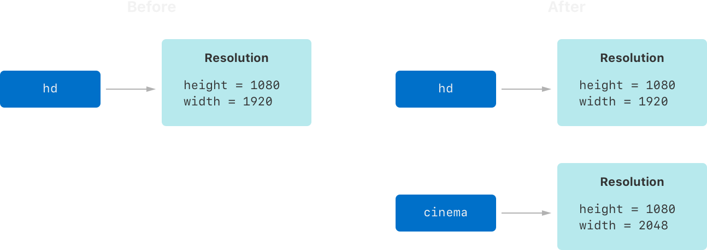
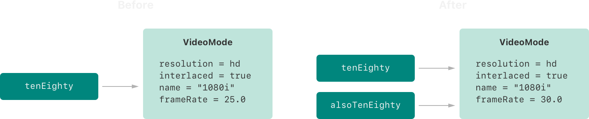

# 结构体和类

<ToBePolishedAfterTranslation />

<OriginalSource
  title="Structures and Classes"
  url="https://docs.swift.org/swift-book/documentation/the-swift-programming-language/classesandstructures"
  summary="对封装数据的自定义类型建模"
/>

结构和类是通用的、灵活的结构，它们成为程序代码的构建块。你定义属性和方法以使用与定义常量、变量和函数相同的语法向你的结构和类添加功能。

与其它编程语言不同，Swift 不需要你为自定义结构和类创建单独的接口和实现文件。在 Swift 中，你在单个文件中定义一个结构或类，该类或结构的外部接口会自动提供给其它代码使用。

:::note
类的实例传统上称为对象。然而，Swift 结构和类在功能上比其它语言更接近，本章的大部分内容描述了适用于类或结构类型实例的功能。因此，使用了更通用的术语实例。
:::

## 比较结构和类

Swift 中的结构和类有很多共同点。两者都可以：

- 定义属性以存储值
- 定义提供功能的方法
- 定义下标以使用下标语法提供对其值的访问
- 定义初始化器以设置其初始状态
- 扩展以扩展其功能，使其超出默认实现
- 符合协议以提供某种标准功能

有关详细信息，请参阅属性、方法、下标、初始化、扩展和协议。

类具有结构所没有的额外功能：

- 继承使一个类能够继承另一个类的特性。
- 类型转换使你能够在运行时检查和解释类实例的类型。
- 析构器使类的实例能够释放它分配的任何资源。
- 引用计数允许对一个类实例进行多次引用。

有关详细信息，请参阅继承、类型转换、取消初始化和自动引用计数。

类支持的附加功能是以增加复杂性为代价的。作为一般准则，更喜欢结构，因为它们更容易推理，并在适当或必要时使用类。实际上，这意味着你定义的大多数自定义类型都是结构和枚举。有关更详细的比较，请参阅在结构和类之间进行选择。

:::note
类和参与者共享许多相同的特征和行为。有关参与者的信息，请参阅并发性。
:::

## 定义语法

结构和类具有相似的定义语法。你使用关键字引入结构 struct，使用关键字引入类 class。两者都将整个定义放在一对大括号中：

```swift
struct SomeStructure {
    // structure definition goes here
}
class SomeClass {
    // class definition goes here
}
```

:::note
每当你定义一个新的结构或类时，你就定义了一个新的 Swift 类型。提供类型名称（例如此处的和）以匹配标准 Swift 类型（例如、和）的大写。提供属性和方法名称（例如和）以将它们与类型名称区分开来。UpperCamelCaseSomeStructureSomeClassStringIntBoollowerCamelCaseframeRateincrementCount
:::

这是结构定义和类定义的示例：

```swift
struct Resolution {
    var width = 0
    var height = 0
}
class VideoMode {
    var resolution = Resolution()
    var interlaced = false
    var frameRate = 0.0
    var name: String?
}
```

上面的示例定义了一个名为 的新结构 Resolution，用于描述基于像素的显示分辨率。此结构有两个存储属性，称为 width 和 height。存储属性是常量或变量，它们被捆绑起来并存储为结构或类的一部分。Int 这两个属性通过将它们设置为初始整数值来推断为类型 0。

上面的示例还定义了一个名为 的新类，用于描述视频显示的特定视频模式。这个类有四个变量存储属性。第一个是用一个新的结构实例初始化的，它推断出一个属性类型。对于其它三个属性，新实例将使用设置（意思是"非隔行扫描视频"）、播放帧速率和可选值. 该属性被自动赋予默认值，或"无值"，因为它是可选类型。VideoModeresolutionResolutionResolutionVideoModeinterlacedfalse0.0Stringnamenamenilname

## 结构和类实例

结构 Resolution 定义和类定义只描述了一个或将是什么样子。它们本身并没有描述特定的分辨率或视频模式。为此，你需要创建结构或类的实例。VideoModeResolutionVideoMode

结构和类创建实例的语法非常相似：

```swift
let someResolution = Resolution()
let someVideoMode = VideoMode()
```

结构和类都对新实例使用初始化语法。最简单的初始化语法形式是使用类或结构的类型名称后跟空括号，例如 Resolution()or 。这将创建类或结构的新实例，并将所有属性初始化为其默认值。类和结构初始化在初始化中有更详细的描述。VideoMode()

## 访问属性

你可以使用点语法访问实例的属性。在点语法中，属性名称紧跟在实例名称之后，由句点 ( .) 分隔，没有任何空格：

```swift
print("The width of someResolution is \(someResolution.width)")
// Prints "The width of someResolution is 0"
```

在本例中，引用 的属性，并返回其默认初始值。someResolution.widthwidthsomeResolution0

你可以深入了解子属性，例如 a 的属性 width 中的属性：resolutionVideoMode

```swift
print("The width of someVideoMode is \(someVideoMode.resolution.width)")
// Prints "The width of someVideoMode is 0"
```

你还可以使用点语法为变量属性分配新值：

```swift
someVideoMode.resolution.width = 1280
print("The width of someVideoMode is now \(someVideoMode.resolution.width)")
// Prints "The width of someVideoMode is now 1280"
```

## 结构类型的成员初始化器

所有结构都有一个自动生成的成员初始化器，你可以使用它来初始化新结构实例的成员属性。新实例属性的初始值可以按名称传递给成员初始化器：

```swift
let vga = Resolution(width: 640, height: 480)
```

与结构不同，类实例不接收默认的成员初始化器。初始化器在初始化中有更详细的描述。

## 结构和枚举是值类型

值类型是一种类型，当它被分配给一个变量或常量，或者当它被传递给一个函数时，它的值被复制。

在前面的章节中，你实际上已经广泛使用了值类型。事实上，Swift 中的所有基本类型——整数、浮点数、布尔值、字符串、数组和字典——都是值类型，并且在幕后实现为结构。

所有结构和枚举在 Swift 中都是值类型。这意味着你创建的任何结构和枚举实例——以及它们作为属性具有的任何值类型——在你的代码中传递时总是被复制。

:::note
标准库定义的集合（如数组、字典和字符串）使用优化来降低复制的性能成本。这些集合不是立即制作副本，而是共享原始实例和任何副本之间存储元素的内存。如果集合的副本之一被修改，元素将在修改之前被复制。你在代码中看到的行为总是好像立即发生了复制。
:::

考虑这个例子，它使用了 Resolution 前面例子中的结构：

```swift
let hd = Resolution(width: 1920, height: 1080)
var cinema = hd
```

该示例声明一个常量 calledhd 并将其设置 Resolution 为使用全高清视频的宽度和高度（1920 像素宽 x 1080 像素高）初始化的实例。

然后它声明一个变量 calledcinema 并将其设置为 的当前值 hd。因为 Resolution 是一个结构，所以创建了现有实例的副本 cinema，并将这个新副本分配给。尽管 hd 和 cinema 现在具有相同的宽度和高度，但它们在幕后是两个完全不同的实例。

接下来，将 width 的属性 cinema 修改为用于数字电影放映的稍宽的 2K 标准的宽度（2048 像素宽和 1080 像素高）：

```swift
cinema.width = 2048
```

检查的 width 属性 cinema 表明它确实已更改为 2048：

```swift
print("cinema is now \(cinema.width) pixels wide")
// Prints "cinema is now 2048 pixels wide"
```

但是，width 原始 hd 实例的属性仍然具有旧值 1920：

```swift
print("hd is still \(hd.width) pixels wide")
// Prints "hd is still 1920 pixels wide"
```

当 cinema 被赋予 的当前值时 hd，存储在中的值 hd 被复制到新 cinema 实例中。最终结果是包含相同数值的两个完全独立的实例。cinema 但是，因为它们是独立的实例，设置为的宽度 2048 不会影响存储在中的宽度 hd，如下图所示：



相同的行为适用于枚举：

```swift
enum CompassPoint {
    case north, south, east, west
    mutating func turnNorth() {
        self = .north
    }
}
var currentDirection = CompassPoint.west
let rememberedDirection = currentDirection
currentDirection.turnNorth()

print("The current direction is \(currentDirection)")
print("The remembered direction is \(rememberedDirection)")
// Prints "The current direction is north"
// Prints "The remembered direction is west"
```

当被赋予 的值时，它实际上被设置为该值的副本。此后更改 的值不会影响存储在 中的原始值的副本。rememberedDirectioncurrentDirectioncurrentDirectionrememberedDirection

## 类是引用类型

与值类型不同，引用类型在分配给变量或常量或传递给函数时不会被复制。使用对相同现有实例的引用而不是副本。

这是一个示例，使用上面定义的类：VideoMode

```swift
let tenEighty = VideoMode()
tenEighty.resolution = hd
tenEighty.interlaced = true
tenEighty.name = "1080i"
tenEighty.frameRate = 25.0
```

该示例声明一个新常量 called 并将其设置为引用该类的一个新实例。视频模式分配了之前的高清分辨率副本。它设置为隔行扫描，名称设置为，帧速率设置为每秒帧数。tenEightyVideoMode19201080"1080i"25.0

接下来，被分配给一个新常量，称为，并且帧速率被修改：tenEightyalsoTenEightyalsoTenEighty

```swift
let alsoTenEighty = tenEighty
alsoTenEighty.frameRate = 30.0
```

因为类是引用类型，实际上都引用同一个实例。实际上，它们只是同一个实例的两个不同名称，如下图所示：tenEightyalsoTenEighty VideoMode



检查的属性表明它正确地报告了来自底层实例的新帧率：frameRatetenEighty30.0VideoMode

```swift
print("The frameRate property of tenEighty is now \(tenEighty.frameRate)")
// Prints "The frameRate property of tenEighty is now 30.0"
```

这个例子还展示了引用类型如何更难推理。如果和在你的程序代码中相距甚远，可能很难找到视频模式更改的所有方式。无论你在哪里使用，你还必须考虑使用 的代码，反之亦然。相比之下，值类型更容易推理，因为与相同值交互的所有代码在源文件中都靠近在一起。tenEightyalsoTenEightytenEightyalsoTenEighty

请注意，和被声明为常量，而不是变量。但是，你仍然可以更改，因为和常量本身的值实际上并没有改变。并且它们自己不"存储"实例——相反，它们都在幕后引用实例。改变的是底层的属性，而不是对那个的常量引用的值。tenEightyalsoTenEightytenEighty.frameRatealsoTenEighty.frameRatetenEightyalsoTenEightytenEightyalsoTenEightyVideoModeVideoModeframeRateVideoModeVideoMode

## 身份运营商

因为类是引用类型，所以多个常量和变量可以在幕后引用同一个类的单个实例。（对于结构和枚举则不同，因为它们总是在分配给常量或变量或传递给函数时被复制。）

有时，找出两个常量或变量是否引用同一个类的实例很有用。为了实现这一点，Swift 提供了两个身份运算符：

- 等同于 ( ===)
- 不等同于 ( !==)

使用这些运算符检查两个常量或变量是否引用同一个实例：

```swift
if tenEighty === alsoTenEighty {
    print("tenEighty and alsoTenEighty refer to the same VideoMode instance.")
}
// Prints "tenEighty and alsoTenEighty refer to the same VideoMode instance."
```

请注意，等同于（由三个等号表示，或）与等于（由两个等号表示，或）===并不相同。等同于表示类类型的两个常量或变量引用完全相同的类实例。等于表示两个实例在值上被认为相等或相等，对于 equal 的某些适当含义，由类型的设计者定义。==

当你定义自己的自定义结构和类时，你有责任决定什么是两个实例相等的条件。等价运算符中描述了定义你自己的==and 运算符实现的过程。!=

## 指针

如果你有使用 C、C++ 或 Objective-C 的经验，你可能知道这些语言使用指针来引用内存中的地址。引用某个引用类型的实例的 Swift 常量或变量类似于 C 中的指针，但不是指向内存中地址的直接指针，并且不需要你写星号 ( ) 来\*指示你正在创建参考。相反，这些引用的定义与 Swift 中的任何其它常量或变量一样。标准库提供了指针和缓冲区类型，如果你需要直接与指针交互，你可以使用它们——请参阅手册内存管理。
