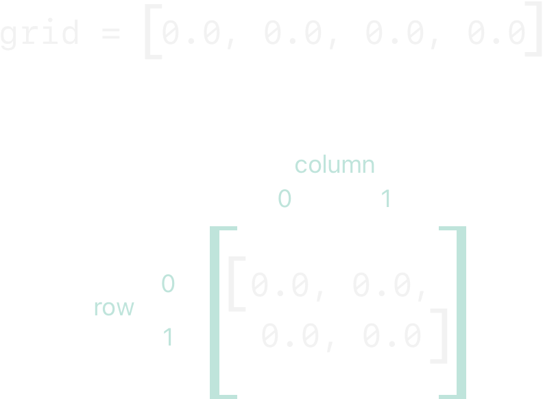
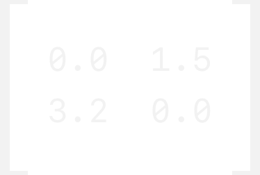

# 下标

<ToBePolishedAfterTranslation />

<OriginalLink
  title="访问集合的元素"
  value="https://docs.swift.org/swift-book/documentation/the-swift-programming-language/subscripts"
/>

类、结构和枚举可以定义下标，这是访问集合、列表或序列的成员元素的快捷方式。你可以使用下标按索引设置和检索值，而无需单独的设置和检索方法。例如，你访问 Array 实例中的元素作为和实例中的元素作为。`someArray[index]DictionarysomeDictionary[key]`

你可以为单个类型定义多个下标，并根据你传递给下标的索引值的类型选择要使用的适当下标重载。下标不限于单个维度，你可以定义具有多个输入参数的下标以满足自定义类型的需要。

## 下标语法

下标使你能够通过在实例名称后方括号中写入一个或多个值来查询类型的实例。它们的语法类似于实例方法语法和计算属性语法。你使用关键字编写下标定义 subscript，并指定一个或多个输入参数和返回类型，其方式与实例方法相同。与实例方法不同，下标可以是可读写的或只读的。此行为由 getter 和 setter 以与计算属性相同的方式传达：

```swift
subscript(index: Int) -> Int {
    get {
        // Return an appropriate subscript value here.
    }
    set(newValue) {
        // Perform a suitable setting action here.
    }
}
```

的类型与下标的返回值相同。与计算属性一样，你可以选择不指定设置器的参数。如果你自己不提供一个名为的默认参数，则会将其提供给你的设置器。newValue(newValue)newValue

get 与只读计算属性一样，你可以通过删除关键字及其大括号来简化只读下标的声明：

```swift
subscript(index: Int) -> Int {
    // Return an appropriate subscript value here.
}
```

下面是一个只读下标实现的示例，它定义了一个结构来表示一个 n 次整数表：TimesTable

```swift
struct TimesTable {
    let multiplier: Int
    subscript(index: Int) -> Int {
        return multiplier * index
    }
}
let threeTimesTable = TimesTable(multiplier: 3)
print("six times three is \(threeTimesTable[6])")
// Prints "six times three is 18"
```

在此示例中，创建了一个新实例来表示三倍表。这是通过将值传递给结构作为实例参数使用的值来指示的。TimesTable3initializermultiplier

你可以通过调用其下标来查询该实例，如对 的调用所示。这将请求三次表中的第六个条目，该条目返回值或 times 。threeTimesTablethreeTimesTable[6]1836

:::note
n 次表基于固定的数学规则。设置为新值不合适，因此将其下标定义为只读下标。threeTimesTable[someIndex]TimesTable
:::

## 下标用法

“下标”的确切含义取决于使用它的上下文。下标通常用作访问集合、列表或序列中的成员元素的快捷方式。你可以自由地以最适合你的特定类或结构的功能的方式实现下标。

例如，Swift 的 Dictionary 类型实现了一个下标来设置和检索实例中存储的值 Dictionary。你可以通过在下标括号内提供字典键类型的键，并将字典值类型的值分配给下标来设置字典中的值：

```swift
var numberOfLegs = ["spider": 8, "ant": 6, "cat": 4]
numberOfLegs["bird"] = 2
```

上面的示例定义了一个名为 call 的变量，并使用包含三个键值对的字典文字对其进行了初始化。字典的类型被推断为. 创建字典后，本示例使用下标赋值向字典添加一个键和一个值。numberOfLegsnumberOfLegs[String: Int]String"bird"Int2

有关 Dictionary 下标的更多信息，请参阅访问和修改字典。

:::note
Swift 的 Dictionary 类型将其键值下标实现为接受并返回可选类型的下标。对于上面的字典，键值下标接受并返回一个类型的值，或“可选 int”。该类型使用可选的下标类型来模拟并非每个键都有值的事实，并提供一种通过为键分配值来删除键值的方法。numberOfLegsInt?Dictionarynil
:::

## 下标选项

下标可以接受任意数量的输入参数，这些输入参数可以是任意类型。下标也可以返回任何类型的值。

与函数一样，下标可以采用不同数量的参数并为其参数提供默认值，如 Variadic Parameters 和 Default Parameter Values 中所述。但是，与函数不同，下标不能使用输入输出参数。

类或结构可以根据需要提供尽可能多的下标实现，将根据使用下标时下标括号内包含的值或值的类型推断要使用的适当下标。这种多下标的定义称为下标重载。

虽然下标采用单个参数是最常见的，但如果适合你的类型，你也可以定义具有多个参数的下标。下面的示例定义了一个 Matrix 结构，它表示值的二维矩阵 Double。该 Matrix 结构的下标采用两个整数参数：

```swift
struct Matrix {
    let rows: Int, columns: Int
    var grid: [Double]
    init(rows: Int, columns: Int) {
        self.rows = rows
        self.columns = columns
        grid = Array(repeating: 0.0, count: rows * columns)
    }
    func indexIsValid(row: Int, column: Int) -> Bool {
        return row >= 0 && row < rows && column >= 0 && column < columns
    }
    subscript(row: Int, column: Int) -> Double {
        get {
            assert(indexIsValid(row: row, column: column), "Index out of range")
            return grid[(row * columns) + column]
        }
        set {
            assert(indexIsValid(row: row, column: column), "Index out of range")
            grid[(row * columns) + column] = newValue
        }
    }
}
```

Matrix 提供一个初始化器，它接受两个参数，称为 rows 和 columns，并创建一个足够大的数组来存储 rows \* columnstype 的值 Double。矩阵中的每个位置都被赋予初始值。为实现这一点，数组的大小和初始单元格值被传递给数组初始化器，该初始化器创建并初始化一个正确大小的新数组。此初始化程序在创建具有默认值的数组中有更详细的描述。0.00.0

Matrix 你可以通过将适当的行数和列数传递给其初始化程序来构造一个新实例：

var matrix = Matrix(rows: 2, columns: 2)
上面的示例创建了一个 Matrix 包含两行和两列的新实例。grid 这个实例的数组实际上 Matrix 是矩阵的扁平化版本，从左上到右下读：



可以通过将行值和列值传递到下标中来设置矩阵中的值，以逗号分隔：

```swift
matrix[0, 1] = 1.5
matrix[1, 0] = 3.2
```

这两个语句调用下标的设置器在矩阵的右上角位置（其中 is 和 is ）和左下角位置（其中 is 和 is ）设置一个值：`1.5row0column13.2row1column0`



下 Matrix 标的 getter 和 setter 都包含一个断言来检查下标 row 和 column 值是否有效。为了协助这些断言，Matrix 包括一个名为 的便捷方法，它检查请求的和是否在矩阵的边界内：indexIsValid(row:column:)rowcolumn

```swift
func indexIsValid(row: Int, column: Int) -> Bool {
    return row >= 0 && row < rows && column >= 0 && column < columns
}
```

如果你尝试访问矩阵边界之外的下标，则会触发断言：

```swift
let someValue = matrix[2, 2]
// This triggers an assert, because [2, 2] is outside of the matrix bounds.
```

## 类型下标

如上所述，实例下标是你在特定类型的实例上调用的下标。你还可以定义在类型本身上调用的下标。这种下标称为类型下标。static 你可以通过在关键字之前写关键字来指示类型下标 subscript。类可以改用 class 关键字，以允许子类覆盖超类对该下标的实现。下面的示例显示了如何定义和调用类型下标：

```swift
enum Planet: Int {
    case mercury = 1, venus, earth, mars, jupiter, saturn, uranus, neptune
    static subscript(n: Int) -> Planet {
        return Planet(rawValue: n)!
    }
}
let mars = Planet[4]
print(mars)
```
